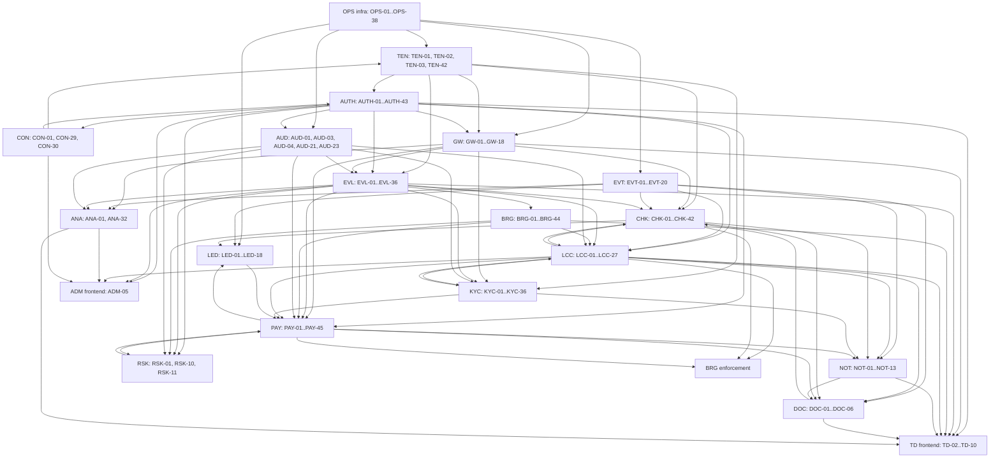

# build-order — render to PNG

Module dependency order from the `Depends On` column of the V1 Execution Sheet (V1.0 + V1.1 rows; inter-module edges only). This mirrors the sheet's dependency data — it is a transcription, not an invention.

Note: edges are the union of `Depends On` references between modules in the sheet. Intra-module dependencies (e.g. AUTH-07 depending on nothing) are omitted. Arrow = "depends on".

## Open contract questions
- TODO — needs owner decision: confirm the critical path (OPS → TEN → AUTH → GW → EVT → EVL/BRG → LCC → CHK → PAY → LED) matches the working session's sequencing.
