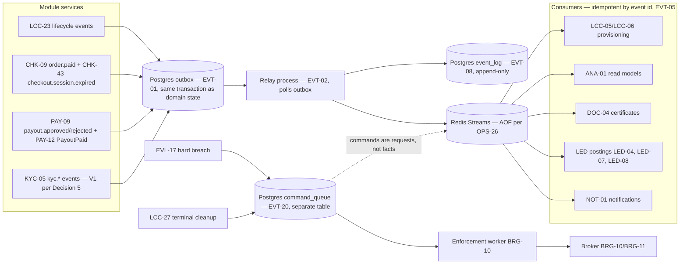

# event-bus — render to PNG

Outbox → relay → Redis Streams → consumers. Derives from EVT-01, EVT-02, EVT-03, EVT-05, EVT-08, EVT-20. Redis Streams only in V1 (BVR-09).

Key contract points: domain state and outbox row written in one transaction (EVT-01); relay survives restarts (EVT-02); envelope id/type/version/tenant_id/occurred_at/payload (EVT-03); at-least-once delivery with idempotent consumers (EVT-05); every published event logged append-only (EVT-08); broker commands never in the event stream (EVT-20).

## Open contract questions
- TODO — needs owner decision: stream/consumer-group naming, partitioning per tenant, and lag alerting.
- TODO — needs owner decision: relay batch/poll parameters and outbox retention.
