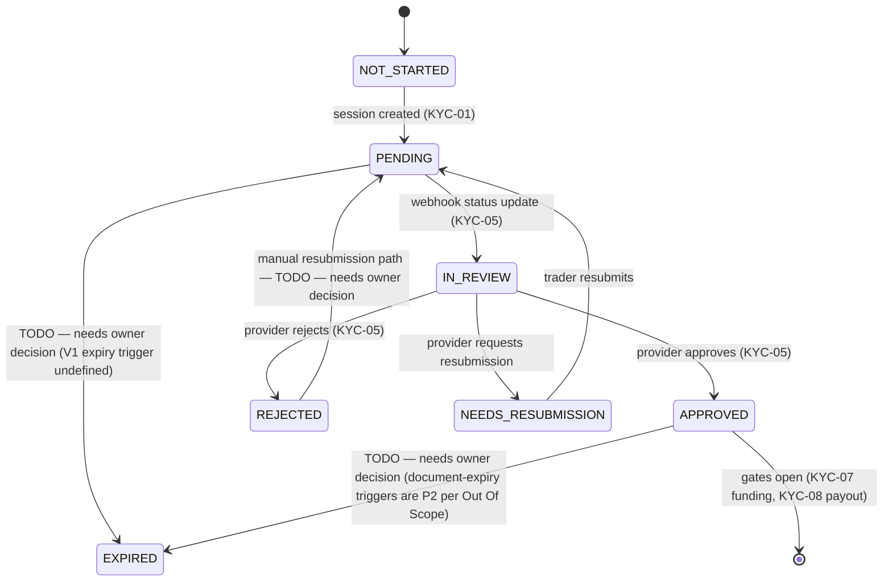

# kyc-state — render to PDF/PNG

The KYC-06 state machine. States are exactly those named by KYC-06. Edge conditions marked TODO are not enumerated in the sheet.

Manual fallback (V1.1): trader uploads documents (KYC-12); tenant admin reviews and decides (KYC-11) — decisions land in the same state machine. Under-18 rejected (KYC-14). Verified identity stored on approval (KYC-09).

## Open contract questions
- TODO — needs owner decision: V1 expiry trigger and REJECTED → retry path.
- TODO — needs owner decision: which state manual-review cases enter (does manual review bypass PENDING/IN_REVIEW?).
