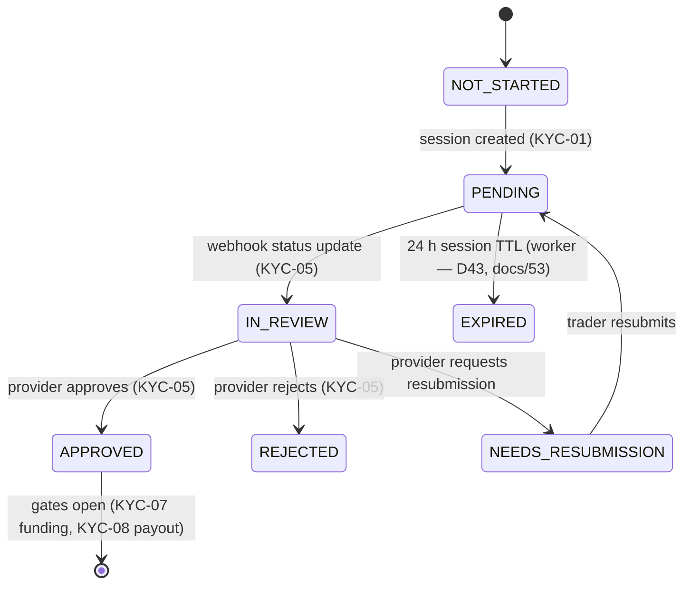

# kyc-state — render to PDF/PNG

The KYC-06 state machine. States are exactly those named by KYC-06. Edge conditions marked TODO are not enumerated in the sheet.

Edge semantics (D43, docs/53): APPROVED never expires in V1 (re-verification
is KYC-21/25, V2 — the APPROVED → EXPIRED edge is removed); REJECTED is
terminal in-session (retry = new session via the 24 h cooldown); manual
review is an IN_REVIEW queue flag (is_manual_review), not a state.

Manual fallback (V1.1): trader uploads documents (KYC-12); tenant admin reviews and decides (KYC-11) — decisions land in the same state machine. Under-18 rejected (KYC-14). Verified identity stored on approval (KYC-09).

## Open contract questions
- Resolved 2026-09-19 (D43, docs/53): EXPIRED = session TTL only; APPROVED→EXPIRED removed from V1; REJECTED terminal in-session (new session via cooldown).
- Resolved 2026-09-19 (D43, docs/53): manual-review cases sit in IN_REVIEW with the is_manual_review queue flag (KYC-11/12 V1.1).
