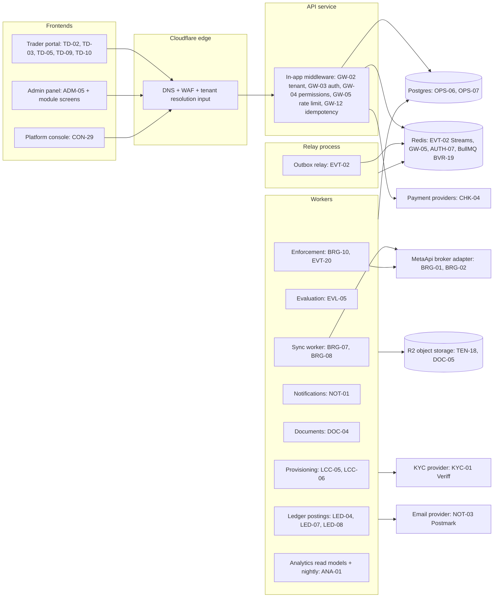

# lanes — render to PNG

High-level service lanes. Derives from OPS-01: "every service including api, workers, relay, bot, and frontends runs as a Docker image built in CI". Compose stack on Hetzner (OPS-02). Edge is Cloudflare (TEN-02, BVR-05/BVR-12: no standalone gateway).

Resolved 2026-09-17: **no `bot` lane in V1** — OPS-01's `bot` reference is a stale forward reference to the V2 Telegram bot worker (NOT-09, V2.0). V1 lanes: edge, api, workers, relay, frontends.

## Open contract questions
- Resolved 2026-09-17: no `bot` lane in V1 (OPS-01's reference is a V2 forward reference to NOT-09). V1 lanes shown above.
