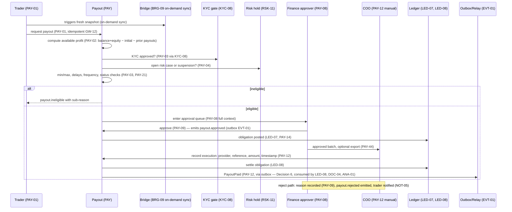

# payout-flow — render to PNG

Payout flow: request → eligibility → approval → execution → ledger. Derives from PAY-01, PAY-02, PAY-03, PAY-04, PAY-08, PAY-09, PAY-12, PAY-14, KYC-08, RSK-11, LED-07, LED-08, BRG-09.

## Open contract questions
- TODO — needs owner decision: who moves approved → processing → paid given manual execution (PAY-13 states vs PAY-12 direct recording).
- TODO — needs owner decision: whether on-demand sync (BRG-09) is automatic in the request flow or operator-triggered.
