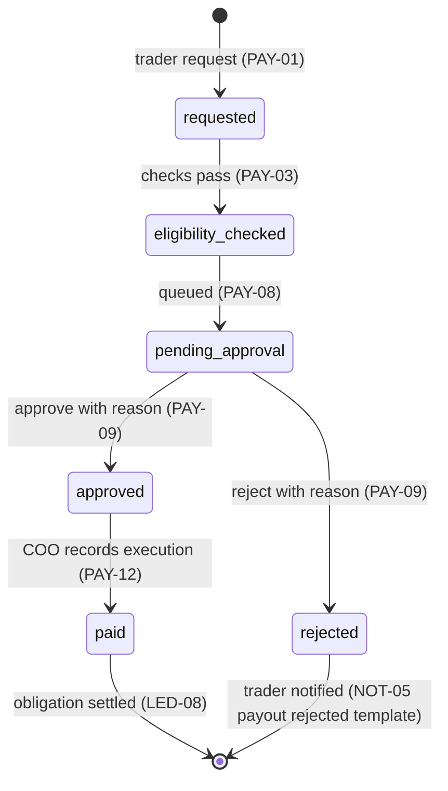

# payout-state — render to PNG

The PAY-13 state machine. States are exactly those named by PAY-13: requested, eligibility checked, pending approval, approved, rejected, processing, paid, failed, cancelled. V1 edges resolved 2026-09-17 (see `api/pay.md` for the guard narrative and citation note).

Failed eligibility never creates a payout — PAY-03 is a synchronous gate, so an ineligible request returns `payout.ineligible` with no payout row (no `requested → rejected` edge).

Reserved states — defined by PAY-13, **no V1 entry path**:
- `processing` — V2 automated provider execution (PAY-24). V1 execution is manual (PAY-12, Build Strategy "Manual for V1"); the manual-send window is elapsed time between approved and paid, not a state.
- `failed` — V2 failure/retry (PAY-18).
- `cancelled` — V2 trader cancellation (PAY-17).

Approval posts an obligation (LED-07); recorded execution settles it (LED-08). Risk hold (PAY-04/RSK-11) blocks entry: open case or suspension prevents request.

## Open contract questions
- Resolved 2026-09-17: V1 edges; `processing`/`failed`/`cancelled` have no V1 entry path (reserved for PAY-24/PAY-18/PAY-17).
