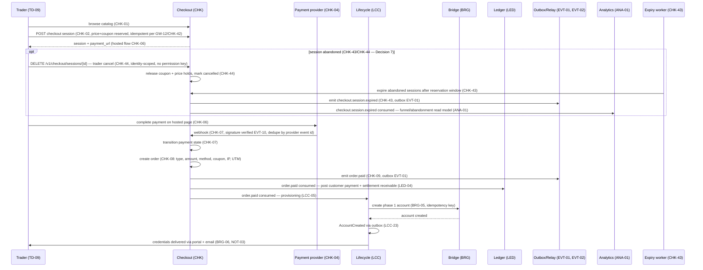

# purchase-flow — render to PNG

Purchase flow: checkout → payment webhook → order → provisioning. Derives from CHK-01, CHK-02, CHK-04, CHK-06, CHK-07, CHK-08, CHK-09, CHK-43, CHK-44, LCC-05, BRG-05, BRG-06, LED-04.

## Open contract questions
- TODO — needs owner decision: webhook tenant routing (how the provider call maps to the tenant).
- TODO — needs owner decision: failed-payment retry branch (CHK-16, V1.1) flow placement.
