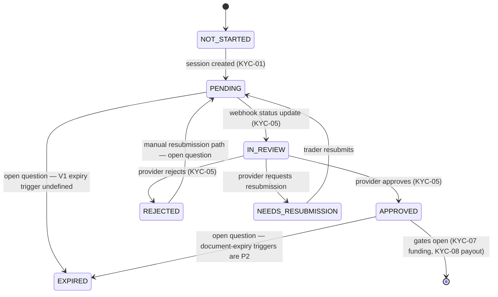

# 13 — KYC: Identity Verification

> Covers PRD module **KYC** (38 requirements). KYC is a **gate system**, not a
> feature: purchase gate (L1) and payout gate (L2). The provider (Veriff) does
> the verification; we own the **gates, the state machine, the manual fallback,
> and the PII hygiene** around all of it.

## 1. Purpose & scope

- **Provider adapter interface (KYC-01)** with **Veriff (KYC-02, SIGNED)** as
  the V1 provider; adapter = the same strategy pattern as BRG/CHK/PAY/KYC rails,
  so provider failover (KYC-34 V2) or a second provider is config, not code.
- **Two gates (FunderBlu TTS parity):**
  - **L1 — funding/activation gate (KYC-07):** government ID + selfie →
    name/DOB/country extracted, **age ≥ 18 (KYC-14)**, **country not restricted
    (KYC-13, tenant config)**. Required before a challenge account activates.
  - **L2 — payout gate (KYC-08):** L1 + proof of address (tenant-configurable
    set) → required before a payout can be approved/executed. V2 adds wallet
    name match (PAY-07) on top.
  - Per-tenant level config (TEN): `kyc: {l1: {required: true, docs:[…]},
    l2: {required: true, docs:[…]}}` — a tenant could set L1 only (crypto-native
    trader base) or stricter.
- **Manual fallback (KYC-11/12, V1):** provider `undecided`/failed-with-docs →
  ADM manual review queue with manual document upload; override decision
  (V2 KYC-18 formalizes, V1 has it — manual review *is* the override).
- **Verified identity record (KYC-09):** the canonical stored identity (see §9).
- **Explicitly out of scope V1:** re-verification triggers (KYC-21 V2), EDD
  (KYC-22 V2), corporate verification (KYC-23 V3), document expiry lifecycle
  (KYC-25 V2), consent management UI (KYC-27 V2 — V1 stores the consent record
  at session start as Veriff requires it).

Requirement coverage: `KYC-01,02,05,06,07,08,16` (V1.0) + `09,11,12,13,14,36` (V1.1) +
`03,04,10,15,17,18,19,20,21,22,24,25,26,27,28,29,30,31,32,33,34,35,37,38` (V2.0) + `23` (V3.0).

## 2. Architecture

```
 trader (TD) ──POST /v1/kyc/sessions {level}──► KYC: gate pre-check
           (country self-declare vs tenant blocklist, age, session TTL)
      ──Veriff checkout URL (embeddable)──► trader completes in browser
 Veriff ──webhook (EVT-10: verify, ingest, idempotent)──► status update
      │
      ├─ approved ─► identity record stored (field-encrypted) ─► gate opens
      ├─ rejected ─► reason stored ─► trader notice (class of issue, KYC-20)
      └─ undecided / docs_needed ─► ADM manual queue (KYC-11)
                                      └─ manual upload (KYC-12) → decision
 gates (read by others, never by KYC acting):
   CHK intent create ──reads──► l1 status (KYC-07)
   PAY approval       ──reads──► l2 status (KYC-08)
   LCC activation     ──reads──► l1 status (KYC-07)
```

KYC **never blocks anything itself** — it publishes state; CHK/LCC/PAY enforce
the gates (same enforcement pattern as RSK→PAY). This keeps one owner of
"verified or not" and N consumers who just read.

## 3. System design

### 3.1 State machine (KYC-06, V1 — binding)

States are exactly those named by KYC-06 (`contracts/diagrams/kyc-state.md`,
rendered PNG alongside):



- **One provider per tenant in V1** (Out Of Scope: no multi-jurisdiction
  routing); the provider runs on the tenant's own Veriff keys (KYC-02,
  TEN-11 config). The session is a provider object (case id stored; the
  provider dashboard is the staff's deep-dive view; our ADM queue is the
  workflow).
- **Manual fallback (V1.1):** trader uploads documents (KYC-12: ID + proof of
  address); tenant admin reviews and decides (KYC-11) — decisions land in the
  same state machine. Under-18 rejected (KYC-14). Verified identity stored on
  approval (KYC-09).
- **Open questions** (from the research): the V1 `EXPIRED` trigger; the
  `REJECTED → PENDING` retry path; which state manual-review cases enter.
- **Upload progress (KYC-36):** TD UI polls session status (provider progress
  passed through) — no fake percentages; states only.

> Extended (post-V1) level model: the two independent per-level machines
> (`l1`/`l2`) — L1 verified + L2 rejected as a normal state (trader can trade,
> can't be paid out) — is the V2 multi-level design. V1 runs a single
> verification flow per tenant; the gates below read its states.

### 3.2 Gate semantics (how consumers read)

| Gate | Read | Fail behavior |
|---|---|---|
| Funding (LCC-07, V1) | `kyc.state == APPROVED` when the challenge's `kyc_timing` requires it before funded creation (LCC-07) | funded account creation blocked until APPROVED (synchronous status check — **not** event consumption) |
| Payout (KYC-08 → PAY-03, V1) | `kyc.state == APPROVED` when timing requires it | `payout.ineligible` (KYC sub-reason) / `payout.kyc_required` (code naming is an open question, contracts/errors/taxonomy.md) — **at request time AND re-checked at approval** (state can change between) |
| Purchase (extended — not a V1 KYC row) | `l1 == APPROVED`-flavored check (TTS parity: buy needs L1) | `kyc.required`-flavored error on intent create (extended surface) |

### 3.2 Gate semantics (how consumers read)

| Gate | Read | Fail behavior |
|---|---|---|
| Purchase (CHK-10 gate, TTS parity: buy needs L1) | `kyc.status(tenant, identity, l1) == verified` | `kyc.required` on intent create (with level + what's missing) |
| Activation (LCC) | same | account stays `kyc_pending`-flavored `opening` note (LCC owns the state; KYC status surfaces in TD) |
| Payout (PAY-08 gate) | `l2 == verified` | `pay.kyc_required` (PAY §3.1) — **at request time AND re-checked at approval** (identity can expire between) |

### 3.3 Verified identity record (KYC-09)

Stored on `verified` (per level, latest wins, history retained):
`{full_name (as documented), dob, country, document_type, document_number_masked,
provider_case_id, provider_score, verified_at, level}` — **field-encrypted**
(AUTH §3.6 pattern). Masked views everywhere: `Ali K.`, `**1234`, country only
when staff don't need more. The **payout name match** (V2 PAY-07) compares the
encrypted name against the wallet name via a hash-equality service (never
decrypt-then-log).

### 3.4 Country & age (KYC-13/14)

- Self-declared country at session start (also from IP, advisory flag if
  mismatch — feeds RSK-03 later); blocklist from **tenant config**
  (`tenants.config.kyc.blocked_countries`) + platform default (PRD geo-restriction
  default list — the 8 non-negotiables' "no sanctioned jurisdictions" rule is
  enforced at tenant creation too).
- Age: `dob <= now − 18y` (tenant min configurable, floor 18) — computed at
  decision time (provider sends DOB), not at session start (self-declared DOB
  can be wrong).

### 3.5 Manual review (KYC-11/12)

ADM queue: session details, provider verdict + reason, document links
(sensitive-read audited), staff decision buttons (approve/reject, reason
required, 2FA — critical tier). Manual upload (KYC-12): trader uploads docs
directly in TD (R2, tenant-prefixed, 10 MB max per PRD attachment default) when
the provider asks for more.

## 4. Events (topic `kyc`)

### 4.1 V1 baseline events — authoritative

From `contracts/events/catalog.md` (the V1 execution sheet). Envelope EVT-03 (`id`, `type`, `version`, `tenant_id`, `occurred_at`, `payload`); schemas in `contracts/events/payloads/`. Producers write the outbox (EVT-01); consumers are idempotent by event id (EVT-05).

| Event | Producer (V1) | V1 consumers |
|---|---|---|
| `kyc.submitted` | KYC-05 (webhook status handling), KYC-16 | NOT-01 (template: KYC result), ANA-01 |
| `kyc.approved` | KYC-05, KYC-16 | NOT-01, LCC-06 (auto-upgrade on approval), PAY-03 (payout eligibility), ANA-01 |
| `kyc.rejected` | KYC-05, KYC-16 | NOT-01, ANA-01 |
| `kyc.expired` | KYC-05, KYC-16 | NOT-01, ANA-01 — EXPIRED trigger is an open question |
| `kyc.resubmission_requested` | KYC-05, KYC-16 | NOT-01, ANA-01 |

**Mapping to the extended model below:** `kyc.submitted` = `kyc.session_started`; `kyc.approved` = `kyc.verified`; `kyc.rejected` / `kyc.resubmission_requested` = the terminal branches of the extended `kyc.status_changed`. The five V1 events were moved into V1 scope by Decision 5 (2026-09-16): KYC-05 was amended to emit them through the outbox and KYC-16 moved from V2.0 to V1.0 / V1-Core. LCC-07 / KYC-07 / KYC-08 gates remain **synchronous status checks**, not event consumption.

### 4.2 Extended (post-V1) event model — design-level

> The extended event set for V2/V3 (and internal V1 detail where marked); see the mapping above for how it relates to the V1 baseline. Topic, dedupe, and transport rules unchanged (docs/04 §5).

| Event | When | Consumers |
|---|---|---|
| `kyc.session_started` | session created (level) | AUD, ANA (funnel) |
| `kyc.status_changed` | any transition (level, from, to, reason_class) | NOT (trader notice on terminal states), LCC (activation note), AUD |
| `kyc.verified` | level verified (record ref) | CHK (gate unblock notification), PAY (gate), ANA, AUD |
| `kyc.manual_review_requested` | provider undecided → queue | NOT (staff), AUD |
| `kyc.gate_blocked` (derived, V2 convenience) | a gated action failed on KYC | ANA (drop-off funnel), NOT (trader "complete your verification") |
| `kyc.consent_recorded` (V2 KYC-27) | consent captured | AUD (compliance) |
## 5. Lifecycles

- **Session:** §3.1 machine (per level); session TTL 24 h (expired →
  `rejected {reason: session_expired}`, re-initiate).
- **Verified record:** `active → (V2 re-verify) superseded` — old rows retained
  (disputes: "what did we verify on the day of that payout").
- **Manual upload:** `uploaded → (reviewed) → archived (retention)`.
- **Document retention (V1 policy, V2 KYC-31 formal):** images in R2
  7 years (financial-adjacent), then deletion job + audit log; metadata
  (names/dob) 7 years min; the retention clock starts at `verified_at`.

## 6. Error taxonomy
### 6.1 V1 baseline codes — authoritative

From `contracts/errors/taxonomy.md` (the V1 execution sheet; module KYC). These are the exact codes the V1 surfaces return; the envelope is GW-18 (`code`, `message`, `correlation_id`).
| Code | HTTP | Meaning | User-facing message |
|---|---|---|---|
| `kyc.country_restricted` | 403 | Registration/verification from restricted jurisdiction | "Verification is not available in your country." |
| `kyc.already_in_progress` | 409 | Session creation while one is active | "You already have a verification in progress." |
| `kyc.upload_failed` | 400 | Manual upload failed (retriable) | "Upload failed. Please try again." |
| `kyc.case_not_reviewable` | 409 | Manual decision on a case not in review | "This case is no longer reviewable." |
| `account.underage` | 403 | Verified age under 18 | "You must be 18 or older." |


Namespace `KYC`:
### 6.2 Extended (post-V1) codes — design-level

> Below the V1 baseline (6.1); names in the GW-18 dotted convention. Rows duplicating a V1 baseline code were folded into the baseline table (the merged registry: docs/30).


| Code | HTTP | Meaning |
|---|---|---|
| `kyc.required` (with `details.level`, `details.missing[]`) | 422 | Gate fail (consumers wrap: CHK `chk.login_required`? no — each consumer uses its own code; this is the KYC-internal result) |
| `kyc.country_blocked` | 422 | Self-declared country in blocklist |
| `kyc.age` | 422 | Under minimum (at decision time) |
| `kyc.session_expired` | 409 | Provider session dead (new session offered) |
| `kyc.session_limit` | 429 | Rate limit (V2 KYC-29; V1: 3 sessions/level/day) |
| `kyc.docs_invalid` | 422 | Upload failed (size/type/corrupt) |
| `kyc.state_conflict` | 409 | Illegal transition (e.g. decide a verified session) |
| `kyc.provider_unavailable` | 503 | Veriff circuit open (manual-upload path still works) |
| `kyc.provider_mismatch` | 500-internal | Webhook state inconsistent with session (anomaly ticket) |
| `kyc.reinitial_cooldown` | 429 | V1 24 h cooldown after rejection |
| `kyc.level_mismatch` | 422 | L2 session attempted before L1 verified |

## 7. API endpoints
### 7.1 V1 baseline — `kyc` (authoritative: `contracts/api/kyc.md`)

| Method + path | Auth | Permission | Idempotency | V1 errors |
|---|---|---|---|---|
| `POST /v1/trader/kyc/sessions` | Trader — implied by KYC-01 session creation + TD-02 self-serve flow | self-action | required | `kyc.country_restricted`, `kyc.already_in_progress` |
| `POST /v1/webhooks/kyc/{provider}` | provider signature (EVT-10 shared verification utilities) — KYC-05 | none (signature-authenticated) | required — dedupe by provider event id | `webhook.signature_invalid` |
| `GET /v1/trader/kyc/status` | Trader (self) — implied by KYC-06 "status is explicit and queryable" | self-action | n/a | standard |
| `POST /v1/trader/kyc/documents` | Trader — KYC-12 (V1.1 manual fallback upload: ID + proof of address) | self-action | required | `kyc.upload_failed` |
| `GET /v1/admin/kyc/manual-queue` | Tenant Admin — KYC-11 (V1.1 fallback when provider unavailable or flags a case) | `kyc.review` # KYC-11 | n/a | standard |
| `POST /v1/admin/kyc/{kyc_verification_id}/decision` | Tenant Admin — KYC-11 (V1.1) | `kyc.review` # KYC-11 | required | `kyc.case_not_reviewable` |
| `PUT /v1/admin/kyc/restricted-countries` | Tenant Admin — KYC-13 (V1.1) | `kyc.restrictions.write` # KYC-13 | required | standard |

Scope, request/response shapes, and per-endpoint notes: `contracts/api/kyc.md` (field values in the research are owner TODOs until contract freeze; canonical JSON is fixed at freeze, per the docs/99 §12 rules).

### 7.2 Extended (post-V1) surface — provisional

> Not in the V1 execution sheet. Design-level; paths beyond the V1 baseline are provisional until the URL-plan decision (`contracts/api/gw.md`, open question). Shown for platform completeness (V2/V3 phases, docs/99).

Trader (TD): `GET /v1/kyc/status` (both levels, what's missing, next action),
`POST /v1/kyc/sessions` `{level, country}` → `{session_id, checkout_url,
expires_at}` (KYC-04 V2 names it; V1 has it),
`GET /v1/kyc/sessions/{id}` (progress, KYC-36),
`POST /v1/kyc/sessions/{id}/documents` (manual upload, KYC-12),
`GET /v1/kyc/sessions/{id}/documents` (own uploaded docs).

Staff (ADM): `GET /v1/admin/kyc/queue` (manual_review sessions),
`GET /v1/admin/kyc/sessions/{id}` (detail: provider verdict, docs [audited
sensitive-read], identity preview masked),
`POST /v1/admin/kyc/sessions/{id}/decide` (2FA, reason; KYC-11; override
V2 KYC-18 = same endpoint with `override: true` + mandatory reason),
`GET /v1/admin/kyc/history?identity_id=` (V2 KYC-17 queue & viewer).

Internal: `/v1/webhooks/veriff` (EVT-10).
## 8. Schema (key shapes)

```jsonc
// GET /v1/kyc/status
{ "data": { "l1": { "state": "verified", "verified_at": 1758270000000 },
    "l2": { "state": "in_review", "session_id": "01J9KYS...",
            "next_action": "awaiting_provider", "missing": ["proof_of_address"] },
    "gates": { "purchase": "pass", "payout": "pending" } } }

// POST /v1/kyc/sessions → 201
{ "data": { "session_id": "01J9KYS...", "level": "l2",
    "checkout_url": "https://api.veriff.me/v1/checkout/…", "expires_at": 1758365400000 } }

// ADM decide
{ "data": { "state": "verified", "decided_by": "01J9...", "reason": "Docs clear on manual review" } }
```

## 9. Database design

```sql
CREATE TABLE kyc_sessions (
  id             ULID PRIMARY KEY,
  tenant_id      ULID NOT NULL,
  identity_id    ULID NOT NULL,
  level          TEXT NOT NULL CHECK (level IN ('l1','l2')),
  state          TEXT NOT NULL DEFAULT 'in_session'
    CHECK (state IN ('in_session','in_review','manual_review','verified',
                     'rejected','expired','re_verification_required')),
  provider       TEXT NOT NULL DEFAULT 'veriff',
  provider_case_id TEXT,                     -- Veriff object id
  country_declared CHAR(2), country_ip CHAR(2),
  dob           DATE,                        -- field-encrypted at column level
  identity_data JSONB,                       -- field-encrypted (name, doc, score)
  key_version   INT NOT NULL DEFAULT 1,
  reject_reason_class TEXT,                  -- what the trader sees
  reject_reason_detail TEXT,                 -- staff-only
  decided_by    ULID, decided_at TIMESTAMPTZ,
  override      BOOLEAN NOT NULL DEFAULT false,   -- V2 KYC-18
  session_url_expires_at TIMESTAMPTZ,
  created_at    TIMESTAMPTZ NOT NULL DEFAULT now(),
  updated_at    TIMESTAMPTZ NOT NULL DEFAULT now()
);
CREATE INDEX idx_kyc_tenant_identity ON kyc_sessions(tenant_id, identity_id, level, created_at DESC);
CREATE INDEX idx_kyc_queue ON kyc_sessions(tenant_id, state) WHERE state = 'manual_review';

CREATE TABLE kyc_documents (
  id         ULID PRIMARY KEY,
  tenant_id  ULID NOT NULL,
  session_id ULID NOT NULL REFERENCES kyc_sessions(id),
  kind       TEXT NOT NULL,                  -- id_front|id_back|selfie|proof_of_address|manual:{n}
  r2_key     TEXT NOT NULL,                  -- kyc/{tenant}/{session}/{n}
  bytes      BIGINT NOT NULL,
  uploaded_by TEXT NOT NULL,                 -- 'trader' | 'staff'
  created_at TIMESTAMPTZ NOT NULL DEFAULT now()
);
CREATE INDEX idx_kycdocs_session ON kyc_documents(session_id);

-- no separate verified-record table V1: the latest verified kyc_sessions row
-- per (identity, level) IS the record; history = the other rows (KYC-09).
-- V2 adds kyc_consent (KYC-27) + kyc_reverification triggers (KYC-21).
```

## 10. Security & compliance

- **PII is the core asset here:** field encryption (per-tenant DEK, AUTH §3.6),
  R2 keys tenant-prefixed + bucket access scoped per tenant prefix (IAM),
  document URLs short-lived (15 min) and issued only to authorized staff with
  sensitive-read audit (AUD-23) — the trader gets their own docs back, nobody
  else's ever.
- **Masking:** APIs return masked identity data by default; unmasked = explicit
  endpoint + role + audit (never in events — `kyc.verified` carries no PII,
  only ids + level + score class).
- **Consent:** Veriff checkout captures consent (our ToS/privacy link passed in
  the session config); V1 stores the provider consent ref (KYC-27 V2 adds the
  full management surface).
- **Decisions are critical-tier audit** (approve/reject/override, 2FA, reason).
- **Provider trust boundary:** Veriff webhooks verified (EVT-10); a webhook
  marking `verified` without a matching session = anomaly, not a state change.
- **Residency:** R2 (US) with tenant-prefix isolation; FunderBlu's legal
  sign-off on the privacy policy + data-processing record is a Phase-1 item
  (KYC data is GDPR-relevant for non-PK traders — the privacy policy must
  name the processor).
- **Age/country decisions at decision-time** (§3.4) prevent self-declaration
  drift; the country self-declare vs IP mismatch is an RSK input later.

## 11. Scalability considerations

- Volume: ~100 sessions/month V1; provider-bound (Veriff SLA minutes–hours);
  our side is state transitions on webhooks — trivial load.
- Document storage: 10 MB × ~6 docs × 100 = ~6 GB/tenant/month — R2 is
  unbothered; lifecycle rule (7 yr) + V2 retention job (KYC-31) handles
  deletion + audit.
- Gate reads (CHK/LCC/PAY) hit `kyc_sessions` (indexed) — add a 30 s Redis
  cache keyed (tenant, identity, level) invalidated by `kyc.status_changed`
  only if ANA shows it matters (V1: direct read, < 2 ms).
- Manual queue latency is a **human** bottleneck (V2 KYC-30 SLA: 24 h target) —
  staffing note, not an engineering one.

## 12. Open-source solutions

| Option | Verdict |
|---|---|
| **Veriff** (SIGNED, register) | **CHOSEN** — checkout embed, PK/IN document support, webhooks, manual-review export, price acceptable at V1 volume |
| Sumsub/Onfido/Jumio (alternatives) | Rejected: Veriff already signed for FunderBlu; adapter interface (KYC-01) keeps them viable |
| in-house OCR + liveness | Rejected: not defensible, compliance liability, weeks of work |
| openkyc / OSS document validators | Rejected: V35 pre-check (KYC-35) is a thin client-side + provider-side check, not a new service |
| Provider failover (KYC-34 V2) | Architecture: second adapter + health probe + tenant-level provider config; no extra infra |

## 13. Technology stack

Go domain package (api) + webhook consumer (EVT-10); Veriff REST/checkout;
Postgres (sessions/documents, field-encrypted columns); R2 (documents,
tenant-prefixed); NOT (trader notices: started/approved/rejected/needs-docs);
ADM (manual queue, FE-1); Postmark (via NOT); Prometheus (session funnel,
provider latency, manual-queue age); Sentry.

## 14. Integration — internal modules (glue)

| Module | How |
|---|---|
| **CHK** | intent create reads L1 gate (`kyc.required` → `CHK`-wrapped code + level detail) |
| **LCC** | activation reads L1; TD "account opening" screen shows the KYC step |
| **PAY** | L2 gate at request + re-check at approval (PAY §3.1); V2 name match (PAY-07) via hash-equality |
| **RSK** | (V2) country self-declare vs IP mismatch → signal input; chargeback + KYC age proximity → EDD trigger (KYC-22) |
| **TEN** | level config (docs required per level), blocked countries, min age, provider config |
| **NOT** | 5 templates (session started, needs docs, approved, rejected-class, manual review done) |
| **ANA** | funnel: sessions → provider verdicts → manual → verified; drop-off by reason class; provider cost per verified (KYC-26 V2) |
| **AUD** | every transition + every document access (sensitive) |
| **TD** | KYC section (status, session embed, doc upload, progress) |

## 15. Integration — external tools

Veriff (checkout, webhooks, dashboard for staff deep-dive), R2 (documents),
Postmark (via NOT), Sentry, Prometheus/Grafana.

## 16. Implementation blueprint

| Step | Owner | Est | Depends | Exit criteria |
|---|---|---|---|---|
| 1. Schemas + field encryption + R2 upload path (tenant-prefixed, 10 MB) | BE-2 | 1.5 d | OPS, AUTH (encryption) | upload → encrypted rows + R2 object with tenant prefix |
| 2. Veriff adapter (session create, checkout URL, status) + circuit state | BE-2 | 2 d | 1 | sandbox: session created, URL opens Veriff checkout |
| 3. Webhook (EVT-10) + state machine + idempotency + mismatch anomaly | BE-2 | 2 d | 2, EVT-10 | replayed webhook → one transition; bogus webhook → anomaly, no state change |
| 4. Gates: L1 (CHK intent, LCC activation) + L2 (PAY request + approval re-check) + age/country at decision | BE-2 | 2 d | 3, CHK, LCC, PAY | each gate fail code triggerable in staging |
| 5. TD KYC UI (status, embed, upload, progress) + ADM manual queue (decide, docs viewer) | FE-01 | 4 d | 3–4 | end-to-end in staging: trader verifies L1 in-browser, gate opens |
| 6. Manual review flow (needs_docs → manual upload → staff decide, 2FA) + notices | BE-2 + FE-01 | 2.5 d | 5 | undecided session lands in queue, docs viewable (audited), decision closes it |
| 7. Masking/audit hardening pass + retention job skeleton + ANA funnel | BE-2 | 1.5 d | 4–6 | property: no PII in any event/log sample; doc access 100% audited |
| 8. V2: re-initiation, re-verification triggers, EDD, expiry lifecycle, consent surface, SLA, cost tracking, provider failover, quality pre-check, performance reports | BE-2 | 3 wks | 7 | each behind Flipt flag per tenant |

**Risks:** Veriff as single provider (mitigation: adapter + manual fallback
means a provider outage ≠ business stop — traders can complete via manual
upload); PII leakage (mitigation: field encryption + masked APIs + audited
sensitive reads + R2 prefix isolation — the Phase-1 legal review gates this);
PK/IN document variety (mitigation: Veriff's document matrix per country,
manual queue as the long-tail path; measure manual rate weekly — if > 15%,
review document guidance with FunderBlu).
