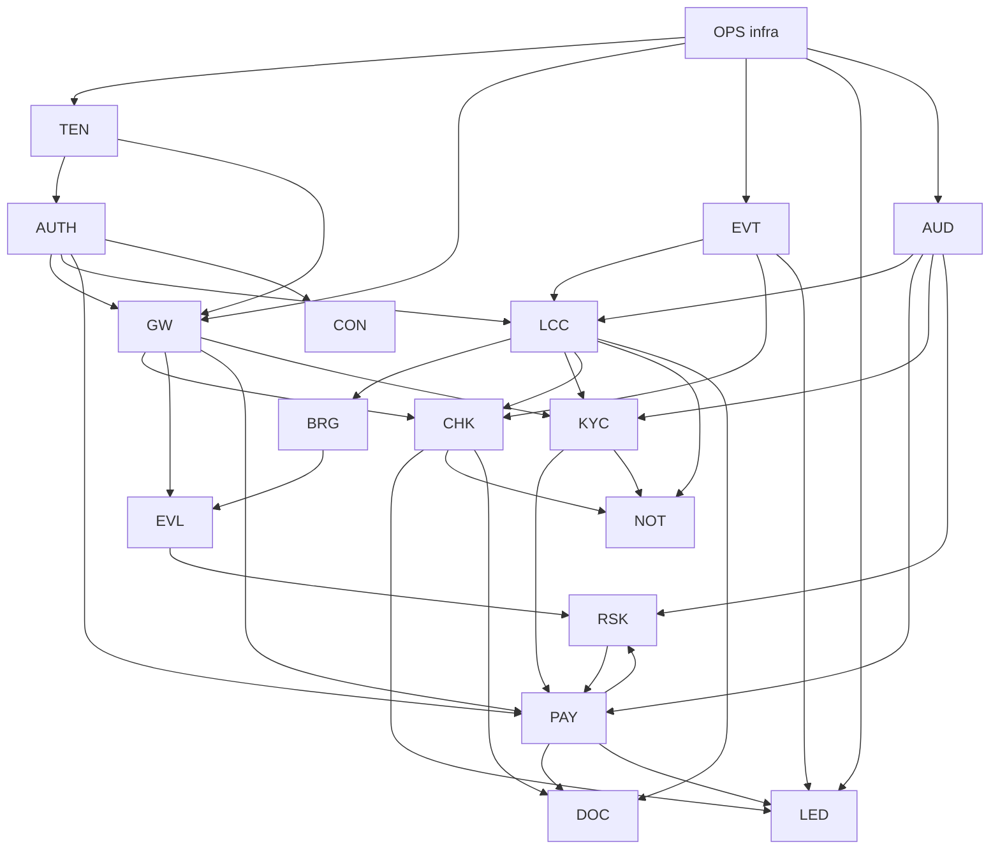

# 99 — Development Phases (the build order)

> **This is the plan the team follows.** Every task below has an
> owner, an estimate, its dependencies (a task never appears
> before its dependencies), and an exit criterion (you can
> tell when it's done). Phases are in strict build order:
> nothing in Phase N needs something unfinished in a later
> phase. The release trains (V1.0 → V1.1 → V2.0 → V3.0, docs/00
> §6) map onto the phases; the anchor tenant (FunderBlu, docs/00
> §3) is the acceptance customer for every money-phase.
>
> **How to navigate:** §2 is the one-page master sequence. §3–§8
> are the phase detail (the task tables). §9 is the team/workstream
> map. §10 the milestones & go/no-go gates. §11 the risk register.
> §12 the definition of done & contract-freeze rules.
>
> **Estimates** are in developer-weeks (1 dev × 1 week), for the
> 4–5 person team (docs/00 §3: BE-1, BE-2, FE-1, FE-2, DevOps,
> + Tech Lead, + FunderBlu stakeholders). Phase durations are
> calendar weeks with 2 BEs + 2 FEs + 1 DevOps running in
> parallel where the dependency graph allows.

---

## 1. Ground rules (binding, from the docs)

1. **The 8 non-negotiables** (docs/00 §8) and the **12 ADRs**
   (docs/01 §3) constrain every task. A task that requires
   breaking one stops and escalates to the Tech Lead + the
   FunderBlu stakeholders — it is not a local decision.
2. **The V1 defaults** (docs/00 §6) hold until a named PRD
   requirement changes them: payout approval = **manual**, an
   open risk case **blocks payouts not purchases**, audit =
   **append-only** (hash chain is *later*, Phase V3), console =
   **separate subdomain + own auth realm**, report API = **no**
   (CSV export), **login-first checkout**, attachments ≤ 10 MB,
   broker = **MT5** (MetaApi, the Week-2 spike outcome per the
   00 register).
3. **Contracts freeze early** (the README convention): the
   OpenAPI + event schemas in `contracts/` are the source of
   truth; code that drifts from them fails CI (docs/04 §6,
   docs/28 §11). A contract change after freeze = the 12-month
   deprecation rule for public surfaces (docs/27 Part A §3.5),
   a versioned additive change for internal ones.
4. **The MetaApi dependency is the #1 schedule risk**
   (docs/00 §7: "sign day 1", docs/08 §16). Phase 0 signs it;
   the demo accounts exist before Phase 1 starts. If the
   MetaApi contract slips, the BRG tasks slip the whole money
   loop — the Tech Lead tracks it weekly.
5. **Every phase ends with a demo on staging with synthetic
   data** (docs/06 §2: staging is synthetic-only — any
   prod-like dataset is a legal event + CON sign-off +
   anonymization, docs/25 §3.7) **and a restore drill** (the
   06 §3.2 monthly duty is live from Phase 0).
6. **Money is never tested with real money before the cutover
   gate** (M2, §10): the payout-rail sandbox (NOWPayments
   test mode, docs/11 §12) is used for all Phase 1 money
   tests.

## 2. The master sequence (one page)

| Phase | Name | Cal. | Release train | Modules (build order inside the phase) | Milestone |
|---|---|---|---|---|---|
| **0** | Foundation | wks 0–4 | pre-V1 | repo+CI+compose (OPS-01..03) → AUTH → TEN → GW+EVT → LED+AUD → OPS full (observability, DR, drill) + **MetaApi signed wks 0–1** + contracts pack v0 frozen | **M0 — the empty platform boots; a tenant can be created; a user can log in; an event flows; the restore drill passes** |
| **1** | The core money loop (V1.0) | wks 5–16 | **V1.0** | LCC → BRG → EVL → RSK(V1) → KYC(L1+L2) → CHK → PAY → NOT → DOC → TD(v1) → ADM(v1) → CON → ANA(v1 dashboard) | **M1 — a trader buys a challenge, funds it, trades on MT5, gets evaluated, breaches or passes, gets paid out — end to end, on synthetic data, manual payout approval** |
| **2** | FunderBlu cutover | wks 17–24 | **V1.1** (MIG) | MIG pipeline (dry run → 14-day parallel → TTS read-only) → cutover → 30-day rollback watch → SUP (the concierge, docs/25 §3.6) | **M2 — FunderBlu's traders are on Alpha One; TTS is read-only; the rollback window is armed** |
| **3** | V1.1 hardening | wks 25–28 | **V1.1** | audit hash chain → no (LATER per 00 §6: pushed to V3 — here: the CON-13/15 review rhythm, the 2-op on all state changes) → ADM/SUP v1.1 polish → the V1.1+ set (19 reqs, docs/00 §6) → load test at 2× V1 (docs/29 §6) | **M3 — the platform is operable unattended for a week (on-call, runbooks, dashboards green)** |
| **4** | V2.0 (breadth) | wks 29–40 | **V2.0** (543 reqs — see §7 for the split) | wave 1: CRM + ANA(v2) + ADM(v2) + CON(v2) + SUP(v2, chat) + CHT → wave 2: CMS (tenant sites) + CMP (competitions) + DOC(v2) → wave 3: MOB (RN) + JRN + EDU + AFF(v2 groundwork) → BIL metering live | **M4 — a tenant can run its whole business on the platform (site, contests, payouts, support, CRM, mobile app)** |
| **5** | V3.0 (ecosystem) | wks 41–52+ | **V3.0** (192 reqs) | wave 1: SDK + DVP (public API, sandbox, portal) → wave 2: TRD (copy, backtest, paper) → wave 3: PLT (capacity/cost governance, multi-region framework) + CS (health, NPS, QBR) + SSO (Authentik) + Lago + BigQuery | **M5 — a third party builds on the platform (the FunderBlu agency's integration is certified); the platform's own governance runs quarterly** |

**The dependency spine** (the critical path, everything else
attaches to it):
`OPS/AUTH/TEN/GW/LED (Ph 0) → LCC/BRG/EVL (Ph 1a) → KYC/CHK/
PAY (Ph 1b) → cutover (Ph 2) → V2 waves (Ph 4) → public API
(Ph 5)`. A slip on the spine slips the milestone; a slip off
the spine (CRM, CMS, MOB…) slips only its wave.

### 2.1 The PRD dependency graph (binding cross-check)

The V1 Execution Sheet's `Depends On` column, transcribed as a
graph (`contracts/diagrams/build-order.md`, rendered PNG alongside).
Arrow = "depends on". This plan is cross-checked against it:

(Condensed to the V1-critical edges; the full transcription — all
modules, all edges, and the in-sheet citation per edge — is in
`contracts/diagrams/build-order.md`.)

**Reconciliation with this plan:**

- **Order respected:** OPS → TEN → AUTH → GW → EVT → LED/AUD all
  land in Phase 0 (0.2–0.9, in that dependency order); `LCC → BRG →
  EVL` is exactly §4a's build order (the sheet's edges say LCC
  before BRG, BRG before EVL); `KYC → PAY` and `LCC → CHK` are
  respected by §4b's KYC → CHK → PAY; NOT/DOC/LED wiring follows
  CHK/PAY as their edges require.
- **Cycles in the sheet (interface pairs):** `LCC ↔ CHK`
  (provisioning consumes `order.paid`; the catalog/price reservation
  needs to exist before purchase) and `PAY ↔ RSK` (RSK-11 payout
  hold consumed by PAY-03; RSK cases link payout context). Both are
  resolved by building against the **frozen V0 contracts** (task
  0.10) — the event schemas and endpoint shapes are locked before
  Phase 1 starts, so each side can build in parallel.
- **The graph's own critical-path note** ("OPS → TEN → AUTH → GW →
  EVT → EVL/BRG → LCC → CHK → PAY → LED") reads EVL/BRG *before*
  LCC — that conflicts with the sheet's own edges (LCC → BRG →
  EVL). **This plan follows the edges**, not the note; the
  discrepancy is recorded as an open question for the PRD owners
  (build-order.md).

## 3. Phase 0 — Foundation (weeks 0–4, pre-V1)

**Goal:** the empty platform boots; a tenant can be created; a
user can log in; an event flows end to end; the DR drill
passes. **Exit = M0** (§10).

| # | Task | Doc §16 | Owner | Est | Depends | Exit criterion |
|---|---|---|---|---|---|---|
| 0.1 | **MetaApi contract signed + demo accounts** (the HIGHEST-RISK dep, docs/00 §7); the MetaApi-vs-Brokeree Week-2 spike resolved (00 §6 default = MT5 via MetaApi poll-only) | 08 §16, 00 §7 | DevOps + FunderBlu stakeholder | wks 0–2 (external) | — | The demo MT5 account trades; the poll reads ticks/deals; the order API places an OCO; `Capabilities()` (08 §1) recorded in the design doc |
| 0.2 | Repo + monorepo layout (Go services, Rust engine, Next.js apps, Node docs-worker — the 01 §2 stack) + CI (GitHub Actions: build, lint (golangci-lint, ESLint), `gitleaks`, dep-scan, test) + environments (dev/staging/prod, docs/06 §1) | 06 §16 | DevOps | 2 wks | — | A PR builds + tests + scans green; the three environments exist (staging = synthetic-only, the 06 §2 rule enforced by the deploy config) |
| 0.3 | Compose stack: PG 16 + PgBouncer (tx) + Redis 7 (AOF) + relay + Hook0 + the Go services' skeletons (the 01 §1's 13 services) + SOPS+age secrets + UFW + Cloudflare origin-auth (the 28 §3.1) | 06 §16, 01 §1, 28 §12 P0 | DevOps | 2 wks | 0.2 | `docker compose up` on a bare Hetzner AX42-class box → all 13 services healthy; the DB/Redis ports are internal-only (the 28 §3.1 check); secrets decrypt at deploy |
| 0.4 | DB foundation: schema v1 (docs/32 §1 conventions: ULIDs, tenant_id, `_cents`, TIMESTAMPTZ, partitioning) + golang-migrate + sqlc codegen + the `isolation.test` property test in CI (the 28 §3.3) | 32, 06 §16, 28 §12 P0 | BE-1 | 1 wk | 0.3 | Migrations run clean on a fresh PG; sqlc generates; the isolation test (query as another tenant = 0 rows) passes for every seeded table |
| 0.5 | **AUTH**: Better Auth (the Phase-0 spike: org plugin, 2d, the 02 §3.1 fallback = own membership table) + PG sessions + Redis deny-set + Argon2id + MFA (TOTP) + refresh single-use + reuse-detection + anomaly scoring (02 §3.6) + API keys (the 02 §3.5) + Cerbos PDP (the `authorizer.Check` interface, the 02 §3.4 fallback) + envelope encryption (the 02 §3.7) + roles (the 02 §3.2) | 02 §16, 28 §12 P1 | BE-1 | 3 wks | 0.3, 0.4 | A user registers (identity), gets the MFA, logs in (the session in PG + Redis), the refresh-reuse fires the revoke-all + CRITICAL (the 02 §3.5), the anomaly score blocks the Tor login (the 02 §3.6), a key with a missing scope gets the 403 (the 02 §3.5), the ABAC denies cross-tenant (the 404-not-403, the 04 posture) |
| 0.6 | **TEN**: the 9-step creation saga (03 §3.1) + tenant config (the per-tenant terms/limits/geo, the 03 §3.1) + domain resolution (custom domain > subdomain > X-Tenant-Id internal, the 04 §3.4 chain) + white-label branding (the 03 §3.2, the R2 tenant prefix) | 03 §16 | BE-1 | 2 wks | 0.5 | `POST /v1/admin/tenants` (the CON's future surface; Phase 0 = a dev script + the CON-less 2-op) → the saga completes (the 9 steps, the 03 §3.1) → the tenant's subdomain resolves → the branding renders (the 03 §3.2) → the tenant's config gates a feature (the Flipt flag, the 01 §2) |
| 0.7 | **GW+EVT**: the GW chain (tenant resolution, auth, ABAC, rate limits, idempotency, payload cap, the error contract, the 04 §3) + the outbox (the PG, the 04 §5.4) + the relay (the single process, the advisory lock, the LastSeq+1 resync, the 04 §5.4) + Redis Streams at-least-once + idempotent consumers (the 04 §5.7) + Hook0 egress (signed webhooks, the retry, the DLQ, the 04 §5.6) + SSE relay (the 01 §4.3) | 04 §16, 28 §12 P2 | BE-1 + BE-2 | 3 wks | 0.5, 0.6 | A request with a bad tenant 404s (the no-oracle); a duplicate idempotency key returns the original (the 04 §3.3); an event written to the outbox flows: PG → relay → Redis Stream → 2 consumers (the idempotent, the 04 §5.7) → the Hook0 delivers a signed webhook (the forged signature 401s, the 28 §2.3 #5); killing the relay and restarting resumes at LastSeq+1 (the no-event-loss, the 04 §5.4) |
| 0.8 | **LED+AUD**: the double-entry ledger (the 05 §9, the `BEFORE UPDATE/DELETE` triggers reject, the 28 §3.3) + the append-only audit (the 05 §9, the critical tier, the fail-closed, the 05 §3.3) + the nightly snapshot + hash (the R2, the 05 §3.5) + the reconciliation job (the 11 §3.5's pre-cursor) | 05 §16, 28 §12 P3 | BE-2 | 2 wks | 0.7 | An unbalanced entry 422s (the 05 §9); a direct UPDATE on `ledger_entries` is rejected by the trigger (the test); a sensitive action (a test admin op) fails when the audit write fails (the fail-closed, the 05 §3.3); the nightly snapshot lands on R2 with the hash (the 05 §3.5) |
| 0.9 | **OPS full**: Prometheus + Grafana (the 01 §2) + Sentry + Uptime Kuma + Loki (the redaction filter, the 28 §3.3) + the WAL backup + daily snapshot + the **monthly restore drill (the RPO ≤ 5-min, the RTO ≤ 2-h, the 06 §3.2 — first drill in week 4)** + the incident runbook skeleton (the 06 §3.3, the P0–P3 ladder, the 21 §3.2) + the egress allowlist (the 28 §3.1, the T5 defense) | 06 §16, 28 §12 P0/P5, 29 §6 | DevOps | 2 wks | 0.3 | The dashboards show the 01 §1's 13 services + the PG/Redis; the first restore drill passes (the RPO/RTO met, the isolation verified post-restore, the 28 §11); an injected failure (kill the PG) follows the runbook (the P0, the 15-min ack, the status update); the egress to an unknown host is blocked (the test) |
| 0.10 | **Contracts pack v0 frozen** (the README convention): `contracts/shared/` (the error envelope, the pagination, the event envelope, the money/id/time schemas) + the V1 modules' OpenAPI (02, 03, 04, 05, 07–15, 17, 21) + the V1 events' JSON Schemas (`contracts/events/`) + the CI gates (the 04 §6 error-registry check, the 31 catalog check, the 32 schema check) | the README, 30/31/32, 28 §11 | Tech Lead + BE-1 | 1 wk | 0.5–0.8 (the shapes) | The CI runs the contract checks on every PR; a code change that breaks a frozen schema fails the build (the test); the pack is tagged `contracts-v0` |

**Phase 0 exit (M0):** all of 0.1–0.10; the staging demo =
"create a tenant, invite a user, log in, watch an event flow
on the dashboard, run the restore drill live."

## 4. Phase 1 — The core money loop (weeks 5–16, V1.0)

**Goal:** the end-to-end money loop on synthetic data.
**Exit = M1** (§10). This is the 137 V1-Core reqs (docs/00
§6) + the V1 defaults.

### 4a — The trading core (weeks 5–9): LCC → BRG → EVL → RSK

| # | Task | Doc | Owner | Est | Depends | Exit criterion |
|---|---|---|---|---|---|---|
| 1.1 | **LCC**: the 14-state machine + the single `Transition()` (the 07 §3.1) + the phase model (challenge/probation/funded, the 07 §3.1) + the activation flow (the 07 §3.2) + the LCC-41 enforcement (the 07 §3.2, the breach → the BRG command) + the terms (the per-tenant, the 07 §3.1) | 07 §16 | BE-1 | 3 wks | 0.7, 0.8 | A synthetic account walks `provisioning → funded → active → breached → closed` (the single Transition, the property test: no path bypasses the machine, the 07 §11); a breach emits `account.breached` (the 31 catalog) + the BRG command (the 1.2's consumer); the LCC-41 (the 07 §3.2) enforces on the synthetic fill |
| 1.2 | **BRG**: the MetaApi connector (poll-only, the 08 §1 binding) + the sync (ticks/deals/positions, the stagger, the 08 §3.2) + the provision (the MT5 account create, the 08 §3.1) + the enforcement commands (the executor, the idempotent, the 08 §3.3) + the `bridge.tick`/`bridge.sync_gap` events + the Capabilities() (the 08 §1) | 08 §16 | BE-2 | 4 wks | 0.1 (MetaApi live), 0.7 | The demo MT5 account's ticks/deals sync ≤ 60 s (the 08 §3.2, the measured); a synthetic trade on the demo account appears as a `bridge.tick`/deal (the 08 §3.2); an enforcement command (the close-all, the 07's) executes on the demo account (the 08 §3.3, the idempotent — the double-send doesn't double-close, the test); a MetaApi outage → `bridge.sync_gap` + the `EVL_TICK_STALE` (the 09's) + no verdict on stale (the 28 §2.3 #6) |
| 1.3 | **EVL**: the Rust service (axum, the ADR-11, the 01 §3) + the `evaluate(state, rules, tick)` pure function (the 09 §1) + the rulepack (versioned, the 09 §3.1) + the verdict (the hash, the recompute, the 09 §3.4) + the drawdowns (daily/overall, the 09 §3.2) + the day boundary (the broker-TZ, the ADR-12, the 01 §3) + the `evaluation.verdict` event | 09 §16 | BE-2 | 3 wks | 1.2 (the ticks) | A synthetic tick sequence produces the expected verdicts (the property test: the recompute = the same hash, the 09 §3.4, the 28 §11); the drawdown breach fires `verdict.breach` (the 31) → the LCC's Transition (the 1.1); the day boundary resets the daily DD at the broker's midnight (the ADR-12, the test with a TZ-shifted broker); the rulepack v1→v2 is additive (the 09 §3.1) |
| 1.4 | **RSK (V1)**: the signal + the case (the 10 §3.1: V1 = the detector output → the human case; the sole V1 action = the **payout hold**, the 10 §3.2) + the detector manifest (the RSK-04/05/06, the 10 §3.3) + the case machine (the 10 §5) | 10 §16 | BE-2 | 2 wks | 1.3 (the verdicts), 0.7 | A synthetic pattern (the RSK-05's copy-pattern on synthetic deals) emits a signal → opens a case → the payout hold blocks a synthetic payout request (the 11's 1.5 consumer, the `PAY_RISK_HOLD`); the case resolves (the 10 §5) → the hold lifts (the 11's eligibility re-checks, the 11 §3.1); the detection runs with zero false-positives on the "clean" synthetic set (the 10 §3.3's baseline) |

### 4b — The money in/out (weeks 9–14): KYC → CHK → PAY

| # | Task | Doc | Owner | Est | Depends | Exit criterion |
|---|---|---|---|---|---|---|
| 1.5 | **KYC**: the L1 (purchase) / L2 (payout) gates (the 13 §1) + the Veriff adapter (the 13 §1, the signed provider, the 00 §7) + the document handling (the R2 per-tenant, the signed URL, the 13 §3.4) + the status machine (the 13 §5) + the reverify (the 13 §3.3, the payout-time) + the `kyc.status_changed` event | 13 §16 | BE-1 | 3 wks | 0.5 (the envelope), 0.3 | A synthetic identity completes the Veriff sandbox flow (the L1) → the gate opens (the 12's 1.6 consumer); a payout attempt without the L2 422s (`PAY_KYC_REQUIRED`, the 11's 1.7); a reverify at payout (the 13 §3.3) passes/fails the synthetic wallet-name match (the V2 note, the 13 §1); a document is stored on R2 (the tenant prefix) and retrieved only via the signed URL (the 5-min TTL, the 13 §3.4) |
| 1.6 | **CHK**: the checkout (login-first, the 00 §6) + the pricing (the frozen price, the 12 §3.2) + the orders + the payment providers (Match2Pay/Interkasa for PK/IN, the NOWPayments, the manual wire — the STRIPE rejected, the 00 §6) + the intent→capture + the `order.paid`/`payments.intent_captured` events + the binding refund machine (the 12 §5) | 12 §16 | BE-1 | 4 wks | 1.5 (the KYC L1 gate), 0.8 (the LED) | A synthetic trader logs in → checks out a challenge (the frozen price, the 12 §3.2) → pays via the NOWPayments test mode → `order.paid` → the LCC's activation (the 1.1) → the LED entries balance (the 05's); a refund (the 12 §5 machine) reverses the LED entries (the 05's reversal, the reason-required); a capture mismatch (the test: the amount differs) → the `CHK_CAPTURE_MISMATCH` (the 12 §6) → the manual review queue (the 17's 1.11) |
| 1.7 | **PAY**: the eligibility (the 16-check, the frozen calc_snapshot, the 11 §3.1–3.2) + the HWM (the 11 §3.2) + the **manual approval + 2FA + two-op** (the 00 §6, the 02 §3.4, the 17 §3.3) + the rails (the NOWPayments crypto, the manual wire, the 11 §3.4) + the method-change cooldown (the 11 §3.3) + the reconciliation (the provider_events, the 11 §3.5) + the `payout.*` events | 11 §16 | BE-1 | 4 wks | 1.6 (the purchase), 1.1 (the account state), 1.4 (the RSK hold), 0.8 (the LED) | A synthetic funded trader who hit the target requests a payout → the eligibility passes (the 16-check, the snapshot frozen) → the manual approval (the 2FA, the two-op, the 17's) → the NOWPayments test transfer → `payout.settled` → the LED (the 05's) + the HWM (the 11 §3.2: the second payout request for the same profit 422s, the property test, the 28 §11); a payout while an RSK hold is open 422s (`PAY_RISK_HOLD`); a method change < 72 h 422s (`PAY_METHOD_CHANGED_RECENTLY`); a failed transfer → the manual (the 18's 1.14 ticket, the no-auto-retry, the 11 §3.5) |
| 1.8 | **NOT**: the channels (in-app, email via Postmark, the 14 §3.1) + the templates (the versioned, the 14 §3.2) + the dedupe (the SETNX 24-h, the 14 §3.5) + the preferences (the 14 §3.2) + the `notification.failed_final` | 14 §16 | BE-2 | 2 wks | 0.7 (the events) | Every V1 event in the 31 catalog that has a consumer=NOT delivers the right template to the right channel (the test matrix); the dedupe blocks the double-send (the 24-h, the 14 §3.5); a Postmark failure → the retry → the `notification.failed_final` (the 14's) + the in-app fallback (the 29 §4); the preferences suppress the opted-out channel (the 14 §3.2) |

### 4c — The surfaces (weeks 12–16): DOC → TD → ADM → CON → ANA

| # | Task | Doc | Owner | Est | Depends | Exit criterion |
|---|---|---|---|---|---|---|
| 1.9 | **DOC**: the Node 22 Puppeteer worker (the 15 §12) + the mappers (frozen snapshots only, the 15 §3.1) + the V1 documents (the account statement, the payout receipt, the challenge certificate) + the R2 storage + the `document.generated` | 15 §16 | FE-2 (the worker) + BE-2 | 2 wks | 1.7 (the payout data), 0.3 | A settled payout generates the receipt PDF (the Puppeteer, the 15 §12) on R2 (the tenant prefix); the certificate (the challenge pass, the 07's) renders with the frozen snapshot (the 15 §3.1 — the test: the document never reads a live table, the CI check); the download is the signed URL (the 15 §3.4) |
| 1.10 | **TD (v1)**: the Next.js 15 trader portal (the 16 §3.1's screen set: login, dashboard, the equity chart (TradingView Lightweight Charts, the 16 §12), the rules, the payout request, the documents, the settings) + the SSE live (the 01 §4.3) | 16 §16 | FE-1 | 4 wks | 1.7, 1.8, 0.7 (the SSE) | The synthetic trader's full journey on the UI: log in → see the live equity (the SSE, the 16 §11) → read the rules (the 09's rulepack, the rendered) → request the payout (the 11's, the 2FA) → download the receipt (the 15's); the 404-not-403 holds on the UI (the cross-tenant URL → the not-found, the test); the Lighthouse/FCP targets (the 16 §11) on the staging box |
| 1.11 | **ADM (v1)**: the Next.js tenant admin (the 17 §3.1: the traders, the accounts, the payouts queue (the approve/process, the 2FA, the two-op), the KYC queue, the documents, the exports (the CSV, the 00 §6)) + the role UI (the 02 §3.2) | 17 §16 | FE-2 | 4 wks | 1.7, 1.10 (the patterns), 0.5 (the roles) | The FunderBlu risk/finance staff (synthetic) approve a payout on the ADM (the 2FA, the two-op, the 17 §3.3) → it settles (the 1.7); the export (the CSV) is the critical audit (the 05 §3.3) + the `AUD_EXPORT_LIMITED` (the 05's) on the bulk; a role without the scope sees 404 (the 02 §3.4, the 404-not-403) |
| 1.12 | **CON (the platform console)**: the separate subdomain + own auth realm (the 00 §6, the 21 §3.1) + the home screen (the 21 §3.1) + the tenant management (the 03's saga surface) + the audit review (the CON-13/15, the 21 §3.3, the 2-op) + the incident control (the CON-15, the 21 §3.2) | 21 §16 | FE-1 + BE-1 | 3 wks | 0.5, 0.6, 0.8 | The platform ops (the `platform:*` roles, the 02 §3.2) create the FunderBlu tenant on the CON (the 03's saga, the 1.0.6's flow) → review the audit (the CON-13, the 21 §3.3, the 2-op) → declare a P0 (the CON-15, the 21 §3.2, the status + the tenant notice); the CON realm is separate (the 00 §6 — a tenant user can't get in, the test) |
| 1.13 | **ANA (v1 dashboard)**: the read models (the `*_ro`, the 19 §3.1, the rebuildable-never-authoritative, the 19 §2) + the V1 dashboard (the 5 blocks, the 19 §3.1) + the `as_of` everywhere (the 19 §2) | 19 §16 | BE-2 | 2 wks | 1.7 (the data), 0.7 | The V1 dashboard (the 19 §3.1's 5 blocks: the accounts, the PnL, the payouts, the purchases, the breaches) renders from the `*_ro` (the 19 §3.1) with the `as_of` (the 19 §2 — the property test: a stale model shows the stale `as_of`, never a silent number, the ANA-14, the 19 §2); a rebuild (the 19 §3.4) reproduces the model from the source (the test) |

**Phase 1 exit (M1):** the M1 demo (§10) — the full synthetic
money loop; the load test at the V1 numbers (the 00 §5, the
29 §6) passes; the contracts pack v1 frozen (the V1 modules'
OpenAPI + events).

## 5. Phase 2 — FunderBlu cutover (weeks 17–24, V1.1/MIG)

**Goal:** FunderBlu's live traders move off TTS onto Alpha One
with a proven rollback. **Exit = M2** (§10). Built now (the
docs/00 commitment: the MIG is V2-phrased in the PRD but the
anchor tenant's cutover *is* V1's business case, docs/25 §1).

| # | Task | Doc | Owner | Est | Depends | Exit criterion |
|---|---|---|---|---|---|---|
| 2.1 | **MIG pipeline**: the 7-step (extract → transform → load → reconcile → verify → cutover → watch, the 25 §3.1) + the **anonymized dry run** (the 25 §3.7, the synthetic staging, the 06 §2) + the **per-row sha256 reconciliation** (the 100%-or-dispositioned gate, the 25 §3.3) | 25 §16 | BE-1 + BE-2 | 3 wks | 1.13 (Ph 1 done), the FunderBlu TTS access | The dry run on the anonymized TTS export: every row either matches (the sha256, the 25 §3.3) or is dispositioned (the manual queue, the 25 §3.3) — the 100% gate (the 25 §3.3) passes on the synthetic set |
| 2.2 | The **14-day parallel run** (the 25 §3.6): TTS stays live, Alpha One mirrors (the read-only, the 25 §3.6) + the concierge (the SUP, the 25 §3.6) + the per-day delta report (the reconciliation, the 25 §3.3) | 25 §16, 18 §16 | BE-1 + FunderBlu stakeholder | 2 wks (calendar, the parallel) | 2.1 | 14 consecutive days: the per-day delta = 0 unexplained (the 25 §3.3); the concierge (the SUP's tickets, the 18's) resolves the FunderBlu staff's questions (the 25 §3.6); the go/no-go = the M2 gate (§10) |
| 2.3 | **Cutover**: the finish-on-TTS (the 25 §3.6: TTS → read-only at the cutover instant, the 25 §3.6) + the KYC reverify-at-payout (the 25 §3.3, the 13 §3.3) + the trader comms (the NOT, the 14's) + the rollback watch (the 30-day, the 25 §3.7: TTS read-only = the rollback source) | 25 §16, 13 §16 | BE-1 + BE-2 + DevOps | 1 wk (the event) + 30-day watch | 2.2 (the go) | The cutover instant: TTS read-only, Alpha One live, the traders' first payout reverified (the 13 §3.3) → settled (the 11's); the 30-day rollback window armed (the TTS read-only snapshot, the 25 §3.7 — the restore-from-TTS runbook rehearsed, the 06 §3.3's class) |
| 2.4 | **SUP (live)**: the in-house Go support (the 18 §1) + the tickets (the 18 §3.1) + the SLA (the 18 §3.3) + the money-linked resolve (the 2FA, the 18 §3.3) + the FunderBlu concierge (the 25 §3.6) | 18 §16 | BE-2 | 2 wks (starts at 2.2) | 1.12 (the patterns), 2.2 | The FunderBlu staff's cutover tickets are triaged (the 18 §3.1), SLA-met (the 18 §3.3), a money-linked resolve (a payout correction, the 11's) gets the 2FA (the 18 §3.3) + the audit (the 05's critical); the ticket → the 2-yr retention (the 18 §3.5) |

**Phase 2 exit (M2):** FunderBlu is live; TTS is read-only;
the 30-day rollback armed; the first real payout settled with
the reverify; the cutover post-mortem (the 06 §3.3, the
blameless).

## 6. Phase 3 — V1.1 hardening (weeks 25–28)

**Goal:** the platform is operable unattended; the V1.1+ set
(19 reqs, docs/00 §6) lands. **Exit = M3** (§10).

| # | Task | Doc | Owner | Est | Depends | Exit criterion |
|---|---|---|---|---|---|---|
| 3.1 | The **CON-13/15 review rhythm** live (the weekly audit review, the 2-op, the 21 §3.3–3.5) + the break-glass (the 21 §3.5, the 2FA) + the on-call rota (the 06 §3.3) | 21 §16, 06 §16 | DevOps + BE-1 | 1 wk | 2.4 | Two consecutive weekly audit reviews completed (the 2-op, the 21 §3.5); a break-glass use is logged + reviewed (the 21 §3.5); the on-call acks a synthetic P1 within 30 min (the 06 §3.3) |
| 3.2 | The **V1.1+ reqs** (the 19, the 00 §6): the named set (the PAY-28 UX formalization, the 11's; the BRG-28 placeholder resolved (the 00 §6: "define/delete before contract freeze") → deleted or spec'd; the 14-proposals triage (the 00 §6, the V2/V3 ones move to Ph 4/5)) | the 00 §6, 11 §16, 08 §16 | Tech Lead | 1 wk | 2.4 | The 19 reqs are either shipped (the named tasks) or explicitly deferred (the 00 §6's deferred list, the CON-adjacent decision, the 21's); BRG-28 is deleted or frozen (the 00 §6) |
| 3.3 | **Load test at 2× V1** (the 29 §6, the k6-class, the 06's CI) + the capacity baseline (the 29 §1.3, the 27 Part C.1's PLT-02 pre-cursor) | 29 §6, 06 §16 | DevOps | 1 wk | 3.1 | The 2× V1 load (the 00 §5's V1 × 2) holds the p95 (the 04 §6's class) + 0 errors (the 04 §6); the Grafana baseline (the 29 §1.3) recorded for the PLT-02 review (the 27 Part C.1) |
| 3.4 | The **first monthly restore drill post-cutover** (the 06 §3.2, now with the real (anonymized-for-staging) shape) + the incident table-top (the 06 §3.3, the 28 §2.3's top-10, a scenario) | 06 §16, 28 §11 | DevOps | 0.5 wk | 3.3 | The drill passes (the RPO/RTO, the 06 §3.2); the table-top (a scenario, the 28 §2.3) → the runbook updated (the 06 §3.3) |
| 3.5 | The **contracts pack v1.1** (the V1.1 additions frozen; the BRG-28 resolution reflected) | the README | Tech Lead | 0.5 wk | 3.2 | The CI gates pass on the v1.1 pack; the tag `contracts-v1.1` |

**Note:** the **audit hash chain** is deliberately **not** in
V1.1 — it is "LATER" per the 00 §6 default (append-only is the
V1 control, the 28 §3.4); it lands in V3 (the §8 wave 3) with
the 05's roadmap.

## 7. Phase 4 — V2.0 breadth (weeks 29–40)

**Goal:** a tenant can run its whole business on the platform.
The V2 train is 543 reqs (docs/00 §6) — the largest. It's
split into **3 waves** by the dependency spine (each wave
independent of the next; the waves can overlap by 1 week).
The V2 reqs per module (from the PRD parse, the session
memory): EVL 52, RSK 50, PAY 48, BRG 46, CHK 46, TEN 45, AUTH
43, LCC 43, NOT 41, ADM 40, OPS 40, KYC 37, SUP 33, DOC 14,
+ CRM 15, CON 33, BIL 21, CMS 15, CMP 17, MIG 8, MOB 8, JRN
8, CHT 7, EDU 9, AFF (V2 groundwork).

### 7.1 Wave 1 (weeks 29–33) — the tenant ops depth

| # | Task | Doc | Owner | Est | Depends | Exit criterion |
|---|---|---|---|---|---|---|
| 4.1 | **CRM (V2)**: the consent (in NOT, the 20 §1) + the computed segments (the `*_ro`-only, the 20 §1) + the RSK-exclusion (the 20 §1) + the campaigns (the 20 §3) | 20 §16 | BE-2 | 3 wks | 1.13 (the `*_ro`), 1.8 (the NOT) | A segment (the 20 §3) is computed over the `traders_ro` (the 19's) → a campaign (the 20 §3) sends via the NOT (the 14's, the consent-checked, the 20 §1); a RSK-flagged trader is excluded (the 20 §1, the test); the CRM decides, the NOT executes (the 20 §1 boundary) |
| 4.2 | **ANA (v2)**: the full read-model set (the 19 §3.1) + the reports (the async, the R2, the 19 §3.3) + the KPIs (the 19 §3.2) + the CSV export (the 00 §6, the no-report-API) | 19 §16 | BE-2 | 3 wks | 4.1, 1.13 | The V2 dashboards (the 19 §3.1) + a report run (the 19 §3.3, the async → the R2 → the download, the 24-h TTL, the 19 §3.3); the `as_of` (the 19 §2) on every number; a rebuild (the 19 §3.4) is byte-identical (the test) |
| 4.3 | **ADM (v2) + CON (v2)**: the ADM's V2 (the 17 §16: the full queues, the audit UI, the settings) + the CON's V2 (the 21 §16: the cross-tenant queue (the CON-25), the recon alerts (the CON-22), the impersonation (the CON-18, the deny-list, the 2FA)) | 17 §16, 21 §16 | FE-2 + FE-1 | 3 wks | 4.2, 1.12 | The ADM's V2 surfaces (the 17 §16) live; the CON-25 cross-tenant queue (the 21 §3.4) shows the tenant queue depths; the CON-18 impersonation (the 21 §3.4) works with the deny-list + the 2FA + the audit (the 05's critical) |
| 4.4 | **SUP (v2) + CHT (V2)**: the chat channel (the CHT = the SUP ticket with the `channel` enum, the 26 Part E §1) + the cursor-sync (the SSE fast path, the 26 Part E §3) + the presence (the honest ephemeral, the Redis, the 26 Part E §3) + the announcements (the CHT-05, the 2FA + preview, the 26 Part E §3) + the Discord bridge (the tenant-owned server, the no-admin bot, the 26 Part E §3) | 18 §16, 26 §16 (Part E) | BE-2 + FE-1 | 3 wks | 4.1, 1.12 | A trader chats (the CHT's channel, the 26 Part E) → the SUP queue (the 18's) with the `channel` + the `seq` (the 26 Part E §1); the cursor-sync (the 26 Part E §3) resumes after a reconnect (the test); an announcement (the CHT-05, the 2FA, the preview, the 26 Part E §3) broadcasts; the Discord bridge (the 26 Part E §3) posts the tenant-approved message (the permission-minimal bot, the 26 Part E §3); a withdrawal is the labeled state, never a delete (the 26 Part E §3) |
| 4.5 | **BIL metering live**: the meter (the 22 §3.1, the funded accounts/payout volume/API/storage/KYC/events) + the invoice (the 22 §3.5, the monthly) + the pass-through (the 22 §3.4, the "at cost + 5%") + the dunning → pause (trading continues) → terminate (the 22 §3.5) | 22 §16 | BE-1 | 3 wks | 4.2 (the meter data), 1.13 | The FunderBlu's first real invoice (the 22 §3.5) reflects the meter (the 22 §3.1) + the pass-through (the 22 §3.4, the MetaApi cost visible, the 08 §1); a dunning (the 22 §3.5) pauses the billing (the trading continues, the 22 §3.5 — the test) but not the trading; a termination (the 22 §3.5) is the CON-adjacent (the 21's) |

### 7.2 Wave 2 (weeks 33–37) — the tenant's front door

| # | Task | Doc | Owner | Est | Depends | Exit criterion |
|---|---|---|---|---|---|---|
| 4.6 | **CMS (V2)**: the constrained block model (the 24 Part A §3) + the Next renderer (the 24 Part A §3) + the legal blocks (the 2FA + version-cited, the 24 Part A §3.4) + the media (the R2 signed-URL, the 24 Part A §3.5) + the lead form (the CMS-07, the 26 Part E §3's CHT-01 route) | 24 §16 (Part A) | FE-1 + BE-1 | 3 wks | 4.5, 1.13 | A tenant publishes a landing page (the 24 Part A §3's blocks) → it renders (the Next renderer, the 24 Part A §3); a legal block change (the 2FA, the version-cite, the 24 Part A §3.4) is audited (the 05's); a lead (the CMS-07, the 26 Part E §3) creates the CRM record (the 20's) + the CHT lead (the 26 Part E) |
| 4.7 | **CMP (V2)**: the `competition` class on the LCC (the 24 Part B §1) + the re-runnable scoring (the pure, the versioned, the 09 §3.4 discipline, the 24 Part B §3.3) + the prizes via the PAY `kind:prize` (the 24 Part B §3) + the pool liability at creation (the 24 Part B §3) + the gamification (never gates money, the 24 Part B §1) | 24 §16 (Part B) | BE-2 + FE-2 | 3 wks | 4.5 (the BIL), 1.7 (the PAY), 1.1 (the LCC) | A competition is created (the pool liability recorded, the 24 Part B §3) → traders enter (the LCC's `competition` class, the 24 Part B §1) → the scoring (the pure, the versioned, the re-runnable, the 24 Part B §3.3 — the re-run = the same result hash, the test) → the prize (the PAY's `kind:prize`, the 24 Part B §3) pays out (the 11's, the manual approval, the 00 §6); the gamification (the 24 Part B §1) never gates a money action (the property test, the 24 Part B §1) |
| 4.8 | **DOC (v2)**: the V2 documents (the competition certificate, the account statements monthly, the e-sign pre-cursor (the Documenso is V3, the 00 §7)) + the mapper additions (the frozen snapshots, the 15 §3.1) | 15 §16 | FE-2 | 2 wks | 4.7, 1.9 | The competition certificate (the 24 Part B's) renders (the 15's, the frozen snapshot, the 15 §3.1); the monthly statement (the 05's data, the 15's) generates for all funded (the async, the 15 §3.2) |

### 7.3 Wave 3 (weeks 37–40) — the trader's second screen

| # | Task | Doc | Owner | Est | Depends | Exit criterion |
|---|---|---|---|---|---|---|
| 4.9 | **MOB (V2)**: the RN app (the 26 Part A §1, the Flutter rejected) consuming the TD's GW API + the SSE (the 26 Part A §1, no new backend) + the biometric (the Better Auth 7-day device token, the biometric never substitutes the server session, the 26 Part A §3) + the push (the NOT `push` adapter, the FCM/APNs, the 26 Part A §3.3) + the Veriff mobile SDK (the 13's) | 26 §16 (Part A) | FE-1 + BE-2 | 4 wks | 4.4 (the NOT push), 1.10 (the API), 1.5 (the Veriff) | The RN app (the 26 Part A) logs in (the biometric = the device token, the 26 Part A §3 — the server session is still the source, the test), sees the live equity (the SSE, the 26 Part A §1), gets the push (the NOT's push adapter, the 26 Part A §3.3, the critical/high defaults), completes the KYC (the Veriff mobile SDK, the 13's); the app is a thin client (the 26 Part A §1 — no new backend, the CI check: the app calls only the TD's GW routes) |
| 4.10 | **JRN (V2)**: the private annotations keyed to the BRG deals (the 26 Part C §1, the `deal_snapshot` frozen at write) + the structural privacy (no staff read path, the **no cross-trader analytics** — the CI property test, the 26 Part C §1) + the zero weight in EVL/RSK (the 26 Part C §1) | 26 §16 (Part C) | FE-2 + BE-2 | 3 wks | 4.9, 1.2 (the BRG deals) | A trader annotates a deal (the 26 Part C) → the `deal_snapshot` is frozen (the 26 Part C §1 — the test: the annotation's data = the snapshot, never the live deal); the privacy property test (the 26 Part C §1: no staff read path, no cross-trader aggregation) passes in CI; the EVL/RSK (the 09/10) never read the JRN (the 26 Part C §1, the CI check) |
| 4.11 | **EDU (V2)**: the CMS-03 block pattern (the 2nd user, the 26 Part D §1) + the R2 signed-URL video (no V2 transcoding, the 26 Part D §3) + the completion honesty (video = self-attested 90%+ended; quiz = server-checked gate, the 26 Part D §3) + the certificates via the DOC `course_certificate` + the QR verify (the 26 Part D §3) + the answer-key server-side (the property test, the 26 Part D §3) | 26 §16 (Part D) | FE-1 + BE-1 | 3 wks | 4.6 (the CMS), 4.8 (the DOC) | A course (the 26 Part D) is authored (the CMS-03 blocks, the 26 Part D §1) → a trader enrolls (the 26 Part D) → the video completion (the self-attested 90%+ended, the 26 Part D §3) + the quiz (the server-checked gate, the 26 Part D §3) → the certificate (the DOC's `course_certificate`, the 26 Part D §3) with the "completed (assessed)" text (the 26 Part D §3) + the QR verify (the 26 Part D §3); the answer-key property test (the 26 Part D §3: the key never in the client bundle) passes |
| 4.12 | **AFF (V2 groundwork)**: the first-party last-touch 30d (the 23 §3.1) + the frozen rate cards (the 23 §3.1) + the reversal-never-delete (the 23 §3.2) + the self-referral detector (the 23 §3.2) + the fraud hold ↔ RSK (the 23 §3.2) + the depth-2 cap (the 23 §3.1) | 23 §16 | BE-2 | 2 wks | 4.1 (the CRM), 1.4 (the RSK) | A referral (the 23 §3.1) attributes last-touch (the 30-d, the 23 §3.1) → the commission (the frozen rate card, the 23 §3.1) posts to the LED (the 05's); a reversal (the 23 §3.2) never deletes (the test); a self-referral (the 23 §3.2) is detected + the fraud hold (the RSK's, the 23 §3.2) blocks the payout (the 11's); the depth-2 cap (the 23 §3.1) rejects the depth-3 (the test) |

**Phase 4 exit (M4):** the M4 demo (§10) — the FunderBlu's
whole business on the platform (the site, a live competition
with a prize payout, the mobile app, the journal, a course,
a referral, the CRM campaign, the BIL invoice); the load test
at the V2 numbers (the 00 §5, the 29 §6).

## 8. Phase 5 — V3.0 ecosystem (weeks 41–52+)

**Goal:** third parties build on the platform; the platform's
own governance runs. The V3 train is 192 reqs (docs/00 §6).
All V3 modules get their design now (the docs/00 commitment)
but **build** in V3. The waves:

### 8.1 Wave 1 (weeks 41–47) — the public surface (SDK + DVP)

| # | Task | Doc | Owner | Est | Depends | Exit criterion |
|---|---|---|---|---|---|---|
| 5.1 | **The public-API foundation** (the 27 Part A §16 step 1–2): the public-subset declaration + the ref indirection (the `public_id_refs`, the 27 Part A §8, the ULID-leak property test) + the keys' public extension (the environment, the scopes, the two secrets, the delegation, the 27 Part A §3.3) + the rate tiers (the SDK-14, the 27 Part A §3.1) | 27 §16 (Part A) | BE-1 | 4 wks | 4.12 (Ph 4 done), 1.13 | A public route returns only the refs (the property test, the 27 Part A §8); a breaking OpenAPI change fails the CI (the 27 Part A §3.5); a delegation (the 27 Part A §3.3) works (the sub-key's scopes ⊆, the parent-revoke cascade, the audit's two-key trail) |
| 5.2 | **The public read APIs + the BYO surface** (the 27 Part A §16 step 3): the accounts/payouts/payments/kyc/trading/accounting/crm (the 27 Part A §3.1) + the **always-manual payout rule** (the 202, the 27 Part A §3.1) + the SDK-12 accounting export (the async, the hash-verifiable, the 27 Part A §3.3) + the SDK-13 CRM sync (the masked PII, the 27 Part A §8) | 27 §16 (Part A) | BE-1 | 4 wks | 5.1 | The FunderBlu agency's integration (the anchor, the 27 Part A §1): their CRM pulls the trader states (the SDK-13, the masked, the 27 Part A §8); their accounting pulls the monthly export (the SDK-12, the hash verified against the 05's snapshot, the 27 Part A §3.3); a payout request via the API lands in the manual queue (the 202, the `api:{key_id}` source, the 27 Part A §3.1) |
| 5.3 | **The webhooks + the sandbox + the certification** (the 27 Part A §16 step 4–5): the Hook0 signed egress (the SDK-02/03, the 27 Part A §3.2) + the DVP-05 simulator (the 27 Part A §3.4) + the SDK-06 injection (the sandbox-only, the 404-on-live, the 27 Part A §1) + the mock server (the Prism, the DVP-18, the 27 Part A §3.4) + the conformance suite (the 50-check, the SDK-10, the 27 Part A §2) + the certification (the badge, the directory, the DVP-13/14, the 27 Part A §3.5) | 27 §16 (Part A) | BE-1 + FE-2 | 4 wks | 5.2, 0.7 (the Hook0) | A developer's full loop (the 27 Part A §16 step 5): sign up → the sandbox tenant (the auto-provisioned, the synthetic broker, the 27 Part A §3.4) → the keys + the webhook endpoint → the injection fires (the handler tested, the 27 Part A §3.4) → the conformance run (the 50 checks, the forged-signature 401s, the 28 §2.3 #5) → the badge (the directory, the DVP-13); the FunderBlu agency certified (the reference, the 27 Part A §2) |
| 5.4 | **The DVP portal** (the 27 Part A §16 step 6): the `web/dvp` (the docs generated, the explorer (Scalar), the usage (the DVP-06), the status (the DVP-07, the Uptime Kuma feed), the changelog (the DVP-08, the subscription), the support (the DVP-17), the directory (the public)) + the GraphQL (the DVP-11, the read projection) + the SSE public (the DVP-12) | 27 §16 (Part A) | FE-2 + BE-1 | 4 wks | 5.3, 1.12 (the patterns) | The FunderBlu agency manages their keys/webhooks/usage on the portal (the 27 Part A §16 step 6); the GraphQL projection = the REST data (the contract test, the 27 Part A §1); the SSE stream (the key-authed, the 10/key cap, the 27 Part A §3.1) delivers the public events |
| 5.5 | **The SDK core + the deprecation machinery** (the 27 Part A §16 step 7): the Go + TS SDK (the generated models, the reference verifier, the idempotent retry, the SDK-16 quickstart, the SDK-17 matrix, the SDK-18 publishing) + the `Deprecation` header + the 410 + the 12-month clock (the 27 Part A §3.5) + the SDK-11 BYO-KYC sync (the `external_accepted` config, the 27 Part A §1) | 27 §16 (Part A) | BE-1 | 3 wks | 5.4, the contracts pack | The SDK quickstart (the 5-minute path, the 27 Part A §16 step 7); the deprecation (the header, the changelog, the 410 after the window, the time-travel test, the 27 Part A §3.5); the SDK-11 (an external KYC status sync, the `source: external`, the config gate, the 27 Part A §1) |

### 8.2 Wave 2 (weeks 47–51) — the advanced trading (TRD)

| # | Task | Doc | Owner | Est | Depends | Exit criterion |
|---|---|---|---|---|---|---|
| 5.6 | **The copy engine + the social feed** (the 27 Part B §16 step 1–2): the leaders (the `trading_leaders`, the opt-in, the 2FA) + the mirror (the MetaApi order on the follower's account, the all-or-nothing, the 60-s stale, the 27 Part B §3.1) + the `copy_engine: platform` flag (the RSK-05 allowlist, the 27 Part B §1) + the social feed (the TRD-02, the public performance, the as_of, the masked PII, the 27 Part B §8) + the tenant curation (the ADM queue, the 2FA) | 27 §16 (Part B) | BE-2 | 5 wks | 5.5, 1.2 (the BRG), 1.3 (the EVL) | A sandbox leader's fill → the follower's mirror (the ≤ 500 ms p95, the 27 Part B §3.1); the slippage/stale skip (the labeled, the audit, the 27 Part B §3.1); the RSK-05 allowlist (the property test: the platform copy doesn't fire, the trader-initiated copy does, the 27 Part B §1); the feed (the as_of present, the no-PII property test, the 27 Part B §10) |
| 5.7 | **The TRD-08 guardrails + the order path + the advanced orders** (the 27 Part B §16 step 3–4): the single order path (the 07 §3.2's posture, the TRD-08 pre-check, the 27 Part B §3.4) + the `algo_guardrails` (the versioned, the 2FA) + the halt (the circuit, the 08 §3.3's pattern, the 27 Part B §9) + the MetaApi advanced orders (the OCO, the trailing, the Capabilities(), the 27 Part B §3.4) | 27 §16 (Part B) | BE-2 + FE-1 | 4 wks | 5.6, 1.1 (the LCC command) | The guardrail reject (the `TRD_TRD08_LIMIT`, the `details.checks[]`, the 27 Part B §8); the halt (the breach → the circuit, the keep/close labeled, the 2FA on the close, the notice, the RSK signal, the audit, the 27 Part B §3.4); the order path is single (the property test: no order bypasses the TRD-08, the 27 Part B §16); the OCO (the TD, the 2FA, the MetaApi execution, the BRG sync, the EVL observed, the 27 Part B §3.4) |
| 5.8 | **The algo API + the backtesting** (the 27 Part B §16 step 5–6): the `trading:write` scope (the Part A's strictest, the 27 Part B §1) + the delegation (the one-level, the 27 Part A §3.3) + the rate limit (the order rate, the 27 Part B §3.4) + the key-halt runbook (the 30-min, the 27 Part B §10) + the 09 engine's historical mode (the `--historical`, the 27 Part B §3.2) + the data (the 13-mo, the labeled window) + the results (the recompute, the 09 §3.4, the disclaimer) | 27 §16 (Part B) | BE-2 + BE-1 | 4 wks | 5.7, 1.3 (the 09 engine) | The algo's order (the SDK, the key, the TRD-08 pre-check, the MetaApi execution, the critical audit, the `api:{key_id}`, the 27 Part B §3.4); the key-compromise drill (the revoke + the cascade + the notice, the 30-min, the 27 Part B §10); a backtest (the platform engine, the 13-mo window, the recompute = the same hash, the property test, the 27 Part B §3.2) + the MT5 backtest (the MetaApi API, the label, the 27 Part B §3.2) |
| 5.9 | **The strategy marketplace + the paper trading** (the 27 Part B §16 step 7–8): the listing (the backtest-verified gate, the 27 Part B §6) + the curation (the ADM, the 2FA) + the subscription (the BIL-adjacent, the 22 §3.4) + the no-guarantee (the ToS, the 27 Part B §1) + the simulation (the no-broker, the synthetic fills, the slippage model, the 27 Part B §3.3) + the "PAPER" badge (the property test: never the funded-badge, the 27 Part B §5) + the no-real-money route (the 403, the 27 Part B §6) + the contest (the 24 Part B's pattern, the zero-cost) | 27 §16 (Part B) | BE-2 + FE-1 | 4 wks | 5.8, 4.7 (the CMP), 4.5 (the BIL) | A strategy listed (the backtest-verified, the mark, the disclaimer, the 27 Part B §16); the no-guarantee (the ToS, the FunderBlu legal sign-off, the 27 Part B §1); a 100-trader paper contest (the zero-cost, the no-MetaApi, the 27 Part B §11; the simulation tick-driven, the virtual balance, the "PAPER" badge property test green, the no-real-money route 403, the 27 Part B §6); the prize (the 24 Part B's pattern, the PAY-class, the real money via the entry fee, the 27 Part B §3.3) |

### 8.3 Wave 3 (weeks 51–52+) — the platform's own governance

| # | Task | Doc | Owner | Est | Depends | Exit criterion |
|---|---|---|---|---|---|---|
| 5.10 | **PLT (V3)**: the cost model (the PLT-03, the per-tenant, the 22 §3.4, the 27 Part C.1 §2) + the capacity review (the PLT-02, the quarterly, the 00 §5's targets → the 29's headroom, the 27 Part C.1 §2) + the incident governance (the PLT-05, the monthly review, the game day, the 27 Part C.1 §2) + the multi-region framework (the PLT-01, the go/no-go, the RTO-trigger, the 27 Part C.1 §2) | 27 §16 (Part C.1) | DevOps + BE-2 | 4 wks | 4.5 (the BIL meter), 3.3 (the capacity baseline) | The FunderBlu's monthly invoice shows their cost (the MetaApi, the infra share, the R2, the 27 Part C.1 §2); the first quarterly capacity review (the decision, the labeled, the audit, the 7-yr, the 27 Part C.1 §2); the game day (the full walk, the cross-team, the post-mortem, the 27 Part C.1 §2); the multi-region framework (the trigger, the cost, the decision, the audit, the 27 Part C.1 §2) |
| 5.11 | **CS (V3)**: the health score (the weekly, the 19's rebuild, the 27 Part C.2 §2) + the NPS (the quarterly, the survey, the 27 Part C.2 §2) + the QBR (the deck, the auto-generated, the DOC's PDF, the 27 Part C.2 §2) + the churn prediction (the V3-late, the trend first, the ML sidecar, the 27 Part C.2 §2) + the concession (the BIL contract, the 2FA, the 27 Part C.2 §3) | 27 §16 (Part C.2) | BE-2 + FE-2 | 4 wks | 5.10, 4.2 (the ANA) | The FunderBlu's health score (the weekly, the CON's surface, the rebuildable, the 27 Part C.2 §2); the first NPS (the quarterly, the 2-person, the 27 Part C.2 §2); the first QBR (the auto-generated deck, the tenant-branded, the decisions, the action items, the 7-yr audit, the 27 Part C.2 §2); the churn-risk (the weekly, the > 70 → the QBR agenda, the human, the 27 Part C.2 §2) |
| 5.12 | **The V3 infra items**: the SSO (the Authentik, the 00 §7's consider-later, the 02 §3.8) + the Lago self-hosted (the BIL V3, the 22 §3.1) + the BigQuery dump (the 19 §3.5, the 00 §7's consider-later) + the **audit hash chain** (the 05's roadmap, the LATER per the 00 §6) + the 2-box scale-out (the 29 §3.2, the read-replica + the stateless horizontal, the PLT-02's decision) | 02 §16, 22 §16, 19 §16, 05 §16, 29 §3 | DevOps + BE-1 | 4 wks | 5.10, 3.3 | A tenant's SSO (the Authentik, the 02 §3.8) works; the Lago (the 22 §3.1) meters + invoices (the 22's); the BigQuery dump (the 19 §3.5, the off-peak) lands; the audit hash chain (the 05's, the LATER) is live + the verify (the 05's); the 2-box (the 29 §3.2) is up (the read-replica serves the `_ro`, the 2-GW/2-relay, the 29 §3.2) |

**Phase 5 exit (M5):** the M5 demo (§10) — a third party
(the FunderBlu agency) is certified and running on the public
API; a copy-trading subscription + a paper contest are live
on synthetic; the first PLT quarterly review + the first CS
QBR are done; the 2-box is the production shape.

## 9. The team & workstream map

The 4–5 person team (docs/00 §3) + Tech Lead + FunderBlu
stakeholders. The workstreams (who owns what, across the
phases):

| Person | Workstream | Owns (the primary) |
|---|---|---|
| **BE-1** | The money + the identity | AUTH (02), TEN (03), GW+EVT (04), LED+AUD (05), KYC (13), CHK (12), PAY (11), the public-API (27 Part A), the SSO/Lago (5.12) |
| **BE-2** | The trading + the breadth | LCC (07), BRG (08), EVL (09), RSK (10), NOT (14), SUP (18), ANA (19), CRM (20), BIL (22), AFF (23), CHT/JRN/EDU backends (26), the TRD (27 Part B), the CS/PLT backends (27 Part C) |
| **FE-1** | The trader + the console | TD (16), CON (21), the CMS renderer (24 Part A), the MOB (26 Part A), the CHT UI (26 Part E), the TRD UI (27 Part B) |
| **FE-2** | The tenant + the documents | ADM (17), DOC worker (15), the CMP UI (24 Part B), the JRN/EDU UI (26 Part C/D), the DVP portal (27 Part A), the CS UI (27 Part C.2) |
| **DevOps** | The infra + the reliability | OPS (06), the MetaApi (0.1, the external), the DR (the 06 §3.2), the load test (the 29 §6), the PLT infra (5.10), the 2-box (5.12) |
| **Tech Lead** | The plan + the contracts + the risk | The 99 (this doc), the contracts pack (the README), the ADRs (the 01 §3), the risk register (§11), the go/no-go (§10), the PRD triage (the 00 §6) |

**Parallelization rules** (from the dependency graph):
- BE-1 and BE-2 are independent after Phase 0 (BE-1 = the
  money/identity, BE-2 = the trading) — they run in parallel
  through Phase 1 (the 4a/4b split is the seam).
- FE-1 and FE-2 are independent once the GW (0.7) is up —
  FE-1 builds the TD/CON, FE-2 builds the ADM/DOC, in
  parallel.
- DevOps is on the critical path in Phase 0 (the infra) and
  at each phase's end (the load test, the drill) — the Tech
  Lead schedules DevOps' phase-end work 1 week ahead.
- The **FunderBlu stakeholder** is needed at: 0.1 (the
  MetaApi sign), 2.2 (the parallel run, the concierge),
  2.3 (the cutover go), 4.5 (the BIL invoice review), 5.5
  (the agency integration, the certification), 5.11 (the
  QBR). The Tech Lead books them 2 weeks ahead.

## 10. The milestones & go/no-go gates

| Gate | When | The demo (staging, synthetic) | The go/no-go checklist (all must be true) |
|---|---|---|---|
| **M0** | end of wk 4 | Create a tenant → invite a user → log in → an event flows (the outbox → relay → Stream → 2 consumers → the signed webhook) → the restore drill (live) | 0.1–0.10 done; the MetaApi demo trades (0.1); the isolation test green (0.4); the RPO/RTO met (0.9); the contracts pack v0 frozen (0.10) |
| **M1** | end of wk 16 | The full money loop: buy (the NOWPayments test) → fund → trade (the demo MT5) → evaluate (the verdict) → breach OR pass → **manual payout approval (the 2FA, the two-op)** → settled (the test rail) → the receipt (the PDF) | 1.1–1.13 done; the HWM property test green (the 28 §11); the load test at V1 (the 00 §5) passes; the `account.breached` → the BRG enforcement works (the 1.1/1.2); the recompute (the 09 §3.4) green; the contracts pack v1 frozen |
| **M2** | end of wk 24 (the cutover) + 30-day watch | FunderBlu's live traders on Alpha One; TTS read-only; the first real payout (the reverified) settled | 2.1–2.4 done; the 14-day parallel delta = 0 unexplained (the 25 §3.3); the KYC reverify-at-payout works (the 25 §3.3); the 30-day rollback armed (the TTS read-only, the 25 §3.7); the FunderBlu stakeholder signs (the 00 §3) |
| **M3** | end of wk 28 | A week of unattended operation: the on-call acks, the dashboards green, the audit reviews done, the load test at 2× V1 | 3.1–3.5 done; the weekly audit reviews × 2 (the 21 §3.3); the 2× V1 load (the 29 §6) holds; the restore drill post-cutover (the 06 §3.2); the V1.1+ set resolved (the 00 §6) |
| **M4** | end of wk 40 | The FunderBlu's whole business: the site (the CMS), a live competition (the prize paid), the mobile app, the journal, a course, a referral, a CRM campaign, the BIL invoice | 4.1–4.12 done; the load test at V2 (the 00 §5) passes; the competition scoring re-runnable (the 27… the 24 Part B §3.3); the BIL invoice reflects the meter (the 22 §3.1); the no-cross-trader JRN property test green (the 26 Part C §1) |
| **M5** | end of wk 52+ | A third party (the FunderBlu agency) certified + running on the public API; a copy subscription + a paper contest live (synthetic); the first PLT quarterly + CS QBR; the 2-box production | 5.1–5.12 done; the conformance suite (the 50-check) green (the 27 Part A §2); the ULID-leak property test green (the 27 Part A §8); the "PAPER" badge property test green (the 27 Part B §5); the 2-box (the 29 §3.2) is production; the multi-region framework (the 27 Part C.1) decided |

## 11. The risk register (top risks, the mitigation, the
owner — updated at each gate)

| # | Risk | Phase | Likelihood | Impact | Mitigation (the doc) | Owner |
|---|---|---|---|---|---|---|
| R1 | **The MetaApi contract/capability slips** (the HIGHEST-RISK dep, the 00 §7) | 0–1 | Med | **Critical** (the whole money loop) | Signed in wk 0–1 (0.1); the Week-2 spike (the 00 §6); the `Capabilities()` recorded (the 08 §1); the fallback = the Brokeree (the 00 §6, the Week-2 decision); the poll-only design (the 08 §1) is the minimum-viable | Tech Lead + DevOps |
| R2 | **The cutover data mismatch** (the TTS → Alpha One) | 2 | Med | **High** (the FunderBlu trust) | The anonymized dry run (the 25 §3.7); the per-row sha256 100%-or-dispositioned (the 25 §3.3); the 14-day parallel (the 25 §3.6); the 30-day rollback (the TTS read-only, the 25 §3.7); the concierge (the 25 §3.6) | BE-1 + FunderBlu |
| R3 | **The payout fraud / the insider** (the T2/T3, the 28 §2.2) | 1+ | Low | **Critical** (the money) | The manual approval + the 2FA + the two-op (the 00 §6, the 02 §3.4, the 17 §3.3); the HWM (the 11 §3.2, the property test); the method-cooldown (the 11 §3.3); the RSK hold (the 10 §3.2); the audit fail-closed (the 05 §3.3); the CON-13/15 review (the 21 §3.3) | BE-1 + DevOps |
| R4 | **The cross-tenant leak** (the A5, the 28 §2.1) | 0+ | Low | **Critical** (the existential) | The structural `tenant_id` (the 01 ADR-1); the sqlc typed (the 01 §2); the 404-not-403 (the 04 §6); the `isolation.test` in CI (the 04 §11, the 28 §3.3); the CON-22 recon alert (the 21 §3.4); the monthly drill verifies (the 28 §11) | BE-1 + DevOps |
| R5 | **The box is a single point of failure** (the A7, the 28 §2.1) | 0+ | Med | **High** (the availability) | The 06 §1's sizing (the 29 §1.2's 2×); the WAL + daily (the 06 §3.2); the monthly restore drill (the RPO/RTO, the 06 §3.2); the 2-box in V3 (the 29 §3.2); the multi-region framework (the 27 Part C.1, the RTO-trigger) | DevOps |
| R6 | **The scope creep into V1** (the 543 V2 reqs pulling early) | 1 | High | Med (the schedule) | The phase gates (the §10); the PRD triage (the 00 §6, the 3.2); the V1 defaults held (the 00 §6); a V2 req in V1 = the Tech Lead's explicit decision (the 99 §1.1) | Tech Lead |
| R7 | **The team is small (4–5) for the breadth** | all | Med | Med (the velocity) | The phase waves (the §7); the parallelization (the §9); the V2 split into 3 waves (the §7); the V3 is the ecosystem (the design-now-build-later, the docs/00); the FunderBlu concierge (the 25 §3.6) absorbs the ops load early | Tech Lead |
| R8 | **The contract rot** (the code drifts from the `contracts/`) | 0+ | Med | Med (the integration) | The CI gates (the 04 §6, the 30/31/32, the 28 §11); the contracts frozen per phase (the §12); the 12-month deprecation (the 27 Part A §3.5) for the public | Tech Lead |
| R9 | **The provider dependency** (the Veriff/NOWPayments/Match2Pay/Postmark outage) | 1+ | Med | Med (the degraded) | The per-provider queue (the 11/12/13/14 §11); the manual fallback (the 11 §3.5, the 12 §1's wire); the in-app fallback (the 14 §3.1); the `*_PROVIDER_UNAVAILABLE` (the 04 §6); the 29 §4 failure map | BE-2 + DevOps |
| R10 | **The V2→V3 compute cost** (the backtest/paper/ML, the 27 Part B) | 5 | Med | Low (the cost) | The off-peak (the 06 §3.3); the 29 §5 cost model (the tenant's vs the platform's); the PLT-02 review (the 27 Part C.1); the 2-box (the 29 §3.2) | DevOps + Tech Lead |

## 12. The definition of done & the contract-freeze rules

**A task is done when** (all of):
1. The code is on `main`, CI green (the build, the lint, the
   test, the `gitleaks`, the dep-scan, the 06's CI).
2. The **contract check** passes (the 04 §6, the 30/31/32
   gates — the code matches the `contracts/` pack).
3. The **exit criterion** (§3–§8) is demonstrable on staging
   (the synthetic data, the 06 §2).
4. The **security** for the task's surface is in place (the
   28 §12's phase mapping — the AUD for the sensitive action,
   the ABAC for the access, the encryption for the PII).
5. The **observability** (the 06 §3.4) — the Grafana panel +
   the Sentry + the log for the task's path.
6. The **docs** — the module doc's §16 row is checked off;
   the PRD req ids (the `MODULE-NN`) are covered (the module
   doc's §1).

**The contract-freeze rules** (the README convention, the
28 §11):
- The `contracts/` pack is the **source of truth**; the code
  is generated/checked against it.
- A **freeze** happens at each milestone (the v0 at M0, the
  v1 at M1, the v1.1 at M3, the v2 at M4, the v3 at M5).
- Between freezes: **additive only** (a new field, a new
  endpoint, a new event) — no breaking change.
- After a freeze: a breaking change on a **public** surface
  = the 12-month deprecation (the 27 Part A §3.5); on an
  **internal** surface = a versioned bump (the 04 §3, the
  `/v2/`).
- The **event schemas** (`contracts/events/`) follow the
  additive-only rule (the 31 catalog, the 04 §5.6); a
  changed/removed field = a new `event_version`.

**The non-negotiable re-check at every gate** (the 00 §8,
the 28 §1): the 8 non-negotiables + the 12 ADRs are re-
verified at M0–M5 (the §10 checklist implicitly); a gate
fails if any is broken.
