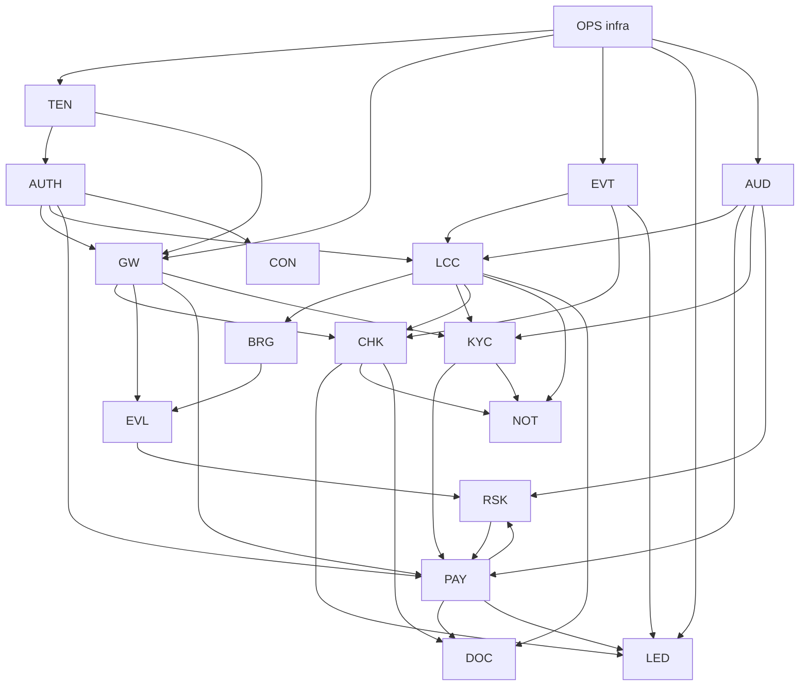

# 99 — Development Phases (the build order)

> **This is the plan the team follows.** Every task below has an
> owner, an estimate, its dependencies (a task never appears
> before its dependencies), and an exit criterion (you can
> tell when it's done). Phases are in strict build order:
> nothing in Phase N needs something unfinished in a later
> phase. The release trains (V1.0 → V1.1 → V2.0 → V3.0, docs/00
> §6) map onto the phases; the anchor tenant (FunderBlu, docs/00
> §3) is the acceptance customer for every money-phase.
>
> **How to navigate:** §2 is the one-page master sequence. §3–§8
> are the phase detail (the task tables). §9 is the team/workstream
> map. §10 the milestones & go/no-go gates. §11 the risk register.
> §12 the definition of done & contract-freeze rules. **Appendix A**
> is the Req-ID-by-phase index (every PRD row lands in exactly one
> phase — the no-confusion list). **Appendix B** is the module
> build-order checklist (entry criteria per module — the no-blockers
> list).
>
> **Estimates** are in developer-weeks (1 dev × 1 week), for the
> 4–5 person team (docs/00 §3: BE-1, BE-2, FE-1, FE-2, DevOps,
> + Tech Lead, + FunderBlu stakeholders). Phase durations are
> calendar weeks with 2 BEs + 2 FEs + 1 DevOps running in
> parallel where the dependency graph allows.
>
> **Scope authority:** all Req-ID counts below are verified against
> `scripts/prd-backlog.json` (1020 PRD rows: 154 V1.0 + 21 V1.1 +
> 630 V2.0 + 214 V3.0 + 1 unassigned — BRG-28, the workbook's open
> placeholder; 2026-09-19). Where a task needs a capability
> the PRD schedules later, the task says so explicitly
> ("doc-defined" or "pulled forward") — scope is never silently
> borrowed from a later train.

---

## 1. Ground rules (binding, from the docs)

1. **The 8 non-negotiables** (docs/00 §8) and the **12 ADRs**
   (docs/01 §3) constrain every task. A task that requires
   breaking one stops and escalates to the Tech Lead + the
   FunderBlu stakeholders — it is not a local decision.
2. **The V1 defaults** (docs/00 §6) hold until a named PRD
   requirement changes them: payout approval = **manual**, an
   open risk case **blocks payouts not purchases**, audit =
   **append-only** (hash chain is *later*, Phase V3), console =
   **separate subdomain + own auth realm**, report API = **no**
   (CSV export), **login-first checkout**, attachments ≤ 10 MB,
   broker = **MT5** (MetaApi, the Week-2 spike outcome per the
   00 register).
3. **Contracts freeze early** (the README convention): the
   OpenAPI + event schemas in `contracts/` are the source of
   truth; code that drifts from them fails CI (docs/04 §6,
   docs/28 §11). A contract change after freeze = the 12-month
   deprecation rule for public surfaces (docs/27 Part A §3.5),
   a versioned additive change for internal ones.
4. **The MetaApi dependency is the #1 schedule risk**
   (docs/00 §7: "sign day 1", docs/08 §16). Phase 0 signs it;
   the demo accounts exist before Phase 1 starts. If the
   MetaApi contract slips, the BRG tasks slip the whole money
   loop — the Tech Lead tracks it weekly.
5. **Every phase ends with a demo on staging with synthetic
   data** (docs/06 §2: staging is synthetic-only — any
   prod-like dataset is a legal event + CON sign-off +
   anonymization, docs/25 §3.7) **and a restore drill** (the
   06 §3.2 monthly duty is live from Phase 0).
6. **Money is never tested with real money before the cutover
   gate** (M2, §10): the payout-rail sandbox (NOWPayments
   test mode, docs/11 §12) is used for all Phase 1 money
   tests.
7. **The PRD backlog is the scope authority.** Appendix A maps
   every PRD Req ID to exactly one phase. A task that needs a
   Req ID scheduled in a later phase is over-scoped: stop,
   descope the task to its own train's IDs, and escalate the
   remainder to the Tech Lead (recorded as a plan deviation, not
   a silent borrow). `scripts/prd-backlog.json` + the
   `--check-only` cross-check are the enforcement.
8. **The V2 owner imbalance is rebalanced at M3, not before.**
   The PRD assigns BE-2 51% of V2.0 (321/630 rows, §9) — that
   does not fit one developer in 12 weeks. The Tech Lead moves
   whole modules (never half a module) at the M3 gate; the
   rebalancing decision is recorded in §9.

## 2. The master sequence (one page)

| Phase | Name | Cal. | Release train (PRD-verified scope) | Modules (build order inside the phase) | Milestone |
|---|---|---|---|---|---|
| **0** | Foundation | wks 0–4 | pre-V1: infra + the V1.0 AUTH(14)/TEN(9)/GW(7)/EVT(7)/LED(7)/AUD(4)/OPS(12) rows | repo+CI+compose (OPS-01..04) → AUTH → TEN → GW+EVT → LED+AUD → OPS full (backups, DR, drill) + **MetaApi signed wks 0–1** + contracts pack v0 frozen | **M0 — the empty platform boots; a tenant can be created; a user can log in; an event flows; the restore drill passes** |
| **1** | The core money loop (V1.0) | wks 5–16 | **V1.0: all 154 rows** (146 P0 + 8 P1; App. A) | LCC → BRG → EVL → RSK(V1: model+opening) → KYC(L1+L2) → CHK → PAY → NOT → DOC → TD(v1) → ADM(v1) → CON → ANA(v1 foundation) | **M1 — a trader buys a challenge, funds it, trades on MT5, gets evaluated, breaches or passes, gets paid out — end to end, on synthetic data, manual payout approval** |
| **2** | FunderBlu cutover | wks 17–24 | **V1.1 safety slice (8 rows)** + **MIG-01/02/04–08 (7 V2.0 rows pulled forward)** | V1.1 safety slice (RSK-11, PAY-04/45, LCC-11, EVL-20, KYC-09/14) → MIG pipeline (dry run → 14-day parallel → TTS read-only) → cutover → 30-day rollback watch → SUP (concierge: SUP-13/15 are V1.1) | **M2 — FunderBlu's traders are on Alpha One; TTS is read-only; the rollback window is armed** |
| **3** | V1.1 hardening | wks 25–28 | **V1.1: remaining 13 rows** (App. A) + CON-13/15 pulled forward | audit review rhythm (CON-13/15, 2-op) → the 13 V1.1 rows (CHK/KYC/PAY/EVL/ANA/AUD/TD) → load test at 2× V1 (docs/29 §6) → restore drill + table-top | **M3 — the platform is operable unattended for a week (on-call, runbooks, dashboards green)** |
| **4** | V2.0 (breadth) | wks 29–40 | **V2.0: 623 rows** (630 − 7 MIG built in Ph 2; App. A) | wave 1: tenant-ops depth (SUP+CHT, CRM, ANA, ADM, CON, NOT, DOC) → wave 2: platform depth (TEN, AUTH, GW, EVT, LED, AUD, OPS) → wave 3: trading depth (LCC, BRG, EVL, RSK, KYC, CHK, PAY, TD) + MOB + JRN + EDU | **M4 — a tenant runs its business on the platform (support, CRM, analytics, mobile app, journal, academy, community chat, full admin + console)** |
| **5** | V3.0 (ecosystem) | wks 41–52+ | **V3.0: all 214 rows** (App. A, incl. PLT-01..08) | wave 1: SDK + DVP (public API, sandbox, portal) + SSO → wave 2: CMS + CMP (sites, competitions) + TRD (copy, backtest, paper) → wave 3: AFF + BIL + CRM depth (money ecosystem) → wave 4: CS + PLT + RSK/ops stragglers | **M5 — a third party builds on the platform (the FunderBlu agency's integration is certified); the platform's own governance runs quarterly** |

**The dependency spine** (the critical path, everything else
attaches to it):
`OPS/AUTH/TEN/GW/LED (Ph 0) → LCC/BRG/EVL (Ph 1a) → KYC/CHK/
PAY (Ph 1b) → cutover (Ph 2) → V2 waves (Ph 4) → public API
(Ph 5)`. A slip on the spine slips the milestone; a slip off
the spine (CRM, CMS, MOB…) slips only its wave.

### 2.1 The PRD dependency graph (binding cross-check)

The V1 Execution Sheet's `Depends On` column, transcribed as a
graph (`contracts/diagrams/build-order.md`, rendered PNG alongside).
Arrow = "depends on". This plan is cross-checked against it:

(Condensed to the V1-critical edges; the full transcription — all
modules, all edges, and the in-sheet citation per edge — is in
`contracts/diagrams/build-order.md`.)

**Reconciliation with this plan:**

- **Order respected:** OPS → TEN → AUTH → GW → EVT → LED/AUD all
  land in Phase 0 (0.2–0.9, in that dependency order); `LCC → BRG →
  EVL` is exactly §4a's build order (the sheet's edges say LCC
  before BRG, BRG before EVL); `KYC → PAY` and `LCC → CHK` are
  respected by §4b's KYC → CHK → PAY; NOT/DOC/LED wiring follows
  CHK/PAY as their edges require.
- **Cycles in the sheet (interface pairs):** `LCC ↔ CHK`
  (provisioning consumes `order.paid`; the catalog/price reservation
  needs to exist before purchase) and `PAY ↔ RSK` (RSK-11 payout
  hold consumed by PAY-03; RSK cases link payout context). Both are
  resolved by building against the **frozen V0 contracts** (task
  0.10) — the event schemas and endpoint shapes are locked before
  Phase 1 starts, so each side can build in parallel.
- **The graph's own critical-path note** ("OPS → TEN → AUTH → GW →
  EVT → EVL/BRG → LCC → CHK → PAY → LED") reads EVL/BRG *before*
  LCC — that conflicts with the sheet's own edges (LCC → BRG →
  EVL). **This plan follows the edges**, not the note; the
  discrepancy is recorded as an open question for the PRD owners
  (build-order.md).

## 3. Phase 0 — Foundation (weeks 0–4, pre-V1)

**Goal:** the empty platform boots; a tenant can be created; a
user can log in; an event flows end to end; the DR drill
passes. **Exit = M0** (§10). PRD scope: the V1.0 rows of
AUTH(14), TEN(9), GW(7), EVT(7), LED(7), AUD(4), OPS(12) —
Appendix A lists every ID.

| # | Task | Doc §16 | Owner | Est | Depends | Exit criterion |
|---|---|---|---|---|---|---|
| 0.1 | **MetaApi contract signed + demo accounts** (the HIGHEST-RISK dep, docs/00 §7); the MetaApi-vs-Brokeree Week-2 spike resolved (00 §6 default = MT5 via MetaApi — **streaming ingest per D78**, docs/63; the spike also answers docs/63 §8 Q1–Q5: position-symbol price push, region latency, sidecar RSS/account, G2 + `reliability` choice, and captures the `packetLogger` fixture corpus) | 08 §16, 00 §7 | DevOps + FunderBlu stakeholder | wks 0–2 (external) | — | The demo MT5 account trades; the stream (and the REST fallback) reads equity/positions/deals; the order API places an OCO; `Capabilities()` (08 §1) recorded in the design doc |
| 0.2 | Repo + monorepo layout (Go services, Rust engine, Next.js apps, Node docs-worker — the 01 §2 stack) + CI (GitHub Actions: build, lint (golangci-lint, ESLint), `gitleaks`, dep-scan, test) + environments (dev/staging/prod, docs/06 §1) | 06 §16 | DevOps | 2 wks | — | A PR builds + tests + scans green; the three environments exist (staging = synthetic-only, the 06 §2 rule enforced by the deploy config) |
| 0.3 | Compose stack: PG 16 + PgBouncer (tx) + Redis 7 (AOF) + relay + Hook0 + the Go services' skeletons (the 01 §1's 13 services) + SOPS+age secrets + UFW + Cloudflare origin-auth (the 28 §3.1) | 06 §16, 01 §1, 28 §12 P0 | DevOps | 2 wks | 0.2 | `docker compose up` on a bare Hetzner AX42-class box → all 13 services healthy; the DB/Redis ports are internal-only (the 28 §3.1 check); secrets decrypt at deploy |
| 0.4 | DB foundation: schema v1 (docs/32 §1 conventions: ULIDs, tenant_id, `_cents`, TIMESTAMPTZ, partitioning) + golang-migrate + sqlc codegen + the `isolation.test` property test in CI (the 28 §3.3) | 32, 06 §16, 28 §12 P0 | BE-1 | 1 wk | 0.3 | Migrations run clean on a fresh PG; sqlc generates; the isolation test (query as another tenant = 0 rows) passes for every seeded table |
| 0.5 | **AUTH (V1.0 = the 14 rows: AUTH-01/04/05/07/09/12/13/15/16/17/20/39/40/43 + the promoted AUTH-11/24/25/28/29)**: stand up **ZITADEL** (Compose service, own DB; ADR-13) → org-per-tenant provisioning, hosted-login hand-off from the web tier, token verification (JWKS, audience per realm), credential/password/2FA/lockout policies per org, staff 2FA enforced on the `amr` claim (AUTH-09) with our backup codes (AUTH-11), SSO for the cutover tenant (AUTH-24) and SCIM users (AUTH-25), suspension/unsuspend mirrored to ZITADEL (AUTH-20/43) + Redis deny-set + `auth_sessions` projection (AUTH-07/39), **Casbin** embedded policy model (ADR-14) + role catalog + tenant scoping + super-admin audience separation (AUTH-12/13/15/16), **Postgres RLS** on tenant-owned tables (D3). **Not V1.0** (do not build): trader 2FA (AUTH-10, V2), email verification UX (AUTH-02/41, V2), tenant API keys (AUTH-21, V2), login throttling/history (AUTH-18/19, V2) — HIBP + reuse detection + anomaly scoring are doc-defined hardening inside the V1 rows' exit tests | 02 §16, 28 §12 P1, docs/41 §10 | BE-1 | 4 wks | 0.3, 0.4 | A trader registers on the tenant subdomain (redirected to the tenant's ZITADEL org), staff enrolls 2FA and logs in (token verified over JWKS, session projected + deny-set), logout revokes immediately (AUTH-39), password change requires the current password (AUTH-40), a suspended user is denied and an unsuspend restores with audit (AUTH-20/43), a role with a missing permission gets the 403 (AUTH-12/13), Casbin denies the cross-tenant read (404-not-403, 04 posture), the console token is rejected by tenant routes (AUTH-16), the SSO tenant signs in through its IdP (AUTH-24) |
| 0.6 | **TEN (V1.0 = the 9 rows: TEN-01/02/03/08/11/12/15/18/42)**: tenant record + creation flow (the doc-defined 9-step saga shape, 03 §3.1) + tenant resolution (custom domain > subdomain > X-Tenant-Id internal, the 04 §3.4 chain) + subdomain reservation + tenant-scoped data access + entitlements + integration config + secrets handling + suspension cascade + storage scoping (R2 tenant prefix). **Not V1.0:** white-label branding (TEN-04, V2) | 03 §16 | BE-1 | 2 wks | 0.5 | `POST /v1/admin/tenants` (the CON's future surface; Phase 0 = a dev script + the CON-less 2-op) → the tenant record + config + storage prefix exist (TEN-01/11/12/18) → the tenant's subdomain resolves (TEN-02/42) → tenant-scoped queries return 0 cross-tenant rows (TEN-03) → suspension cascades (TEN-15) → an entitlement gates a feature (TEN-08) |
| 0.7 | **GW+EVT (V1.0 = GW-01/02/03/04/05/12/18 + EVT-01/02/03/05/08/10/20)**: the GW chain (single entry point, tenant resolution, auth, ABAC, rate limits, idempotency, the error contract, the 04 §3) + the outbox (the PG, the 04 §5.4) + the relay (the single process, the advisory lock, the LastSeq+1 resync, the 04 §5.4) + Redis Streams at-least-once + idempotent consumers (the 04 §5.7) + the append-only event log + inbound webhook verification + command queue separation + Hook0 egress (signed webhooks, the retry, the DLQ, the 04 §5.6) + SSE relay (the 01 §4.3) | 04 §16, 28 §12 P2 | BE-1 + BE-2 | 3 wks | 0.5, 0.6 | A request with a bad tenant 404s (the no-oracle); a duplicate idempotency key returns the original (the 04 §3.3); an event written to the outbox flows: PG → relay → Redis Stream → 2 consumers (the idempotent, the 04 §5.7) → the Hook0 delivers a signed webhook (the forged signature 401s, the 28 §2.3 #5); killing the relay and restarting resumes at LastSeq+1 (the no-event-loss, the 04 §5.4) |
| 0.8 | **LED+AUD (V1.0 = LED-01/02/03/04/07/08/18 + AUD-01/03/04/21)**: the double-entry ledger (chart of accounts, entry model, idempotent posting, capture/payout postings, the `BEFORE UPDATE/DELETE` triggers reject, the 05 §9, the 28 §3.3) + the append-only audit (event schema, single service API, append-only storage, the critical tier, the fail-closed, the 05 §3.3, access/export audit). The nightly snapshot + hash to R2 (05 §3.5) is doc-defined ops practice inside this task, not a PRD row | 05 §16, 28 §12 P3 | BE-2 | 2 wks | 0.7 | An unbalanced entry 422s (the 05 §9); a direct UPDATE on `ledger_entries` is rejected by the trigger (the test); a sensitive action (a test admin op) fails when the audit write fails (the fail-closed, the 05 §3.3); the nightly snapshot lands on R2 with the hash (the 05 §3.5) |
| 0.9 | **OPS (V1.0 = OPS-01/02/03/04/06/07/09/25/26/36/37/38)**: containerization + Compose + CI/CD pipelines + migrations + PG backups + secrets (SOPS+age) + PgBouncer + Redis durability + image registry + resource limits + host capacity plan + backup-integrity verification + the **monthly restore drill (the RPO ≤ 5-min, the RTO ≤ 2-h, the 06 §3.2 — first drill in week 4)** + `/healthz` per service + Sentry SDKs day 1 (docs/34 §9) + the incident runbook skeleton (the 06 §3.3, the P0–P3 ladder, the 21 §3.2) + the egress allowlist (the 28 §3.1, the T5 defense). **Not V1.0:** the observability stack + business dashboards (OPS-10/12, V2 — Phase 4 wave 2; external uptime + dead-man switches moved INTO V1 by D57, docs/57) | 06 §16, 28 §12 P0/P5, 29 §6 | DevOps | 2 wks | 0.3 | The health endpoints + Sentry show the 01 §1's 13 services + the PG/Redis; the first restore drill passes (the RPO/RTO met, the isolation verified post-restore, the 28 §11); an injected failure (kill the PG) follows the runbook (the P0, the 15-min ack, the status update); the egress to an unknown host is blocked (the test) |
| 0.10 | **Contracts pack v0 frozen** (the README convention): `contracts/shared/` (the error envelope, the pagination, the event envelope, the money/id/time schemas) + the V1 modules' OpenAPI (02, 03, 04, 05, 07–15, 17, 21) + the V1 events' JSON Schemas (`contracts/events/`) + the CI gates (the 04 §6 error-registry check, the 31 catalog check, the 32 schema check, **the `scripts/check_event_payloads.py` payload gate** — every catalog event must have a `payloads/<Event>.v1.json` with a matching `type` const and no float-typed money field, added 2026-09-20) | the README, 30/31/32, 28 §11 | Tech Lead + BE-1 | 1 wk | 0.5–0.8 (the shapes) | The CI runs the contract checks on every PR; a code change that breaks a frozen schema fails the build (the test); the pack is tagged `contracts-v0` |

**Phase 0 exit (M0):** all of 0.1–0.10; the staging demo =
"create a tenant, invite a user, log in, watch an event flow
on the dashboard, run the restore drill live."

**Phase-0 gates added by the docs/42 identity review (2026-09-19)** — all five are
inside task 0.5/0.9 and must be *recorded* (docs/34 §9 checklist) before M0:

1. **Org-scope behaviour check** — reproduce ZITADEL issue #11869 with a multi-org test
   user on the pinned version; the result decides whether the `urn:…:org:id:` scope can
   be used for staff-grant scenarios or only for home-org users (docs/02 §3.1).
2. **Staff-MFA `amr` check** — confirm the hosted-login access token carries the TOTP
   factor (`amr`/`auth_time`) and that `POST /v2/users/{id}/totp` binds the factor when
   called with the *user's own* token (docs/02 §3.2). Failing this escalates to the
   custom-login-UI trade-off (docs/41 §4.1) — a scope decision, not a silent workaround.
3. **IdP backup/restore rehearsal** — restore the `zitadel` database into a scratch
   instance, log in against it, and verify the master key is stored separately from the
   dump (docs/06 §2.4).
4. **Password-import dry run** — import a sample of TTS-shaped hashes through
   `ImportHumanUser` to confirm the verifier configuration works before the cutover gate
   commits to posture A or B (docs/25 §3.5, decision D7).
5. **DPO review** — the residual-PII limitation in ZITADEL's event stream (upstream
   #7811) is reviewed and either accepted in writing or mitigated (docs/02 §10.4,
   decision D9).

The second-pass review artifact is `docs/42-auth-ten-gap-analysis.md` (G1–G20); the
requirement-coverage impact is limited to V1 design detail — **no PRD workbook row was
changed** (the promotions were already recorded in docs/37).

**Phase-0 gates added by the deprovisioning design (docs/43, 2026-09-19)** — recorded in
docs/34 §9 alongside the five above:

6. **Token-lifetime enforcement** — the instance OIDC settings are set to 900 s
   access/ID and read back, and the access token's session claim is identified so
   session termination can be keyed on it (docs/02 §3.2, docs/43 §6). Without this the
   pipeline's worst-case bound is 12 h, not 15 min.
7. **`idp-sync` end-to-end** — poll the event log from a sequence cursor on the pinned
   version, diff the live event-type list against docs/43 §4, prove duplicate
   suppression, and run the kill-the-worker drill (page < 5 min, catch-up exact).
8. **Self-delete posture** — no `user.self.delete`-capable role grants present, or a
   written DPO acceptance on file (decision D12, docs/43 §8).

**Gates added by the fourth-pass review (docs/44, 2026-09-19)** — recorded in docs/34 §9:

9. **Authorization set is complete and fail-closed** — `contracts/permissions/roles.yaml`
   seeded into `casbin_rule` by migration, `scripts/verify_roles.py` green in CI
   (YAML ⇄ seed ⇄ rendered tables, `inherits` expanded), and a boot with an empty or
   unloadable rule set denies every route and raises the SEV-1 alert (docs/44 §4).
10. **Identity-link resolution** — one identity across two orgs resolves through
    `identity_idp_links` in both directions (login + `idp-sync`), no overwrite of the
    other org's `idp_user_id`, and the `SECURITY DEFINER` accessors are the only
    context-free reads (docs/44 §3/§5).
11. **DB principals** — `app_rw` / `app_platform` / `migrator` exist with the §5 grants;
    the negative suite proves `app_rw` sees zero rows without context (console sessions
    included) while `app_platform` works and is the only role that does (docs/44 §5).

**Gates added by the fifth-pass review (docs/45, 2026-09-19)** — recorded in docs/34 §9:

12. **Per-tenant audience binding** — a token minted for tenant A is refused on tenant B's
    host (`auth.tenant_mismatch`), the `auth_sessions` row carries the resolved tenant, and
    the audience check runs before any membership read (docs/02 §3.2, decision D19).
13. **Route → permission coverage** — every V1 operation in `contracts/*.openapi.yaml`
    declares a registry key bound in `roles.yaml` or an explicit `self`/`none` marker, and
    `scripts/verify_roles.py` fails the build when one does not (review G41).
14. **Step-up freshness** — `payout.approve` with an `auth_time` older than 5 min returns
    403 `authz.step_up_required`, and the hosted re-auth (`prompt=login&max_age=300`) then
    succeeds (docs/02 §3.2, decision D23).

**Gates added by the sixth-pass consolidation (docs/46, 2026-09-19)** — recorded in docs/34 §9:

15. **Authorization views are render-fresh** — `contracts/permissions/matrix.md` (the role ×
    key matrix, the key → holders detail, the V1 route → permission → authorized-roles map)
    regenerates byte-identical from `contracts/permissions/roles.yaml` + the registry V1
    table + the `x-phase: V1` operations via `scripts/verify_roles.py --write-matrix`; the
    check mode fails the build on drift (docs/46 §11).

**Gates added by the seventh-pass consolidation (docs/47, 2026-09-19)** — recorded in docs/34 §9:

16. **Tenant state matrix is machine-fresh** — `contracts/tenants/state-capabilities.yaml`
    (the state × capability matrix, the docs/35 I-20 test source) renders byte-identical
    into docs/03 §5.1 via `scripts/verify_tenant_states.py`, every matrix state exists in
    the `tenants.status` DDL, and every blocked cell's code is registered in
    `contracts/errors/taxonomy.md`; the check mode fails the build on drift (docs/47 §11).

**Gates added by the eighth-pass review (docs/48, 2026-09-19)** — recorded in docs/34 §9:

17. **Journal invariants are commit-enforced** — the deferred constraint trigger rejects
    unbalanced or mixed-currency entries at COMMIT (property test over randomized line
    sets passes), immutability triggers + INSERT-only privileges hold for the app role,
    the ledger-applier replays the same event idempotently (same `idempotency_key` → one
    entry), and a deliberately unbalanced post rolls the business transaction back with
    `led.entry_unbalanced` (docs/48 §5, decisions D25–D27).

The third-pass design artifact is `docs/43-idp-deprovisioning.md` (decisions D10–D12) and
the fourth-pass artifact is `docs/44-auth-multitenancy-review.md` (G21–G33, decisions
D13–D18) and the fifth-pass artifact is `docs/45-auth-contract-hardening.md` (G34–G45,
decisions D19–D24) and the sixth-pass artifact is `docs/46-authorization-model.md` (the
consolidated authorization specification, findings A1–A4), the seventh-pass artifact is
`docs/47-multi-tenancy-model.md` (the consolidated multi-tenancy specification, findings
M1–M10, owner decisions W/U/D recorded in its §15) and the eighth-pass artifact is
`docs/48-ledger-audit-review.md` (the LED + AUD deep review, findings F1–F10, owner
decisions D25–D27) the ninth-pass artifact is `docs/49-chain-review-ledger-audit-oss.md`
(the four-domain chain review — findings C1/C2, the required event `correlation_id` — and
the LED/AUD open-source evaluation with the V2 hash-chain design rules), the tenth-pass
artifact is `docs/50-evl-lcc-review.md` (the trading-core review — decisions D28–D31: the
Phase-1 five events in the V1 catalog, guarded breach-reversal edges, expiry-as-breach,
suspension-freezes-everything — plus F13 surfaced for the next pass), the eleventh-pass
artifact is `docs/51-brg-review.md` (the trading-bridge review — decisions D33–D36: history-window
gap detection, the full bridge.tick shape, BRG-owned account_snapshots, worker-internal sync —
and `bridge.sync_gap` joining the V1 catalog), the twelfth-pass artifact is `docs/52-pay-review.md`
(the payout review — D32 answered: the FUNDED breach edge + hold-flag queue; D37–D39: no V1 request
event, reserves as visibility-only, re-check-failure pins; the PAY-13 machine reconciled everywhere),
the thirteenth-pass artifact is `docs/53-chk-kyc-review.md` (money-in + gates — D40–D44: minimal
manual refunds, wire to V2, order-at-submit + checkout_sessions DDL, KYC edges pinned, no V1 purchase
gate; the workbook itself used as the citation oracle), and the fourteenth-pass artifact is
`docs/54-gw-evt-review.md` (the spine — D45–D47: the success envelope binding, the GW-01 groups as the
URL plan, the V1 relay dlq subcommand; all gateway/event contract TODOs resolved), and the gateway solution
specification `docs/55-gw-solution-spec.md` (the developer-facing
how-to-build for the eleven chain steps of docs/04 §3.1 — per-step
algorithms, caches, degradation contracts, latency budgets, tests and the
SOL-01…SOL-20 register, with SOL-04/06/07 ratified 2026-09-20 as D48–D50); implementation-level only), and the fifteenth-pass artifact is
`docs/56-ops-review.md` (the platform under everything — OPS/DevOps: D51 the
three-container Redis topology, D52 gw.maintenance + the degraded header rule,
D53 dual-approval migration PRs, D54 the Hook0/minimal-metrics V1 tier split;
the ops signals registered in the event catalog, the ops-platform tables given
their DDL, the ops contract's stale TODOs resolved), and the sixteenth-pass artifact is
`docs/57-ops-industry-benchmark.md` (OPS benchmarked against industry
practice — D55 pgBackRest + 3-2-1 off-provider copies, D56 the warm standby
host (promote ≤ 15 min), D57 external uptime + dead-man switches in V1,
D58 two-replica rolling deploys, D59 weekly automated restore verification),
and the seventeenth-pass artifact is `docs/58-not-doc-review.md` (NOT + DOC —
messages and paper: D60 the settlement event is `payout.settled`, D61 the
14-template V1 set with every trigger registered and every reserve named,
D62 no KYC invite email in V1, D63 expiry silent; the signed-URL endpoint in
the V1 baseline, D45 shapes in the DOC contract, ten contract questions
resolved), and the eighteenth-pass artifact is `docs/59-surfaces-review.md`
(the four surface modules TD/ADM/CON/ANA: D64 dual transport — browser
surfaces on the HttpOnly session cookie with the origin check in the GW
chain, machines keep the bearer JWT; D65 the risk-case spine events promoted
to V1 for the ADM risk queue; D66 the realm idle carve-out — traders 30,
staff + console 15; D67 the admin panel on the tenant host under /admin;
plus the pre-D45 envelope, the un-prefixed trader paths, the PAY-44 tier,
the step-up code, the ops.* topic, the ANA-32 tier and feed names, and 12
contract questions resolved), and the nineteenth-pass artifact is
`docs/60-rsk-review.md` (RSK — the last Phase-1 core module: D68 the breach
auto-open is V1.0 with the dormant payout_hold flag, the PAY-04 interlock
bites from V1.1; D69 the error namespace unified on risk.*; D70 case
decisions always carry the 2FA step-up; D71 one open case per account,
app-enforced under a per-trader advisory lock; plus the V1 baseline gained
the queue reads + the decide endpoint, the AccountBreached consumer wiring,
the payload parity rebuild, and all 10 contract TODOs resolved), and the
twentieth-pass artifact is `docs/61-freeze-audit.md` (the cross-cutting
freeze audit — docs/28 Security + 29 Scalability + 35 Testing: **zero new
decisions** — every finding was binding text not yet propagated: the D51
three-Redis / D55 pgBackRest / D56 standby / D57 external-monitor facts
synced into docs/28/29, the 30+ pre-restructure `02 §3.x` citation refs
re-pointed to the real sections, `audit_log` → `audit_events`, three legacy
uppercase error codes lowercased, the `payments.*` alias family retired in
docs/07/23/24/27/99, the `isolation.test` suite given its true home
(01 ADR-1 / 28 §3.3 / 35 I-01), and docs/35 gained the decision-coverage
test hooks for D64/D66/D68/D70/D71), and the twenty-first-pass artifact is
`docs/62-contract-todo-sweep.md` (the contract-TODO backlog: all 53 open
owner-questions closed — 49 by citation, 4 decided: D72 the closed
payout-ineligible sub-reason enum, D73 the confirm-once method flow,
D74 ops-runbook credential delivery in V1, D75 the coupon/add-on/numbering
shapes — the contract pack is now TODO-free);
like docs/42
these change V1 design detail only — **no PRD workbook row was
changed**.

## 4. Phase 1 — The core money loop (weeks 5–16, V1.0)

**Goal:** the end-to-end money loop on synthetic data.
**Exit = M1** (§10). This is the 154 V1.0 reqs (docs/00
§6: 146 P0 + 8 P1) + the V1 defaults — Appendix A lists every ID.

### 4a — The trading core (weeks 5–9): LCC → BRG → EVL → RSK

| # | Task | Doc | Owner | Est | Depends | Exit criterion |
|---|---|---|---|---|---|---|
| 1.1 | **LCC (V1.0 = the 12 rows: LCC-01/02/03/05/06/07/20/23/27/41/43/44)**: the TradingAccount aggregate + the state machine (the single `Transition()`, the 07 §3.1) + state history/audit + provisioning on purchase + on phase pass + KYC-gated funding + payout terms at funding + lifecycle events + terminal cleanup + **double-enforcement prevention (LCC-41)** + breach-decision idempotency key + partial-enforcement/confirm state | 07 §16 | BE-1 | 3 wks | 0.7, 0.8 | A synthetic account walks `provisioning → funded → active → breached → closed` (the single Transition, the property test: no path bypasses the machine, the 07 §11); a breach emits `account.breached` (the 31 catalog) + the BRG command (the 1.2's consumer); the double-breach fires once (LCC-41/43: the second decision with the same idempotency key is a no-op, the test); a partial enforcement confirms per position (LCC-44) |
| 1.2 | **BRG (V1.0 = the 13 rows: BRG-01/02/05/06/07/08/09/10/11/12/14/43/44)**: the capability interface (BRG-01) + the MetaApi MT5 adapter (**streaming primary via the `bridge-stream` SDK sidecar + credit-budgeted fallback poll** — D77/D78, docs/63; BRG-21 pulled forward from V3) + the conflator/group-commit/doorbell hot path (D79) + account creation + credential storage/delivery + balance/equity sync + position/trade sync (the stagger, the 08 §3.2) + on-demand sync + enforcement execution + command confirmation + leverage/group config + enable/disable trading + the adapter contract-test suite + credential encryption/rotation | 08 §16 | BE-1 | 4 wks | 0.1 (MetaApi live), 0.7 | The demo MT5 account's deals/position changes reach `bridge.tick` in < 1 s and a guard-band/floor-crossing quote → verdict p95 < 50 ms internal (docs/63 §4.6, the measured); I-21..I-23 green (docs/35); stream kill → `stale` → fallback poll ≤ 30 s → resync with no duplicate deals; a synthetic trade on the demo account appears as a `bridge.tick`/deal (the 08 §3.2); an enforcement command (the close-all, the 07's) executes on the demo account (the 08 §3.3, the idempotent — the double-send doesn't double-close, the test); a MetaApi outage → `bridge.sync_gap` + the `EVL_TICK_STALE` (the 09's) + no verdict on stale (the 28 §2.3 #6); the contract suite (BRG-43) runs in CI against the sandbox |
| 1.3 | **EVL (V1.0 = the 22 rows: EVL-01/02/04/05/06/07/08/16/17/19/29/34/35/44/46/47/48/49/50/52/53/54)**: the Rust service (axum, the ADR-11, the 01 §3) + the `evaluate(state, rules, tick)` pure function (the 09 §1) + challenge templates + rulepack versioning/composition + profit-target/daily-DD/max-DD/trailing-HWM rules + evaluation triggers + decision priority + metric registry + trading calendar/broker-TZ day boundary (the ADR-12, the 01 §3) + observed-vs-evaluated snapshots + ordering/staleness/comparison semantics + verdict (hard-breach action, pass detection, the 09 §3.4) + evaluation audit + regression + test-vector suites | 09 §16 | BE-1 | 3 wks | 1.2 (the ticks) | A synthetic tick sequence produces the expected verdicts (the property test: the recompute = the same hash, the 09 §3.4, the 28 §11); the drawdown breach fires `verdict.breach` (the 31) → the LCC's Transition (the 1.1); the day boundary resets the daily DD at the broker's midnight (the ADR-12, the test with a TZ-shifted broker); the rulepack v1→v2 migrates existing accounts (EVL-34, additive); the regression + vector suites (EVL-35/54) run in CI |
| 1.4 | **RSK (V1.0 = 2 rows ONLY: RSK-01 signal+case model, RSK-10 case opening)**: the signal record + the case aggregate + the case machine (the 10 §5) + manual case opening (staff/API) + the breach auto-open (D68, docs/60: the case + the dormant `payout_hold` flag on `AccountBreached`; the PAY-04 interlock waits for task 2.1) + the ADM queue reads (docs/17 §3.1). **Not V1.0** (do not build): every detector (RSK-04/05/06 and the V2 detector set — Phase 4 wave 3), the payout-hold interlock (RSK-11 + PAY-04, V1.1 — task 2.1), the SLA/claim/assignment layer (V2). V1.0 proves the case spine; the teeth arrive in Phases 2–4 | 10 §16 | BE-2 | 1 wk | 1.3 (the verdicts feed signals later), 0.7 | A staff user opens a case on a synthetic account (RSK-10) with a linked signal (RSK-01) → the case walks its machine (the 10 §5) → resolves with audit; a synthetic breach opens a case automatically with the dormant hold flag (D68); no detector fires in V1.0 (the manifest is empty by design — the test asserts it) |

### 4b — The money in/out (weeks 9–14): KYC → CHK → PAY

| # | Task | Doc | Owner | Est | Depends | Exit criterion |
|---|---|---|---|---|---|---|
| 1.5 | **KYC (V1.0 = the 7 rows: KYC-01/02/05/06/07/08/16)**: the L1 (purchase) / L2 (payout) gates (the 13 §1) + the provider-adapter interface + the Veriff adapter (the signed provider, the 00 §7) + webhook status handling + the status machine (the 13 §5) + document handling (the R2 per-tenant, the signed URL, the 13 §3.4) + the `kyc.*` events. **Not V1.0:** the verified-identity record + manual review + uploads + country/age rules (KYC-09/11/12/13/14/36, V1.1 — tasks 2.1/3.2), re-verification triggers (KYC-21, V2) | 13 §16 | BE-2 | 3 wks | 0.5 (the envelope), 0.3 | A synthetic identity completes the Veriff sandbox flow (the L1) → the gate opens (the 12's 1.6 consumer); a payout attempt without the L2 422s (`PAY_KYC_REQUIRED`, the 11's 1.7); a document is stored on R2 (the tenant prefix) and retrieved only via the signed URL (the 5-min TTL, the 13 §3.4) |
| 1.6 | **CHK (V1.0 = the 10 rows: CHK-01/02/04/06/07/08/09/42/43/44)**: catalog consumption + checkout session (login-first, the 00 §6) + payment-provider adapters (Match2Pay/Interkasa for PK/IN, NOWPayments, the manual wire — STRIPE rejected, the 00 §6) + hosted payment flow + payment webhooks + order creation + provisioning trigger + client-retry idempotency + session expiry job + session cancellation + the `order.paid` event (the extended `payment.intent_captured` alias — docs/12) + the frozen price (the 12 §3.2). **Not V1.0:** the refund machine (CHK-15/35, V2 — Phase 4 wave 3), the payment state machine (CHK-20, V2) | 12 §16 | BE-2 | 4 wks | 1.5 (the KYC L1 gate), 0.8 (the LED) | A synthetic trader logs in → checks out a challenge (the frozen price, the 12 §3.2) → pays via the NOWPayments test mode → `order.paid` → the LCC's activation (the 1.1) → the LED entries balance (the 05's); a capture mismatch (the test: the amount differs) → the `chk.capture_mismatch` (the 12 §6) → the manual review (the 17's 1.11 surface) |
| 1.7 | **PAY (V1.0 = the 10 rows: PAY-01/02/03/08/09/12/13/14/21/38)**: the payout request + available-profit calc + the eligibility engine (the frozen rules, the 11 §3.1) + the approval queue + approve/reject with reason (**manual approval + staff 2FA (AUTH-09) + two-op**, the 00 §6, the 02 §3.4, the 17 §3.3) + manual execution recording + the payout state machine + ledger integration + scheduling enforcement + payout-policy config + the `payout.*` events; rails = NOWPayments crypto + manual wire (the 11 §3.4). **Not V1.0:** the eligibility snapshot freeze (PAY-27, V2), the method-change cooldown (PAY-06, V2), the reconciliation job (PAY-34, V2), batch export + address validation (PAY-44/45, V1.1 — tasks 2.1/3.2), the RSK hold wiring (PAY-04, V1.1 — task 2.1) | 11 §16 | BE-2 | 4 wks | 1.6 (the purchase), 1.1 (the account state), 0.8 (the LED) | A synthetic funded trader who hit the target requests a payout → the eligibility passes (the frozen rules) → the manual approval (the 2FA, the two-op, the 17's) → the NOWPayments test transfer → `payout.settled` → the LED (the 05's); a payout for already-paid profit 422s (the available-profit calc, PAY-02 — the property test, the 28 §11); a failed transfer → the manual ticket (the 2.5, the no-auto-retry, the 11 §3.5) |
| 1.8 | **NOT (V1.0 = the 4 rows: NOT-01/03/05/13)**: the event consumer + the email-provider adapter (Postmark, the 14 §3.1) + the core transactional templates (the versioned, the 14 §3.2) + idempotency/dedupe (the SETNX 24-h, the 14 §3.5) + the `notification.failed_final` event (preferences + the in-app channel are V2 — NOT-11/07/08; the V1 template set = 14 per D61, docs/58) | 14 §16 | BE-2 | 2 wks | 0.7 (the events) | Every V1 event in the 31 catalog that has a consumer=NOT delivers the right template to the right channel (the test matrix); the dedupe blocks the double-send (the 24-h, the 14 §3.5); a Postmark failure → the retry → the `notification.failed_final` (the 14's) + the in-app fallback (the 29 §4); the preferences suppress the opted-out channel (the 14 §3.2) |

### 4c — The surfaces (weeks 12–16): DOC → TD → ADM → CON → ANA

| # | Task | Doc | Owner | Est | Depends | Exit criterion |
|---|---|---|---|---|---|---|
| 1.9 | **DOC (V1.0 = the 5 rows: DOC-01/03/04/05/06)**: the Node 22 Puppeteer worker (the 15 §12) + the mappers (frozen snapshots only, the 15 §3.1) + the V1 documents (the account statement, the payout receipt, the challenge certificate) + the event triggers + the R2 storage (the tenant prefix) + the trader-portal download (signed URL, the 15 §3.4) + the `document.generated` | 15 §16 | FE-2 (the worker) + BE-2 | 2 wks | 1.7 (the payout data), 0.3 | A settled payout generates the receipt PDF (the Puppeteer, the 15 §12) on R2 (the tenant prefix); the certificate (the challenge pass, the 07's) renders with the frozen snapshot (the 15 §3.1 — the test: the document never reads a live table, the CI check); the download is the signed URL (the 15 §3.4) |
| 1.10 | **TD (V1.0 = the 4 rows: TD-02/03/09/10)**: the Next.js 15 trader portal — auth screens + overview dashboard + purchase-flow UI + payout section (with the equity/rules/documents/settings views the backend already serves, doc-defined per the 16 §1 justification) + the SSE live (the 01 §4.3). The equity chart uses plain SVG/canvas in V1.0 (TradingView Lightweight Charts adopts in V2, docs/34 §7) | 16 §16 | FE-1 | 4 wks | 1.7, 1.8, 0.7 (the SSE) | The synthetic trader's full journey on the UI: log in → see the live equity (the SSE, the 16 §11) → read the rules (the 09's rulepack, the rendered) → request the payout (the 11's, the 2FA) → download the receipt (the 15's); the 404-not-403 holds on the UI (the cross-tenant URL → the not-found, the test); the Lighthouse/FCP targets (the 16 §11) on the staging box |
| 1.11 | **ADM (V1.0 = 1 row: ADM-05 account list)**: the Next.js tenant admin with the account list + a **minimal payout-approval screen** (doc-defined: serves PAY-08/09 approve/reject + 2FA + two-op, the 17 §3.3) + a **minimal KYC-status view** (doc-defined: serves KYC-06). **Not V1.0:** every queue, export, role UI, and settings surface (the 40 ADM V2 rows — Phase 4 wave 1). V1.0 proves a staff member can see accounts and approve a payout; the consoles' depth arrives in V2 | 17 §16 | FE-2 | 2 wks | 1.7, 1.10 (the patterns), 0.5 (the roles) | The FunderBlu risk/finance staff (synthetic) sees the account list (ADM-05) and approves a payout on the minimal screen (the 2FA, the two-op, the 17 §3.3) → it settles (the 1.7); a role without the scope sees 404 (the 02 §3.4, the 404-not-403) |
| 1.12 | **CON (V1.0 = the 3 rows: CON-01/29/30)**: the separate subdomain + own auth realm (the 00 §6, the 21 §3.1) + the shell/navigation + session management/security. **Not V1.0:** tenant management, audit review (CON-13/15 — pulled forward to task 3.1 for ops readiness), incident control, recon alerts (the 28 CON V2 rows — Phase 4 wave 1). V1.0 proves the platform realm exists and is separate; its power arrives in V2 | 21 §16 | FE-1 + BE-1 | 2 wks | 0.5, 0.6, 0.8 | The platform ops (the `platform:*` roles, the 02 §3.2) logs into the separate CON realm (a tenant user can't get in, the test, the 00 §6); the shell renders; sessions enforce the CON policy (CON-30) |
| 1.13 | **ANA (V1.0 = 1 row: ANA-01 read-model foundation)**: the read-model spine (`*_ro`, rebuildable-never-authoritative, the 19 §2) + the first models (accounts/traders, the 19 §3.1) + the rebuild job + the `as_of` everywhere (the 19 §2). **Not V1.0:** every dashboard block, KPI, and report (ANA-32 real-time KPIs are V1.1 — task 3.2; the 29 ANA V2 rows — Phase 4 wave 1). V1.0 proves the spine; the glass arrives later | 19 §16 | BE-2 | 2 wks | 1.7 (the data), 0.7 | The first `*_ro` models build from the source (the 19 §3.1) with the `as_of` (the 19 §2 — the property test: a stale model shows the stale `as_of`, never a silent number, the ANA-14, the 19 §2); a rebuild (the 19 §3.4) reproduces the model from the source (the test) |

**Phase 1 exit (M1):** the M1 demo (§10) — the full synthetic
money loop; the load test at the V1 numbers (the 00 §5, the
29 §6) passes; the contracts pack v1 frozen (the V1 modules'
OpenAPI + events).

## 5. Phase 2 — FunderBlu cutover (weeks 17–24, V1.1/MIG)

**Goal:** FunderBlu's live traders move off TTS onto Alpha One
with a proven rollback. **Exit = M2** (§10). PRD scope: the
**V1.1 cutover-safety slice (8 rows)** + **MIG-01/02/04–08
(7 V2.0 rows pulled forward** — the docs/00 commitment: the MIG
is V2-phrased in the PRD but the anchor tenant's cutover *is*
V1's business case, docs/25 §1). MIG-03 stays in V3.

| # | Task | Doc | Owner | Est | Depends | Exit criterion |
|---|---|---|---|---|---|---|
| 2.1 | **The V1.1 cutover-safety slice (8 rows)**: the RSK→PAY hold interlock (RSK-11 + PAY-04: an open case blocks payouts) + crypto-address validation (PAY-45) + account suspension/resume (LCC-11) + the EVL manual override (EVL-20, the 2-op) + the verified-identity record + age verification (KYC-09/14). These 8 make the cutover safe to run: holds, stops, and identity proof before the first real trader arrives | 10/11/07/09/13 §16 | BE-2 + BE-1 | 2 wks | 1.13 (Ph 1 done) | An open RSK case blocks a synthetic payout (RSK-11 + PAY-04, the `PAY_RISK_HOLD`); a bad crypto address 422s (PAY-45); a suspended account stops trading and resumes cleanly (LCC-11); a staff override of an EVL verdict needs the 2-op and audits (EVL-20); the identity record + age gate hold at L2 (KYC-09/14) |
| 2.2 | **MIG pipeline (MIG-01/02/04/05/06/07/08)**: the 7-step (extract → transform → load → reconcile → verify → cutover → watch, the 25 §3.1) + the **anonymized dry run** (the 25 §3.7, the synthetic staging, the 06 §2) + the **per-row sha256 reconciliation** (the 100%-or-dispositioned gate, the 25 §3.3) | 25 §16 | BE-1 + BE-2 | 3 wks | 2.1, the FunderBlu TTS access | The dry run on the anonymized TTS export: every row either matches (the sha256, the 25 §3.3) or is dispositioned (the manual queue, the 25 §3.3) — the 100% gate (the 25 §3.3) passes on the synthetic set |
| 2.3 | The **14-day parallel run** (the 25 §3.6): TTS stays live, Alpha One mirrors (the read-only, the 25 §3.6) + the concierge (the SUP, the 25 §3.6) + the per-day delta report (the reconciliation, the 25 §3.3) | 25 §16, 18 §16 | BE-1 + FunderBlu stakeholder | 2 wks (calendar, the parallel) | 2.2 | 14 consecutive days: the per-day delta = 0 unexplained (the 25 §3.3); the concierge (the SUP's tickets, the 18's) resolves the FunderBlu staff's questions (the 25 §3.6); the go/no-go = the M2 gate (§10) |
| 2.4 | **Cutover**: the finish-on-TTS (the 25 §3.6: TTS → read-only at the cutover instant, the 25 §3.6) + the identity-record check at first payout (KYC-09 + the L2 gate, the 13's — full re-verification triggers are KYC-21, V2) + the trader comms (the NOT, the 14's) + the rollback watch (the 30-day, the 25 §3.7: TTS read-only = the rollback source) | 25 §16, 13 §16 | BE-1 + BE-2 + DevOps | 1 wk (the event) + 30-day watch | 2.3 (the go) | The cutover instant: TTS read-only, Alpha One live, the traders' first payout checks the identity record (the 13's) → settled (the 11's); the 30-day rollback window armed (the TTS read-only snapshot, the 25 §3.7 — the restore-from-TTS runbook rehearsed, the 06 §3.3's class) |
| 2.5 | **SUP (live)**: the in-house Go support (the 18 §1) + the tickets (the 18 §3.1, incl. the V1.1 SUP-13/15 slices) + the SLA (the 18 §3.3) + the money-linked resolve (the 2FA, the 18 §3.3) + the FunderBlu concierge (the 25 §3.6). The 29 SUP V2 rows (chat, KB, automations) land in Phase 4 wave 1 | 18 §16 | BE-2 | 2 wks (starts at 2.3) | 1.12 (the patterns), 2.3 | The FunderBlu staff's cutover tickets are triaged (the 18 §3.1), SLA-met (the 18 §3.3), a money-linked resolve (a payout correction, the 11's) gets the 2FA (the 18 §3.3) + the audit (the 05's critical); the ticket → the 2-yr retention (the 18 §3.5) |

**Phase 2 exit (M2):** FunderBlu is live; TTS is read-only;
the 30-day rollback armed; the first real payout settled with
the identity-record check; the cutover post-mortem (the 06 §3.3, the
blameless).

## 6. Phase 3 — V1.1 hardening (weeks 25–28)

**Goal:** the platform is operable unattended; the **remaining
13 V1.1 rows** land (8 shipped in task 2.1; 21 total, App. A).
**Exit = M3** (§10).

| # | Task | Doc | Owner | Est | Depends | Exit criterion |
|---|---|---|---|---|---|---|
| 3.1 | The **CON-13/15 review rhythm** live (the weekly audit review, the 2-op, the 21 §3.3–3.5 — 2 V2.0 CON rows pulled forward for ops readiness) + the break-glass (the 21 §3.5, the 2FA) + the on-call rota (the 06 §3.3) | 21 §16, 06 §16 | DevOps + BE-1 | 1 wk | 2.5 | Two consecutive weekly audit reviews completed (the 2-op, the 21 §3.5); a break-glass use is logged + reviewed (the 21 §3.5); the on-call acks a synthetic P1 within 30 min (the 06 §3.3) |
| 3.2 | The **13 remaining V1.1 rows**: failed-payment handling + receipts + trader invoices (CHK-16/17/40) + manual evaluation trigger + fast risk guard (EVL-36/51) + manual review fallback + manual uploads + country restrictions + upload progress/retry (KYC-11/12/13/36) + payout-method management + approval batch export (PAY-05/44) + real-time KPI dashboard (ANA-32) + sensitive-data access audit (AUD-23) + objectives/progress view (TD-05) | 12/09/13/11/19/05/16 §16 | BE-2 + BE-1 + FE-1 | 2 wks | 2.5 | All 13 rows demonstrable on staging (the CHK-16 failed-payment path, the KYC-11 manual review, the PAY-05 method management, the ANA-32 KPIs, the TD-05 objectives — each with its exit test from the module doc's §16); the V1.1 train is now 21/21 (App. A) |
| 3.3 | **Load test at 2× V1** (the 29 §6, the k6-class, the 06's CI) + the capacity baseline (the 29 §1.3, the 27 Part C.1's PLT-02 pre-cursor) | 29 §6, 06 §16 | DevOps | 1 wk | 3.1 | The 2× V1 load (the 00 §5's V1 × 2) holds the p95 (the 04 §6's class) + 0 errors (the 04 §6); the Grafana baseline (the 29 §1.3) recorded for the PLT-02 review (the 27 Part C.1) |
| 3.4 | The **first monthly restore drill post-cutover** (the 06 §3.2, now with the real (anonymized-for-staging) shape) + the incident table-top (the 06 §3.3, the 28 §2.3's top-10, a scenario) | 06 §16, 28 §11 | DevOps | 0.5 wk | 3.3 | The drill passes (the RPO/RTO, the 06 §3.2); the table-top (a scenario, the 28 §2.3) → the runbook updated (the 06 §3.3) |
| 3.5 | The **contracts pack v1.1** (the 21 V1.1 additions frozen) + the **M3 rebalancing decision** (§9: the BE-2 V2 load split into whole modules, recorded) | the README, §9 | Tech Lead | 0.5 wk | 3.2 | The CI gates pass on the v1.1 pack; the tag `contracts-v1.1`; the rebalancing memo exists (§9) |

**Note:** the **audit hash chain** is deliberately **not** in
V1.1 — it is "LATER" per the 00 §6 default (append-only is the
V1 control, the 28 §3.4); it lands in V3 (the §8 wave 4) with
the 05's roadmap. **BRG-28** (broker server time-drift
detection) carries *no release* in the workbook — it is the backlog
audit's open ERROR finding (`docs/39-prd-change-log.md` §2): either
it is defined into a train (then Phase 4 wave 3) or deleted before
the Phase-1 contract freeze. It is unassigned, not V2.

## 7. Phase 4 — V2.0 breadth (weeks 29–40)

**Goal:** a tenant can run its whole business on the platform.
The V2 train is **630 reqs** (PRD-verified: 175 P0 + 348 P1 +
107 P2), of which 7 MIG rows already shipped in Phase 2 — **623
rows build here**, split into **3 waves** by the dependency spine
(each wave independent of the next; the waves can overlap by 1
week). Per-module V2 counts (PRD-verified): TEN 35, PAY 35, NOT
34, CHK 30, LCC 30, TD 30, ANA 29, EVT 29, SUP 29, CON 28, GW
28, OPS 28, EVL 27, AUTH 26, BRG 23, KYC 24, AUD 19, LED 17,
CRM 8, EDU 8, DOC 11, MOB 7, JRN 6, CHT 5 (+ MIG 7, done).
**Not V2:** CMS, CMP, AFF, BIL, SDK, DVP, TRD, CS are 100% V3.0
(§8) — nothing from those modules builds here. The full ID
lists live in the module docs' §1 + `contracts/api/*.md`
(PROVISIONAL specs); the wave tables below name the lead rows
per task.

### 7.1 Wave 1 (weeks 29–33) — the tenant ops depth (184 rows)

| # | Task (PRD scope) | Doc | Owner | Est | Depends | Exit criterion |
|---|---|---|---|---|---|---|
| 4.1 | **SUP (29) + CHT (5)**: the full ticket machine + KB + automations (the 18 §16) + the chat channel (the CHT = the SUP ticket with the `channel` enum, the 26 Part E §1) + cursor-sync (the SSE fast path, the 26 Part E §3) + presence + Discord relay (CHT-02, the 26 Part E §3) | 18 §16, 26-E §16 | BE-2 + FE-1 (chat UI) | 4 wks | 2.5 (SUP live) | A trader chats (the CHT) → it becomes a ticket (the 18's) → SLA-tracked → resolved with KB link; a Discord message relays (CHT-02); the 29 SUP rows check off in the 18 §16 |
| 4.2 | **CRM (8) + ANA v2 (29)**: consent + computed segments (the `*_ro`-only, the 20 §1) + RSK-exclusion (the 20 §1) + campaigns (the 20 §3) + the full read-model set (the 19 §3.1) + async reports to R2 (the 19 §3.3) + KPIs (the 19 §3.2) + CSV export (the 00 §6, the no-report-API) | 20 §16, 19 §16 | BE-2 | 4 wks | 1.13 (the `*_ro` spine) | A segment (the 20 §3) is computed over the `traders_ro` (the 19's) → a campaign (the 20 §3) sends via the NOT (the 14's, the consent-checked, the 20 §1); a RSK-flagged trader is excluded (the 20 §1, the test); the CRM decides, the NOT executes (the 20 §1 boundary); the ANA reports render `as_of`-stamped (the 19 §2) |
| 4.3 | **ADM v2 (40) + CON v2 (26 of 28; CON-13/15 done in 3.1)**: the full queues (payouts, KYC, risk, orders), the audit UI, settings, role UI (the 17 §16) + the CON's V2 (tenant management, incident control, recon alerts CON-22, cross-tenant queue CON-25, the 21 §16) | 17 §16, 21 §16 | FE-2 (ADM) + FE-1/BE-1 (CON) | 4 wks | 1.11, 1.12 (the shells) | A payout + a KYC case + a risk case are all worked end-to-end in the ADM queues (the 17 §3); a platform op manages a tenant + acks a recon alert in the CON (the 21 §3); the 404-not-403 holds on every new surface (the test) |
| 4.4 | **NOT v2 (34) + DOC v2 (11)**: the channel drivers (Telegram/WhatsApp/SMS via Twilio-deferred, the 14 §3.1) + template engine + tenant branding (NOT-04/06) + the V2 documents (statements, tax docs, the 15 §16) + branding injection (DOC-02) + admin regeneration (DOC-09) + Documenso e-sign (DOC-12, docs/34 §7) | 14 §16, 15 §16 | BE-2 + FE-2 (DOC worker) | 4 wks | 1.8, 1.9 | A trader gets the margin-call on Telegram + email (the NOT-02 drivers); a statement renders with the tenant brand (DOC-02); a doc is e-signed via Documenso (DOC-12); the channel failover (SMS→in-app) holds under a provider outage (the 29 §4) |

### 7.2 Wave 2 (weeks 33–37) — the platform depth (182 rows)

| # | Task (PRD scope) | Doc | Owner | Est | Depends | Exit criterion |
|---|---|---|---|---|---|---|
| 4.5 | **TEN v2 (35) + AUTH v2 (26)**: branding (TEN-04), config versioning, setup checklist (TEN-28/30), tenant-context endpoint (TEN-17), the rest of the tenant machine + email verification + staff invites + trader 2FA + backup codes + custom roles + throttling + history + tenant API keys (AUTH-21, with UnKey, docs/34 §7) + step-up auth + abuse protection (AUTH-02/03/10/11/14/18/19/21/30/32/33…) | 03 §16, 02 §16 | BE-1 | 4 wks | 0.5, 0.6 | A tenant brands its portal (TEN-04) and rolls back a bad config (TEN-28); a trader verifies email + enrolls 2FA (AUTH-02/10); an integration calls with a tenant API key (AUTH-21, the UnKey-managed, the scope-checked); a brute-force hits throttling (AUTH-18) |
| 4.6 | **GW v2 (28) + EVT v2 (29)**: key auth (GW-16), response caching (GW-24), the gateway depth + Hook0 outbound webhooks (EVT-11/13/14/15, docs/34 §7) + DLQ tooling + consumer-lag alerts + the event-catalog depth (the 31's V2 topics live) | 04 §16 | BE-1 | 3 wks | 0.7 | A tenant webhook endpoint receives signed events with retry + DLQ (the EVT-11/13/14/15); a cached response invalidates on write (GW-24); consumer lag pages (the EVT depth) |
| 4.7 | **LED v2 (17) + AUD v2 (19)**: refund/chargeback posting (LED-05), the ledger depth + account replay chain (AUD-05), gateway-flag coverage (AUD-02), compliance-evidence pre-cursor (Comp AI/Openlane spike, docs/34 §7), the audit depth | 05 §16 | BE-1/BE-2 | 3 wks | 0.8 | A refund posts balanced with reason (LED-05); an account replays from the chain (AUD-05); every gateway-mutating route carries its audit flag (AUD-02, the CI check) |
| 4.8 | **OPS v2 (28)**: the observability stack (Prometheus/Grafana/Loki/OTel, OPS-10) + business dashboards (OPS-12) + alerting (OPS-11) + job scheduling + single-execution locks (OPS-17/27, BullMQ Dashboard embedded, docs/34 §7) + external uptime monitoring (OPS-31, Uptime Kuma) + Flipt flags (TEN-10/CON-31, docs/34 §7) + migration tooling depth (OPS-21) | 06 §16 | DevOps | 4 wks | 0.9 | The Grafana stack shows golden signals per service (OPS-10/12); an alert routes to the on-call (OPS-11); the BullMQ dashboard embeds in the CON (OPS-17); Kuma probes from off-platform (OPS-31); a flag rolls out per tenant (Flipt) |

### 7.3 Wave 3 (weeks 37–40) — the trading depth (257 rows)

| # | Task (PRD scope) | Doc | Owner | Est | Depends | Exit criterion |
|---|---|---|---|---|---|---|
| 4.9 | **LCC v2 (30) + BRG v2 (23)**: equity snapshots (LCC-18), staleness detection (LCC-28), the lifecycle depth + the reconciliation job (BRG-15), audit export (BRG-46), the bridge depth (**BRG-28** joins this task only once the placeholder is defined into V2.0) | 07 §16, 08 §16 | BE-1 (BRG) + BE-2 (LCC) | 4 wks | 1.1, 1.2 | Nightly BRG↔broker reconciliation matches or pages (BRG-15); a drifting broker clock is detected (BRG-28); equity snapshots feed the TD charts (LCC-18) |
| 4.10 | **EVL v2 (27) + RSK v2 (37)**: the rule-simulation tool (EVL-22), the evaluation depth + the full detector set (RSK-04/05/06, RSK-50 hours-anomaly, …) + review queue + case SLAs (RSK-12/29) + ipinfo enrichment (RSK-02, docs/34 §7) | 09 §16, 10 §16 | BE-2 | 4 wks | 1.3, 1.4 | A staff member simulates a rulepack change before deploying (EVL-22); a synthetic copy-pattern opens a case via the detector (RSK-05) → lands in the review queue (RSK-12) → SLA-escalates on age (RSK-29); the hold blocks the payout (RSK-11, live since 2.1) |
| 4.11 | **KYC v2 (24) + CHK v2 (30) + PAY v2 (35)**: re-verification triggers (KYC-21), doc-expiry lifecycle (KYC-25), provider failover + SLA tracking (KYC-30/34), cost tracking (KYC-26) + the refund machine (CHK-15/35) + the payment state machine (CHK-20) + admin order UI (CHK-29) + provisioning reconciliation (CHK-31) + the eligibility snapshot freeze (PAY-27) + method-change cooldown (PAY-06) + the reconciliation job (PAY-34) + the payout depth | 13/12/11 §16 | BE-2 (PAY/CHK) + BE-1 (KYC) | 4 wks | 1.5, 1.6, 1.7 | A re-verification triggers on expiry (KYC-21); a refund walks the machine and posts balanced (CHK-15 + LED-05, the 1.6 follow-through); nightly payout↔rail reconciliation matches or pages (PAY-34); a method change inside the window 422s (PAY-06) |
| 4.12 | **TD v2 (30) + MOB (7) + JRN (6) + EDU (8)**: equity curve + daily P&L charts (TD-06, TradingView Lightweight Charts, docs/34 §7), theming (TD-01), the trader-portal depth + the RN app consuming the TD's GW API (the 26 Part A §1, no new backend) + the private journal (frozen `deal_snapshot`, the no-cross-trader property test, the 26 Part C §1) + the academy (CMS-03 block pattern, R2 signed-URL video, completion honesty, the 26 Part D) | 16 §16, 26 §16 | FE-1 (TD/MOB) + FE-2 (JRN/EDU) | 4 wks | 1.10 | The equity curve renders from LCC-18 snapshots (TD-06); the RN app logs in via biometrics and mirrors the portal (MOB); a journal entry links its frozen deal snapshot and no staff read path exists (the 26 Part C test); a course completes honestly (the 26 Part D) |

**Phase 4 exit (M4):** the M4 demo (§10) — the tenant's whole
business on the platform (support + chat, CRM campaign, full
ADM + CON, recon jobs green, mobile app, journal, academy,
community chat); the load test at the V2 numbers (the 00 §5,
the 29 §6); the contracts pack v2 frozen.

## 8. Phase 5 — V3.0 ecosystem (weeks 41–52+)

**Goal:** third parties build on the platform; the platform's
own governance runs. The V3 train is **214 reqs** (PRD-verified:
26 P0 + 76 P1 + 112 P2). Per-module V3 counts: AFF 30, BIL 21,
SDK 18, DVP 18, CMP 17, CMS 15, RSK 13, BRG 10, CRM 8, TRD 8,
CS 7, PLT 8, ANA 5, SUP 4, AUTH 3, CHK 3, CHT 3, +2s (AUD,
CON, EVL, GW, JRN, LED), +1s (EDU, EVT, KYC, LCC, MIG-03, MOB,
NOT, TD, TEN). PLT-01..08 are the platform-governance rows
(the 27 Part C.1) — they entered the backlog with the 2026-09-19
workbook re-parse. All V3 modules get their design now (the docs/00
commitment) but **build** in V3. The waves:

### 8.1 Wave 1 (weeks 41–45) — the public surface (SDK + DVP + SSO)

| # | Task (PRD scope) | Doc | Owner | Est | Depends | Exit criterion |
|---|---|---|---|---|---|---|
| 5.1 | **The public-API foundation (SDK/DVP slice 1)**: the public-subset declaration + the `public_id_refs` indirection (the 27 Part A §3.1) + key self-management (SDK-09) + detection (DVP-16) | 27-A §16 | BE-1 | 2 wks | 4.5 (AUTH-21 keys) | No internal ULID is reachable on any public route (the ULID-leak property test, the 27 Part A §8, green in CI) |
| 5.2 | **The public read APIs + the BYO surface (SDK/DVP slice 2)**: accounts/payouts/payments/kyc/trading/accounting/crm reads (the 27 Part A §3.1) + the SSO rows (AUTH-24/25 federation/provisioning via Authentik-deferred, AUTH-26 passwordless — only on tenant demand, docs/34 §7) | 27-A §16, 02 §3.8 | BE-1 | 3 wks | 5.1 | A third-party reads accounts + payouts + KYC status with a scoped key (the 27 Part A §3.1); the SSO rows ship only behind a paying tenant's demand (the docs/34 gate) |
| 5.3 | **The webhooks + the sandbox + the certification (SDK/DVP slice 3)**: the Hook0 signed egress (SDK-02/03, the 27 Part A §3.2) + the developer sandbox + the 50-check conformance suite + the agency certification | 27-A §16 | BE-1 + BE-2 | 3 wks | 5.2 | The conformance suite (the 50-check) greens a synthetic third-party (the 27 Part A §2); the FunderBlu agency's integration is certified (the M5 demo) |
| 5.4 | **The DVP portal + the SDK core (SDK/DVP slice 4)**: the `web/dvp` (generated docs, Scalar explorer, usage DVP-06, status DVP-07) + the Go + TS SDK (generated models, reference verifier, idempotent retries) + the 12-month deprecation machinery (the 27 Part A §3.5) | 27-A §16 | FE-2 (portal) + BE-1 (SDK) | 3 wks | 5.3 | The portal renders from the frozen OpenAPI (the 27 Part A §16); the SDKs pass the conformance suite; a deprecated field carries its sunset header (the 27 Part A §3.5) |

### 8.2 Wave 2 (weeks 45–49) — the tenant's front door + advanced trading (CMS + CMP + TRD)

| # | Task (PRD scope) | Doc | Owner | Est | Depends | Exit criterion |
|---|---|---|---|---|---|---|
| 5.5 | **CMS (15)**: the constrained block model (the 24 Part A §3) + the Next renderer (the 24 Part A §3) + the legal blocks (the 2FA + version-cited, the 24 Part A §3.4) + the media (the R2 signed URLs) + c15t consent (docs/34 §7, if analytics/chat tools need it) | 24-A §16 | FE-1 + BE-2 | 3 wks | 4.4 (NOT branding) | A tenant publishes a site (the 24 Part A §3) with a version-cited legal block (the 2FA, the test); the media serves signed from R2 |
| 5.6 | **CMP (17)**: the `competition` class on the LCC (the 24 Part B §1) + the re-runnable scoring (the pure, the versioned, the 09 §3.4 discipline, the 24 Part B §3.3) + the prizes via the PAY (the 11's) | 24-B §16 | BE-2 + FE-2 (UI) | 3 wks | 4.9 (LCC depth) | A competition runs on synthetic (the 24 Part B §3) → scoring re-runs identically (the 24 Part B §3.3 test) → the prize pays via the PAY (the 11's) |
| 5.7 | **TRD core (8): copy + guardrails + order path**: the leaders (opt-in, 2FA) + the mirror (the MetaApi execution) + the TRD-08 guardrails + the single order path (the 07 §3.2's posture) + advanced orders | 27-B §16 | BE-2 + FE-1 (UI) | 3 wks | 5.3 (algo scopes), 4.9 | A copy subscription mirrors a leader's fills on the demo broker (the 27 Part B §3); a guardrail breach halts the mirror (TRD-08, the test) |
| 5.8 | **TRD depth: algo + backtest + marketplace + paper**: the `trading:write` scope (the strictest, the 27 Part B §1) + delegation + the backtesting engine (off-peak, the 06 §3.3) + the strategy marketplace (the backtest-verified gate, the 27 Part B §6) + paper trading (the "PAPER" badge property test, the 27 Part B §5) + the social feed | 27-B §16 | BE-2 + FE-1 | 3 wks | 5.7 | A backtest reproduces its Sharpe on re-run (the 27 Part B test); a paper account can never touch a live rail (the "PAPER" badge property test); a strategy lists only backtest-verified (the 27 Part B §6) |

### 8.3 Wave 3 (weeks 49–52) — the money ecosystem (AFF + BIL + CRM)

| # | Task (PRD scope) | Doc | Owner | Est | Depends | Exit criterion |
|---|---|---|---|---|---|---|
| 5.9 | **AFF (30)**: first-party last-touch 30d (the 23 §3.1) + frozen rate cards (the 23 §3.1) + reversal-never-delete (the 23 §3.2) + self-referral detector (the 23 §3.3) + refund/chargeback reversal (AFF-07) + approval window (AFF-08) + the affiliate portal slice | 23 §16 | BE-2 | 3 wks | 4.11 (refunds), 4.2 (segments) | A referral attributes last-touch-30d (the 23 §3.1 test); a refunded purchase reverses the commission, never deletes it (AFF-07, the 23 §3.2); a self-referral is detected (the 23 §3.3) |
| 5.10 | **BIL (21)**: the meter (funded accounts/payout volume/API/storage/KYC/events, the 22 §3.1) + the monthly invoice (the 22 §3.5) + pass-through at cost (the 22 §3.4) + Stripe Billing behind the adapter (BIL-07, docs/34 §7) + Lago self-hosted (the 22 §3.1) + dunning | 22 §16 | BE-1 | 3 wks | 4.7 (LED depth) | The invoice reflects the meter (the 22 §3.1 test); a tenant pays via Stripe Billing (BIL-07); dunning fires on overdue (the 22's) |
| 5.11 | **CRM depth (8) + MIG-03**: the V3 CRM rows (Plunk marketing email behind the adapter, docs/34 §7 — never transactional) + the final migration row (MIG-03) | 20 §16, 25 §16 | BE-2 | 1 wk | 4.2, 2.4 | A newsletter sends via Plunk (the consent-checked); MIG-03 closes the migration scope (App. A: MIG 8/8) |

### 8.4 Wave 4 (weeks 52+) — governance + stragglers (PLT + CS + R1x)

| # | Task (PRD scope) | Doc | Owner | Est | Depends | Exit criterion |
|---|---|---|---|---|---|---|
| 5.12 | **PLT (PLT-01..08)**: the cost model the cost model (per-tenant, the 22 §3.4, the 27 Part C.1 §2) + the quarterly capacity review (PLT-02, the 00 §5 numbers) + the multi-region framework decision (the 27 Part C.1, the RTO-trigger) + the 2-box production shape (the 29 §3.2) | 27-C1 §16 | DevOps + Tech Lead | 2 wks | 4.8 (dashboards) | The first PLT quarterly runs on the cost model (the 27 Part C.1 §2); the 2-box is production (the 29 §3.2); the multi-region decision is recorded (go/no-go + trigger) |
| 5.13 | **CS (7)**: the health score (weekly, the 19's rebuild) + NPS (quarterly survey) + churn signals + onboarding playbooks + renewal + the QBR (the 27 Part C.2 §2) | 27-C2 §16 | BE-2 + FE-2 (UI) | 2 wks | 4.2 (ANA depth) | The first CS QBR runs on the health score + NPS (the 27 Part C.2 §2) |
| 5.14 | **V3 stragglers (RSK 13 + BRG 10 + ANA 5 + SUP 4 + AUTH/CHK/CHT/AUD/CON/EVL/GW/JRN/LED/EDU/EVT/KYC/LCC/MOB/NOT/TD/TEN smalls)**: ML anomaly detection (RSK-25), ~~optional broker streaming (BRG-21)~~ (pulled into V1 task 1.2 by D78 — the non-MT5 adapters' streaming rides BRG-24/25), the audit hash chain (LATER per 00 §6 — now, with the 05's roadmap), BigQuery ETL (ANA-18, deferred, docs/34 §7), n8n/Zapier connectors (DVP-09, pick one), Nango packs (SDK-04, deferred) | 10/08/05/19/27 §16 | BE-2 + BE-1 + DevOps | 3 wks | 5.1–5.13 (as needed) | The hash chain verifies back to genesis on demand (the 05's); every V3 row checks off in its module doc's §16 (App. A: V3 214/214) |

**Phase 5 exit (M5):** the M5 demo (§10) — a third party
(the FunderBlu agency) is certified and running on the public
API; a site + a live competition + a referral + a BIL invoice
all work on synthetic; a copy-trading subscription + a paper
contest are live on synthetic; the first PLT quarterly review +
the first CS QBR are done; the 2-box is the production shape;
the contracts pack v3 frozen.

## 9. The team & workstream map

The 4–5 person team (docs/00 §3) + Tech Lead + FunderBlu
stakeholders. The workstreams (who owns what, across the
phases):

| Person | Workstream | Owns (the primary) |
|---|---|---|
| **BE-1** | The money + the identity | AUTH (02), TEN (03), GW+EVT (04), LED+AUD (05), KYC (13), CHK (12), PAY (11), the public-API (27 Part A), the SSO/Lago (5.2, 5.10) |
| **BE-2** | The trading + the breadth | LCC (07), BRG (08), EVL (09), RSK (10), NOT (14), SUP (18), ANA (19), CRM (20), BIL (22), AFF (23), CHT/JRN/EDU backends (26), the TRD (27 Part B), the CS/PLT backends (27 Part C) |
| **FE-1** | The trader + the console | TD (16), CON (21), the CMS renderer (24 Part A), the MOB (26 Part A), the CHT UI (26 Part E), the TRD UI (27 Part B) |
| **FE-2** | The tenant + the documents | ADM (17), DOC worker (15), the CMP UI (24 Part B), the JRN/EDU UI (26 Part C/D), the DVP portal (27 Part A), the CS UI (27 Part C.2) |
| **DevOps** | The infra + the reliability | OPS (06), the MetaApi (0.1, the external), the DR (the 06 §3.2), the load test (the 29 §6), the PLT infra (5.12), the 2-box (5.12) |
| **Tech Lead** | The plan + the contracts + the risk | The 99 (this doc), the contracts pack (the README), the ADRs (the 01 §3), the risk register (§11), the go/no-go (§10), the PRD triage (the 00 §6) |

**Parallelization rules** (from the dependency graph):
- BE-1 and BE-2 are independent after Phase 0 (BE-1 = the
  money/identity, BE-2 = the trading) — they run in parallel
  through Phase 1 (the 4a/4b split is the seam).
- FE-1 and FE-2 are independent once the GW (0.7) is up —
  FE-1 builds the TD/CON, FE-2 builds the ADM/DOC, in
  parallel.
- DevOps is on the critical path in Phase 0 (the infra) and
  at each phase's end (the load test, the drill) — the Tech
  Lead schedules DevOps' phase-end work 1 week ahead.
- The **FunderBlu stakeholder** is needed at: 0.1 (the
  MetaApi sign), 2.3 (the parallel run, the concierge),
  2.4 (the cutover go), 5.10 (the BIL invoice review), 5.3
  (the agency integration, the certification), 5.13 (the
  QBR). The Tech Lead books them 2 weeks ahead.

**The M3 rebalancing (binding, §1 rule 8).** PRD owner load per
train — V1.0: BE-1 82 / BE-2 52 / FE-1 7 / FE-2 1 / DevOps 12;
V1.1: BE-1 3 / BE-2 16 / FE-1 2; **V2.0: BE-1 160 / BE-2 321 /
FE-1 103 / FE-2 18 / DevOps 28**; V3.0: BE-1 38 / BE-2 140 /
FE-1 22 / FE-2 3 / DevOps 10 / Product 1. BE-2's V2 share (51%) does not fit
one developer in 12 weeks. At M3 the Tech Lead moves **whole
modules** (never half a module — the module doc's §16 is the
unit of ownership) from BE-2 to BE-1/FE-2; the standing
candidates are DOC v2 (11, → FE-2/BE-1: the worker is already
FE-2's in 1.9), CHT backend (5, → BE-1: it rides the SUP ticket
spine), and CRM (8, → BE-1: it rides the ANA `*_ro` spine).
The decision is recorded here (this paragraph) + the module doc
§16 owner line. Complexity mix for capacity planning — V1.0:
34 S + 103 M + 17 L; V1.1: 8 S + 13 M; V2.0: 204 S + 406 M +
21 L; V3.0: 29 S + 141 M + 36 L (no XL anywhere).

## 10. The milestones & go/no-go gates

| Gate | When | The demo (staging, synthetic) | The go/no-go checklist (all must be true) |
|---|---|---|---|
| **M0** | end of wk 4 | Create a tenant → invite a user → log in → an event flows (the outbox → relay → Stream → 2 consumers → the signed webhook) → the restore drill (live) | 0.1–0.10 done; the MetaApi demo trades (0.1); the isolation test green (0.4); the RPO/RTO met (0.9); the contracts pack v0 frozen (0.10) |
| **M1** | end of wk 16 | The full money loop: buy (the NOWPayments test) → fund → trade (the demo MT5) → evaluate (the verdict) → breach OR pass → **manual payout approval (the staff 2FA, the two-op)** → settled (the test rail) → the receipt (the PDF) | 1.1–1.13 done; the EVL-29 trailing-HWM + LCC-41 double-enforcement property tests green (the 28 §11); the load test at V1 (the 00 §5) passes; the `account.breached` → the BRG enforcement works (the 1.1/1.2); the recompute (the 09 §3.4) green; the contracts pack v1 frozen |
| **M2** | end of wk 24 (the cutover) + 30-day watch | FunderBlu's live traders on Alpha One; TTS read-only; the first real payout (the identity-record-checked) settled | 2.1–2.5 done; the 14-day parallel delta = 0 unexplained (the 25 §3.3); the identity-record check at first payout works (the 25 §3.3); the 30-day rollback armed (the TTS read-only, the 25 §3.7); the FunderBlu stakeholder signs (the 00 §3) |
| **M3** | end of wk 28 | A week of unattended operation: the on-call acks, the dashboards green, the audit reviews done, the load test at 2× V1 | 3.1–3.5 done; the weekly audit reviews × 2 (the 21 §3.3); the 2× V1 load (the 29 §6) holds; the restore drill post-cutover (the 06 §3.2); the V1.1 train 21/21 (App. A) + the rebalancing memo (§9) |
| **M4** | end of wk 40 | The tenant's whole business: support + chat, a CRM campaign, the full ADM + CON, recon jobs green, the mobile app, the journal, a course, community chat | 4.1–4.12 done; the load test at V2 (the 00 §5) passes; the BIL-meter pre-cursor (the LED depth, 4.7) posts; the no-cross-trader JRN property test green (the 26 Part C §1); the contracts pack v2 frozen |
| **M5** | end of wk 52+ | A third party (the FunderBlu agency) certified + running on the public API; a tenant site + a live competition + a referral + a BIL invoice (synthetic); a copy subscription + a paper contest live (synthetic); the first PLT quarterly + CS QBR; the 2-box production | 5.1–5.14 done; the conformance suite (the 50-check) green (the 27 Part A §2); the ULID-leak property test green (the 27 Part A §8); the "PAPER" badge property test green (the 27 Part B §5); the 2-box (the 29 §3.2) is production; the multi-region framework (the 27 Part C.1) decided; the contracts pack v3 frozen |

## 11. The risk register (top risks, the mitigation, the
owner — updated at each gate)

| # | Risk | Phase | Likelihood | Impact | Mitigation (the doc) | Owner |
|---|---|---|---|---|---|---|
| R1 | **The MetaApi contract/capability slips** (the HIGHEST-RISK dep, the 00 §7) | 0–1 | Med | **Critical** (the whole money loop) | Signed in wk 0–1 (0.1); the Week-2 spike (the 00 §6); the `Capabilities()` recorded (the 08 §1); the fallback = the Brokeree (the 00 §6, the Week-2 decision); the streaming design with its REST fallback (D78, docs/63) is the minimum-viable — the poll-only plan was retired because it breaks MetaApi's per-server credit limit at V1 scale | Tech Lead + DevOps |
| R2 | **The cutover data mismatch** (the TTS → Alpha One) | 2 | Med | **High** (the FunderBlu trust) | The anonymized dry run (the 25 §3.7); the per-row sha256 100%-or-dispositioned (the 25 §3.3); the 14-day parallel (the 25 §3.6); the 30-day rollback (the TTS read-only, the 25 §3.7); the concierge (the 25 §3.6) | BE-1 + FunderBlu |
| R3 | **The payout fraud / the insider** (the T2/T3, the 28 §2.2) | 1+ | Low | **Critical** (the money) | The manual approval + the 2FA + the two-op (the 00 §6, the 02 §3.4, the 17 §3.3); the available-profit calc (the 11 §3.2, the property test); the method-cooldown (PAY-06, V2, the 11 §3.3); the RSK hold (RSK-11, live since 2.1, the 10 §3.2); the audit fail-closed (the 05 §3.3); the CON-13/15 review (the 21 §3.3) | BE-1 + DevOps |
| R4 | **The cross-tenant leak** (the A5, the 28 §2.1) | 0+ | Low | **Critical** (the existential) | The structural `tenant_id` (the 01 ADR-1); the sqlc typed (the 01 §2); the 404-not-403 (the 04 §6); the `isolation.test` in CI (the 01 ADR-1, the 28 §3.3); the CON-22 recon alert (the 21 §3.4); the monthly drill verifies (the 28 §11) | BE-1 + DevOps |
| R5 | **The box is a single point of failure** (the A7, the 28 §2.1) | 0+ | Med | **High** (the availability) | The 06 §1's sizing (the 29 §1.2's 2×); the WAL + daily (the 06 §3.2); the monthly restore drill (the RPO/RTO, the 06 §3.2); the 2-box in V3 (the 29 §3.2); the multi-region framework (the 27 Part C.1, the RTO-trigger) | DevOps |
| R6 | **The scope creep into V1** (the 630 V2 reqs pulling early) | 1 | High | Med (the schedule) | The phase gates (the §10); the PRD triage (the 00 §6, the 3.2); the V1 defaults held (the 00 §6); the Appendix-A train check (§1 rule 7); a V2 req in V1 = the Tech Lead's explicit decision (the 99 §1.1) | Tech Lead |
| R7 | **The team is small (4–5) for the breadth** | all | Med | Med (the velocity) | The phase waves (the §7); the parallelization (the §9); the V2 split into 3 waves (the §7); the V3 is the ecosystem (the design-now-build-later, the docs/00); the FunderBlu concierge (the 25 §3.6) absorbs the ops load early | Tech Lead |
| R8 | **The contract rot** (the code drifts from the `contracts/`) | 0+ | Med | Med (the integration) | The CI gates (the 04 §6, the 30/31/32, the 28 §11); the contracts frozen per phase (the §12); the 12-month deprecation (the 27 Part A §3.5) for the public | Tech Lead |
| R9 | **The provider dependency** (the Veriff/NOWPayments/Match2Pay/Postmark outage) | 1+ | Med | Med (the degraded) | The per-provider queue (the 11/12/13/14 §11); the manual fallback (the 11 §3.5, the 12 §1's wire); the in-app fallback (the 14 §3.1); the `*_PROVIDER_UNAVAILABLE` (the 04 §6); the 29 §4 failure map | BE-2 + DevOps |
| R10 | **The V2→V3 compute cost** (the backtest/paper/ML, the 27 Part B) | 5 | Med | Low (the cost) | The off-peak (the 06 §3.3); the 29 §5 cost model (the tenant's vs the platform's); the PLT-02 review (the 27 Part C.1); the 2-box (the 29 §3.2) | DevOps + Tech Lead |
| R11 | **BE-2 owns 51% of V2.0 (321/630 rows)** — the V2 wave plan does not fit one developer | 4 | High | Med (the schedule) | The M3 rebalancing (§9: whole modules move to BE-1/FE-2); waves overlap by 1 week; the DOC v2 + CHT + CRM standing candidates (§9) | Tech Lead |

## 12. The definition of done & the contract-freeze rules

**A task is done when** (all of):
1. The code is on `main`, CI green (the build, the lint, the
   test, the `gitleaks`, the dep-scan, the 06's CI).
2. The **contract check** passes (the 04 §6, the 30/31/32
   gates — the code matches the `contracts/` pack).
3. The **exit criterion** (§3–§8) is demonstrable on staging
   (the synthetic data, the 06 §2).
4. The **security** for the task's surface is in place (the
   28 §12's phase mapping — the AUD for the sensitive action,
   the ABAC for the access, the encryption for the PII).
5. The **observability** (the 06 §3.4) — the Grafana panel +
   the Sentry + the log for the task's path.
6. The **docs** — the module doc's §16 row is checked off;
   the PRD req ids (the `MODULE-NN`) are covered (the module
   doc's §1).

**The contract-freeze rules** (the README convention, the
28 §11):
- The `contracts/` pack is the **source of truth**; the code
  is generated/checked against it.
- A **freeze** happens at each milestone (the v0 at M0, the
  v1 at M1, the v1.1 at M3, the v2 at M4, the v3 at M5).
- Between freezes: **additive only** (a new field, a new
  endpoint, a new event) — no breaking change.
- After a freeze: a breaking change on a **public** surface
  = the 12-month deprecation (the 27 Part A §3.5); on an
  **internal** surface = a versioned bump (the 04 §3, the
  `/v2/`).
- The **event schemas** (`contracts/events/`) follow the
  additive-only rule (the 31 catalog, the 04 §5.6); a
  changed/removed field = a new `event_version`.

**The non-negotiable re-check at every gate** (the 00 §8,
the 28 §1): the 8 non-negotiables + the 12 ADRs are re-
verified at M0–M5 (the §10 checklist implicitly); a gate
fails if any is broken.

---

## Appendix A — Req-ID-by-phase index (the no-confusion list)

Every PRD row lands in exactly one phase. Source:
`scripts/prd-backlog.json` (1012 rows). V2.0/V3.0 full ID lists
live in the module docs' §1 + `contracts/api/*.md` (PROVISIONAL
specs carry the per-module scope tables); this appendix pins the
V1.0 (154) and V1.1 (21) IDs verbatim and the V2/V3 per-module
counts + wave assignment.

### A.1 V1.0 — 154 rows (Phases 0–1)

| Module | Phase | V1.0 Req IDs |
|---|---|---|
| AUTH (14) | 0 (task 0.5) | AUTH-01, 04, 05, 07, 09, 12, 13, 15, 16, 17, 20, 39, 40, 43 |
| TEN (9) | 0 (task 0.6) | TEN-01, 02, 03, 08, 11, 12, 15, 18, 42 |
| GW (7) | 0 (task 0.7) | GW-01, 02, 03, 04, 05, 12, 18 |
| EVT (7) | 0 (task 0.7) | EVT-01, 02, 03, 05, 08, 10, 20 |
| LED (7) | 0 (task 0.8) | LED-01, 02, 03, 04, 07, 08, 18 |
| AUD (4) | 0 (task 0.8) | AUD-01, 03, 04, 21 |
| OPS (12) | 0 (task 0.9) | OPS-01, 02, 03, 04, 06, 07, 09, 25, 26, 36, 37, 38 |
| LCC (12) | 1 (task 1.1) | LCC-01, 02, 03, 05, 06, 07, 20, 23, 27, 41, 43, 44 |
| BRG (13) | 1 (task 1.2) | BRG-01, 02, 05, 06, 07, 08, 09, 10, 11, 12, 14, 43, 44 |
| EVL (22) | 1 (task 1.3) | EVL-01, 02, 04, 05, 06, 07, 08, 16, 17, 19, 29, 34, 35, 44, 46, 47, 48, 49, 50, 52, 53, 54 |
| RSK (2) | 1 (task 1.4) | RSK-01, 10 |
| KYC (7) | 1 (task 1.5) | KYC-01, 02, 05, 06, 07, 08, 16 |
| CHK (10) | 1 (task 1.6) | CHK-01, 02, 04, 06, 07, 08, 09, 42, 43, 44 |
| PAY (10) | 1 (task 1.7) | PAY-01, 02, 03, 08, 09, 12, 13, 14, 21, 38 |
| NOT (4) | 1 (task 1.8) | NOT-01, 03, 05, 13 |
| DOC (5) | 1 (task 1.9) | DOC-01, 03, 04, 05, 06 |
| TD (4) | 1 (task 1.10) | TD-02, 03, 09, 10 |
| ADM (1) | 1 (task 1.11) | ADM-05 (+ doc-defined minimal approval + KYC-status screens) |
| CON (3) | 1 (task 1.12) | CON-01, 29, 30 |
| ANA (1) | 1 (task 1.13) | ANA-01 |

### A.2 V1.1 — 21 rows (Phases 2–3)

| Req ID | Feature | Phase.task |
|---|---|---|
| RSK-11 | Payout hold on open case | 2.1 (safety slice) |
| PAY-04 | Risk hold (consumer side) | 2.1 (safety slice) |
| PAY-45 | Crypto address validation | 2.1 (safety slice) |
| LCC-11 | Suspension and resume | 2.1 (safety slice) |
| EVL-20 | Manual override (2-op) | 2.1 (safety slice) |
| KYC-09 | Verified identity record | 2.1 (safety slice) |
| KYC-14 | Age verification | 2.1 (safety slice) |
| SUP-13, SUP-15 | Ticket slices for the concierge | 2.5 (SUP live) |
| CHK-16, CHK-17, CHK-40 | Failed-payment handling, receipts, trader invoices | 3.2 |
| EVL-36, EVL-51 | Manual evaluation trigger, fast risk guard | 3.2 |
| KYC-11, KYC-12, KYC-13, KYC-36 | Manual review, manual uploads, country rules, upload UX | 3.2 |
| PAY-05, PAY-44 | Method management, approval batch export | 3.2 |
| ANA-32 | Real-time KPI dashboard | 3.2 |
| AUD-23 | Sensitive-data access audit | 3.2 |
| TD-05 | Objectives and progress view | 3.2 |

Count check: 7 (2.1) + 2 (2.5) + 12 (3.2) = 21. ✓

### A.3 V2.0 — 630 rows (Phases 2 + 4)

| Module | Rows | Builds in |
|---|---|---|
| MIG | 7 | Phase 2, task 2.2 (MIG-01/02/04/05/06/07/08 — pulled forward) |
| SUP | 29 | Phase 4 wave 1, task 4.1 |
| CHT | 5 | Phase 4 wave 1, task 4.1 |
| CRM | 8 | Phase 4 wave 1, task 4.2 |
| ANA | 29 | Phase 4 wave 1, task 4.2 |
| ADM | 40 | Phase 4 wave 1, task 4.3 |
| CON | 28 | Phase 4 wave 1, task 4.3 (CON-13/15 pulled forward to 3.1) |
| NOT | 34 | Phase 4 wave 1, task 4.4 |
| DOC | 11 | Phase 4 wave 1, task 4.4 |
| TEN | 35 | Phase 4 wave 2, task 4.5 |
| AUTH | 26 | Phase 4 wave 2, task 4.5 |
| GW | 28 | Phase 4 wave 2, task 4.6 |
| EVT | 29 | Phase 4 wave 2, task 4.6 |
| LED | 17 | Phase 4 wave 2, task 4.7 |
| AUD | 19 | Phase 4 wave 2, task 4.7 |
| OPS | 28 | Phase 4 wave 2, task 4.8 |
| LCC | 30 | Phase 4 wave 3, task 4.9 |
| BRG | 23 | Phase 4 wave 3, task 4.9 |
| EVL | 27 | Phase 4 wave 3, task 4.10 |
| RSK | 37 | Phase 4 wave 3, task 4.10 |
| KYC | 24 | Phase 4 wave 3, task 4.11 |
| CHK | 30 | Phase 4 wave 3, task 4.11 |
| PAY | 35 | Phase 4 wave 3, task 4.11 |
| TD | 30 | Phase 4 wave 3, task 4.12 |
| MOB | 7 | Phase 4 wave 3, task 4.12 |
| JRN | 6 | Phase 4 wave 3, task 4.12 |
| EDU | 8 | Phase 4 wave 3, task 4.12 |

Count check: 7 + 184 (wave 1) + 182 (wave 2) + 257 (wave 3) = 630. ✓
Full ID lists: module docs' §1 + `contracts/api/*.md` + `scripts/prd-backlog.json`.

### A.4 V3.0 — 214 rows (Phase 5)

| Module | Rows | Builds in |
|---|---|---|
| SDK | 18 | Phase 5 wave 1, tasks 5.1–5.4 |
| DVP | 18 | Phase 5 wave 1, tasks 5.1–5.4 |
| AUTH | 3 | Phase 5 wave 1, task 5.2 (SSO, on tenant demand) |
| CMS | 15 | Phase 5 wave 2, task 5.5 |
| CMP | 17 | Phase 5 wave 2, task 5.6 |
| TRD | 8 | Phase 5 wave 2, tasks 5.7–5.8 |
| AFF | 30 | Phase 5 wave 3, task 5.9 |
| BIL | 21 | Phase 5 wave 3, task 5.10 |
| CRM | 8 | Phase 5 wave 3, task 5.11 |
| MIG | 1 | Phase 5 wave 3, task 5.11 (MIG-03) |
| CS | 7 | Phase 5 wave 4, task 5.13 |
| PLT | 8 | Phase 5 wave 4, task 5.12 (PLT-01..08, in the backlog since the 2026-09-19 re-parse) |
| RSK | 13 | Phase 5 wave 4, task 5.14 |
| BRG | 10 | Phase 5 wave 4, task 5.14 |
| ANA | 5 | Phase 5 wave 4, task 5.14 |
| SUP | 4 | Phase 5 wave 4, task 5.14 |
| CHK/CHT (+3 each), AUD/CON/EVL/GW/JRN/LED (+2 each), EDU/EVT/KYC/LCC/MOB/NOT/TD/TEN (+1 each) | 28 | Phase 5 wave 4, task 5.14 |

Count check: 36 + 3 + 15 + 17 + 8 + 30 + 21 + 8 + 1 + 7 + 13 + 10 + 5 + 4 + 28 + 8 (PLT) = 214. ✓

---

## Appendix B — Module build-order checklist (the no-blockers list)

A module's build starts when its **entry criteria** hold; it ends
at its **exit gate**. Owners: Appendix A + §9.

| # | Module (doc) | Entry criteria (all must hold) | Exit gate |
|---|---|---|---|
| B-01 | OPS infra (06) | repo exists (0.2) | 0.3: `compose up` healthy on the Hetzner box |
| B-02 | AUTH (02) | B-01 | 0.5: register → login → 2FA(staff) → scopes → 404-cross-tenant |
| B-03 | TEN (03) | B-02 | 0.6: tenant record → resolution → scoping → suspension cascade |
| B-04 | GW+EVT (04) | B-02, B-03 | 0.7: chain + outbox → relay → Streams → signed webhook |
| B-05 | LED+AUD (05) | B-04 | 0.8: balanced entries + trigger-reject + fail-closed audit |
| B-06 | OPS full (06) | B-01 | 0.9: backups + first restore drill + runbooks + Sentry |
| B-07 | Contracts v0 | B-02…B-05 shapes | 0.10: pack tagged, CI gates live |
| B-08 | LCC (07) | B-04, B-05, B-07 | 1.1: account walks the machine; breach → event + BRG command |
| B-09 | BRG (08) | 0.1 MetaApi live, B-04, B-07 | 1.2: demo stream live (deal → tick < 1 s; fallback poll on `stale`); enforcement idempotent; gap → no-verdict |
| B-10 | EVL (09) | B-09 (ticks), B-07 | 1.3: verdicts + recompute-hash + broker-TZ boundary + suites |
| B-11 | RSK (10) | B-10, B-04 | 1.4: case spine (model + opening); detectors/hold explicitly later |
| B-12 | KYC (13) | B-02 (envelope), B-01 | 1.5: Veriff sandbox L1 → gate; L2 gates payout; docs on R2 |
| B-13 | CHK (12) | B-12 (L1), B-05 (LED) | 1.6: login → checkout → test payment → `order.paid` → activation |
| B-14 | PAY (11) | B-13, B-08 (state), B-05 | 1.7: request → eligibility → manual approval → settled → LED |
| B-15 | NOT (14) | B-04 | 1.8: every V1 consumer=NOT event delivers templated + deduped |
| B-16 | DOC (15) | B-14 (payout data), B-01 | 1.9: receipt + certificate from frozen snapshots on R2 |
| B-17 | TD (16) | B-14, B-15, B-04 (SSE) | 1.10: full trader journey on UI; 404-not-403; perf targets |
| B-18 | ADM (17) | B-14, B-17 (patterns), B-02 | 1.11: account list + minimal approval (2FA, two-op) → settled |
| B-19 | CON (21) | B-02, B-03, B-05 | 1.12: separate realm + shell + session policy |
| B-20 | ANA (19) | B-14 (data), B-04 | 1.13: first `*_ro` + rebuild + `as_of` property test |
| B-21 | Safety slice (V1.1×8) | Phase 1 done (M1) | 2.1: hold interlock + suspend/resume + override + identity record |
| B-22 | MIG (25) | B-21, TTS access | 2.2: anonymized dry run, 100%-or-dispositioned gate |
| B-23 | Parallel + cutover | B-22 | 2.3–2.4: 14-day delta = 0 → TTS read-only → first payout settled |
| B-24 | SUP live (18) | B-19 (patterns), B-23 | 2.5: concierge tickets triaged, SLA-met, money-resolve 2FA'd |
| B-25 | V1.1 rest (13 rows) | B-24 | 3.2: V1.1 21/21 on staging |
| B-26 | V2 wave 1 (184) | M3 (B-25 + review rhythm + 2× load + drill) | 4.1–4.4: SUP/CHT + CRM/ANA + ADM/CON + NOT/DOC depth live |
| B-27 | V2 wave 2 (182) | B-26 started (overlap 1 wk) | 4.5–4.8: TEN/AUTH + GW/EVT + LED/AUD + OPS depth live |
| B-28 | V2 wave 3 (257) | B-27 started (overlap 1 wk) | 4.9–4.12: trading depth + MOB + JRN + EDU live |
| B-29 | V3 wave 1 (39) | M4 (B-26…B-28 + V2 load) | 5.1–5.4: public API + sandbox + portal + certified agency |
| B-30 | V3 wave 2 (40) | B-29 | 5.5–5.8: site + competition + copy/backtest/paper live |
| B-31 | V3 wave 3 (60) | B-30 started | 5.9–5.11: affiliate + billing + CRM depth live |
| B-32 | V3 wave 4 (75) | B-31 started | 5.12–5.14: PLT quarterly + CS QBR + stragglers; V3 214/214 |

**How to use this checklist:** before starting any task, verify its
row's entry criteria. If one fails, the task is blocked — work the
blocking row first (its owner is in §9). No task in the plan has an
entry criterion that lives in a later phase; if you find one, it is
a plan bug — file it against this doc (Tech Lead owns the fix).
