# Enterprise-Grade Rules & Trading Platform Bridge for a Prop Firm-as-a-Service Platform

**Complete A–Z architecture, protocol design, diagrams, critical paths, and implementation guide**
**Target languages: TypeScript · JavaScript · Go · Rust**
*Prepared: September 2026*

---

## Table of Contents

1. [Executive Summary](#1-executive-summary)
2. [Domain: How a Prop Firm-as-a-Service Actually Works](#2-domain-how-a-prop-firm-as-a-service-actually-works)
3. [Trading Platform Integration Targets](#3-trading-platform-integration-targets)
4. [High-Level Architecture](#4-high-level-architecture)
5. [The Bridge: Protocol, Transport, and State Machine](#5-the-bridge-protocol-transport-and-state-machine)
6. [The Rules Engine](#6-the-rules-engine)
7. [Consistency, Correctness, and Reliability](#7-consistency-correctness-and-reliability)
8. [Security Architecture](#8-security-architecture)
9. [Scalability, Performance, and Latency Budgets](#9-scalability-performance-and-latency-budgets)
10. [Language Assignment: Rust, Go, TypeScript, JavaScript](#10-language-assignment-rust-go-typescript-javascript)
11. [Technology Selection (Best Solutions)](#11-technology-selection-best-solutions)
12. [Operations, Observability, and Runbooks](#12-operations-observability-and-runbooks)
13. [Testing Strategy and the Simulation Harness](#13-testing-strategy-and-the-simulation-harness)
14. [Build Roadmap, Team, Cost, and Risk Register](#14-build-roadmap-team-cost-and-risk-register)
15. [Glossary and References](#15-glossary-and-references)

---

## 1. Executive Summary

### 1.1 What is being built

A **prop firm-as-a-service (PFaaS) platform** is a multi-tenant SaaS that lets prop firms — and white-label brands — run the entire funded-trader business: challenge storefronts, evaluation accounts, rule enforcement (drawdowns, profit targets, trading restrictions), live account supervision, hedging, and payouts. The platform itself never touches trader funds directly; money moves between traders, tenants (the prop firms), and brokers.

The **trading platform bridge** is the most operationally critical component of such a platform. It is the edge layer that connects thousands of trader-side trading terminals — MetaTrader 4/5 Expert Advisors, cTrader cBots, DXtrade clients, TradingView strategies — to the platform core, over unreliable internet connections, in real time. Everything that makes a prop firm *trustworthy* flows through the bridge:

- **Order telemetry**: every open, modify, and close of a position, with broker-attested prices, timestamps, and tickets.
- **Account state**: balance, equity, margin, free margin — continuously.
- **Control plane**: trading halts, close-all, account suspension, parameter updates pushed *down* to the terminal.
- **Rule enforcement input**: the raw evidence stream that the deterministic rules engine evaluates to decide pass/fail/fraud.

### 1.2 The five hard problems

1. **Execution reality**: on MT4/MT5/cTrader, orders are executed by the trader's *client terminal* against the broker server. The bridge cannot execute orders; it can only *observe, pre-authorize, and react*. The design consequence: execution path and telemetry path must be cleanly separated, and the bridge must tolerate arbitrary disconnects without corrupting rule state.
2. **Trust under adversarial conditions**: the terminal runs on the trader's machine. It is an untrusted device reporting to you over the public internet, and its data determines whether the firm loses money. The bridge must assume malicious or buggy clients: unsigned messages, replayed messages, spoofed PnL, manipulated clocks, patched EAs. Every message is signed, sequenced, deduplicated, cross-checked against broker-attested fields, and cross-validated by independent reconciliation.
3. **Deterministic correctness of rules**: drawdown calculations are *financial*. A daily-loss limit breached by one tick must be enforced; a false positive that fails a trader costs the firm trust and potentially regulatory exposure. Rule evaluation must be a pure, versioned, replayable function over an append-only event log — never ad-hoc code against a mutable DB row.
4. **Multi-tenant isolation at scale**: every tenant (prop firm) has different rule packs, pricing, payout splits, brands, and risk appetites, running on shared bridge infrastructure. Isolation must hold for data (RLS + tenant scoping everywhere), keys (tenant-bound credentials), performance (noisy-neighbor guards), and operations (per-tenant queues and dashboards).
5. **The broker is the source of truth for positions, you are the source of truth for the relationship**: the broker knows what positions exist; you know what the trader is *allowed* to do and what they have *done*. Keeping these two truths consistent — across disconnects, broker outages, and account changes — is the reconciliation discipline this document centers on.

### 1.3 Recommended stack in one paragraph

A stateless **Go** bridge fleet behind a WebSocket-capable load balancer normalizes platform-specific telemetry into a canonical event schema (defined in Protobuf), guards it with sequence numbers, HMAC signatures, and deal-level idempotency, and publishes to **Kafka/Redpanda** partitioned by account. A **Rust** rules engine consumes those ordered streams as a pure evaluator over versioned rule packs, emitting verdicts and state deltas. **Go** domain services (challenges, accounts, orders, payouts, reconciliation) persist to **PostgreSQL** (system of record, row-level security per tenant) with **Redis** for hot session/state and **ClickHouse** for ticks, trades, and analytics. The trader storefront, tenant admin, and back-office are **TypeScript/React**; a small set of browser-side JavaScript bridges (portal widgets, webhook relays) round out the surface. Secrets live in **Vault/KMS**; everything is traced with **OpenTelemetry**; and a Rust **simulation broker harness** lets you replay deterministic market scenarios end-to-end in CI.

### 1.4 Critical-path guarantees (design targets)

| Guarantee | Target |
|---|---|
| Bridge pre-authorization (order_intent → order_allow) | p99 < 8 ms (same region), p999 < 25 ms |
| Telemetry event → rules verdict (end-to-end) | p99 < 150 ms, p99.9 < 500 ms |
| Control command (halt) → delivered to terminal (connected) | p99 < 200 ms |
| Snapshot resync after reconnect | p95 < 3 s for ≤ 200 open positions |
| Daily rollover batch | 100% of accounts within 5 min of rollover |
| Reconciliation drift detection | full daily diff + 60 s event-level checks |
| Message delivery to rule engine | at-least-once with exactly-once *effect* (idempotent apply) |
| Availability of bridge fleet | 99.95 % monthly; degraded mode (trading continues at broker, platform pauses rule clock) on outage |

### 1.5 The single most important design decision

**Never route execution through the bridge.** The terminal executes at the broker; the bridge authorizes, observes, and controls. This keeps trader latency identical to a normal brokerage connection, removes the bridge from the broker's execution critical path (you are not a point of failure for *their* fills), and confines your failure domain to *supervision* — which, by policy and by the reconciliation design, can degrade gracefully and be repaired retrospectively from the event log.

---

## 2. Domain: How a Prop Firm-as-a-Service Actually Works

### 2.1 Business model

A prop firm sells **performance-based access to firm capital**:

1. A trader **pays a fee** to enter an evaluation (challenge) — typically $100–$1,500.
2. The trader gets a **simulated (demo) or firm-controlled account** at a broker, with a fixed starting balance (e.g., $100k virtual).
3. The trader must hit a **profit target** (e.g., +8–10%) within a window (often unlimited days), while respecting **risk rules** (max daily loss 4–5%, max overall loss 8–10%, minimum trading days 3–5, sometimes news/weekend/overnight restrictions).
4. Pass → **verification** (second, easier phase) → **funded account**: the trader trades a real firm capital account, the firm keeps a mirror/hedge account to neutralize market risk, and the trader receives a **profit split** (commonly 70–90%) via periodic payouts.

Revenue for the firm = fees (the majority of revenue for most prop firms; pass rates are typically 1–5% at the funded stage) plus carry on funded accounts. The platform's job is to make this *verifiable, auditable, and operable at scale* for many firms simultaneously.

### 2.2 The prop firm lifecycle (state machine)

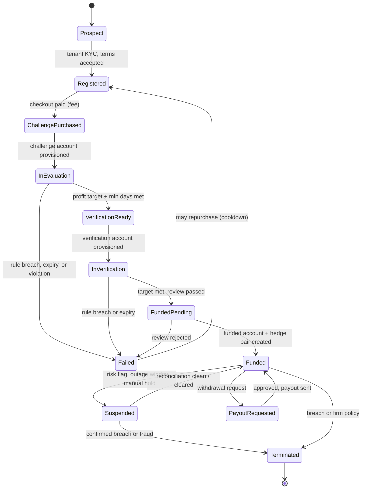

*« 03 trader lifecycle »*


The state machine above is **the** core domain model. Rules engine verdicts are the *only* inputs that may transition it (plus expiry timers and manual risk actions). This is enforced technically: no service other than the challenge state machine writes these states, and every transition is an event with an idempotency key.

### 2.3 Account topology

| Phase | Trader account | Hedge/mirror | Nature |
|---|---|---|---|
| Challenge / Verification | Demo or firm-managed account at broker | Optional (some firms hedge evals) | Virtual capital; broker never sees real money for the trader |
| Funded | Real account with firm capital (deposit = account size) | Real mirror account, 1:1 (or ratio), same broker | Trader's PnL = firm's PnL on funded account − hedge account; firm risk ≈ 0 after split cost |

Key consequences for the bridge:

- **Same broker cluster** for funded + hedge (co-location, shared symbol tables, identical fills where possible).
- The **position/hedge sync service** must mirror every trade with fill-aware tolerance and drift alerts (this is where firms silently lose money if done poorly: slippage asymmetry, partial fills, spreads differing by seconds).
- **Evaluation accounts may be "virtualized"**: balance lives in *your* database, the broker account may just be a $0 demo used for execution and marks. The bridge therefore must support **platform-authoritative balances** (your ledger) alongside **broker-attested execution**. This is the single biggest reason to keep an event-sourced ledger rather than trusting `AccountInfo()` alone.

### 2.4 Money flows (who pays whom)

```
Trader ──fee──▶ Tenant (prop firm) ──(via you, the PFaaS)──▶ platform revenue share
Trader ◀──payout (profit split)── Tenant ◀──firm capital PnL── broker (funded+ hedge accounts)
Tenant ──broker margin/fees──▶ broker
```

The PFaaS platform is a **b2b billing layer**: tenants pay you (revenue share / per-active-trader / infra fee), and you give them tenant-scoped services. The payout service (Section 6.9) computes *trader* payouts on behalf of the tenant; the billing service computes *tenant* invoices from platform usage (active traders, messages processed, storage).

### 2.5 Rule taxonomy (what the engine must evaluate)

| Rule | Typical expression | Evaluation basis | Edge cases |
|---|---|---|---|
| Max daily loss | 4–5% | **Equity** at any moment (intraday) or at EOD | Timezone of "day"; open-position marks; does equity recovery before EOD count? (config: intraday-breach vs EOD) |
| Max overall loss | 8–10% | Equity vs starting balance (**static**) or vs high-water mark (**trailing**) | HWM update frequency; equity-based HWM can be hit intraday by marks |
| Profit target | +8–10% | Equity or balance; realized-only options | Target met while equity is below after a partial close; multiple targets for scaling |
| Min trading days | 3–5 days | Days with ≥ 1 closed trade | One trade at 23:59; timezone; does a rolled day with only swaps count? (config) |
| Time limit | 30/60/∞ days | Calendar | Paused days during outages (policy decision, must be explicit) |
| News trading | Block N min before/after red events (per instrument class) | Order placement time vs economic calendar | Calendar source reliability; instrument impact mapping; pre-positioned orders (position opened *before* window must be flagged, not just new orders) |
| Weekend hold | No positions held into Friday close / no Friday opens | Position state at weekly cutoff | Swap charges over weekend; "close all" automation at cutoff |
| Overnight rule (funded) | No holding overnight / no holding past X hours | Position age vs day boundary | Split-day policies per tenant |
| Spread cap | Reject order if spread > X pips | Live quote at order_intent | Quote staleness; per-symbol table |
| Volume caps | Max volume, max open positions, max per-symbol exposure | Account aggregate | Hedged pairs counted net or gross (config) |
| Consistency / strategy | No martingale, no grid, no stop-hunting (advanced) | Pattern detection over history | ML-based, scored not hard-failed; evidence packs |

Every rule is **data, not code**: a versioned, tenant-scoped JSON rule pack (Section 6.2) evaluated by one engine. This is what makes tenants self-service and makes disputes replayable.

### 2.6 What "as-a-service" adds: the tenant dimension

- **Tenancy**: every row, key, queue partition consumer group, metric, and audit record carries a `tenant_id`.
- **Self-service**: rule packs, pricing, branding, payout schedules are tenant-editable within plan limits (admin UI in TypeScript, validated against the schema).
- **Metering**: the platform bills tenants on usage; the bridge's message counters are the metering source.
- **Independence**: a tenant can leave with its data (export pipeline to object storage) — retention and export are contractual, so design them in from day one.

---

## 3. Trading Platform Integration Targets

The bridge is a **fleet of protocol adapters** behind one canonical event schema. Each adapter owns: wire format, auth model, session semantics, state collection (for snapshots), and known broker-side quirks. New platforms are added by writing a new adapter against the same internal contract — this is the entire extensibility strategy.

### 3.1 Platform capability matrix

| Platform | Order execution location | Bridge channel | Auth model | Snapshot/state collection | Key constraints |
|---|---|---|---|---|---|
| **MetaTrader 4** | Client terminal → broker | EA (MQL4) over HTTPS (WebRequest) or WebSocket-capable proxy | Domain whitelist `.pfx` signature; account-bound pairing key | `PositionsTotal()`, `HistorySelect()`, `AccountInfoDouble` | 32-bit terminal; WebRequest needs per-domain signing (friction for updates); no native custom TLS headers; effectively legacy — support for existing tenants, no new design investment |
| **MetaTrader 5** | Client terminal → broker | EA (MQL5) over **HTTPS REST + optional WebSocket via third-party libs**; most shops use REST polling with short-interval push | WebRequest to any allowed domain (terminal setting "Allow WebRequest"); account-bound pairing key, HMAC per message | `PositionsGet`, `HistoryDealGetTicket`, `AccountInfo` | Terminal is the only path to the broker; **one MT5 account per terminal per broker server** (affects multi-account traders); terminal must stay running (VPS recommended); `OnTradeTransaction`/`OnTester` give event hooks |
| **cTrader** | Client terminal → broker (cBot), **or** broker Open API v2 server-side | cBot (C#) over HTTPS/WS *or* server-side Open API if broker grants | cTrader account tokens; pairing key for bridge | Open API v2 `GetPositionsAsync`, `GetExecutionReportAsync`, `GetHistoryAsync` | cTrader's Open API is the cleanest of the four: full server-side access where broker allows → enables **server-side execution for evaluations** (no trader terminal needed) — a strong differentiator; otherwise cBot pattern mirrors MT |
| **DXtrade** | Client or via broker API | REST + WebSocket API (first-class, broker-supported) | API keys (OAuth-style) per account | REST `/positions`, `/trades`, `/account` | API is designed for firms: webhooks for trade events, position limits, per-account permissions → best fit for **server-side evaluation accounts** |
| **TradingView** | Nowhere (no execution API for retail strategies) | Strategy **webhooks** (outbound HTTPS) | Webhook token (static + HMAC) | None — signals only | One-way, ~0.5–2 s webhook latency; must define: TV is a *signal source*, bridge relays the order to the *primary execution platform* (MT/cTrader) or broker API; rate-limit and origin-validate aggressively |
| **Tradovate / others** | Varies | ODBC/WebSocket | Per broker | Per broker | Treat as adapter projects; same canonical contract |

### 3.2 The two deployment topologies (and why you build both)

**Topology A — Terminal-side thin client (MT4/MT5, cTrader cBot).**
The EA/cBot is the bridge's *agent* on the trader's machine. It:
- subscribes to the bridge's control channel (poll or WS),
- fast-fails locally against a **cached rule pack** (halt flag, weekend rule, spread cap) *before* asking the bridge,
- sends `order_intent` for authorization, executes at the broker, reports the fill with broker-attested fields,
- spools all telemetry in a local ring buffer (≥ 72 h) so a network outage never loses evidence,
- heartbeats and re-authenticates.

This topology is the default for evaluation trading because traders keep their normal workflow and the broker relationship stays purely between trader-terminal and broker.

**Topology B — Server-side execution (cTrader Open API, DXtrade API, MT5 via broker-authorized paths).**
The *platform* holds the credentials (in Vault) and executes directly. The bridge then has **both** the execution path and the telemetry path, which enables:
- **instant halts** (you stop orders at your edge, not the trader's machine),
- **no-PA trading** (evaluations without trader-installed software — reduces tampering surface to near zero),
- **faster rule feedback** (fill → verdict in the same control loop).
This is the strategic direction: new platforms default to B; MT remains A (MT has no open broker API for this purpose).

The adapter contract is identical for both: *intake of canonical events, emission of control commands*. Topology B simply adds an `Executor` port the adapter implements.

### 3.3 MT4/MT5 reality check (read before designing the EA)

- **The terminal must be running and logged in.** The bridge must model "trader offline" as a first-class, long-lived state (weekends, vacations, VPS failure) with explicit policy: grace windows, retroactive rule application from spooled data, and invalidation after tenant-configurable maximum silence.
- **MT4 WebRequest** requires the trader to install a per-domain signature file and allow WebRequest in terminal options; MT5 requires only the allow-list. Both make onboarding friction a *conversion* problem: pairing flow must be 3 clicks and support QR.
- **Terminal restarts lose in-memory state but not spooled evidence** — the EA's on-disk ring buffer is non-negotiable, and the snapshot flow (diagram 08) rebuilds session state from it.
- **Multiple evaluation attempts** = multiple accounts = multiple terminals/VPS instances. Capacity and fraud models must assume N accounts per human (device/IP fingerprinting, Section 8.5).
- **Time**: use **broker timestamps** (`time` of deals, `OrderSelectTime`) as the rule-authoritative clock; the trader's machine clock is untrusted. Bridge NTP (chrony) is authoritative for *bridge-side* ordering; deal times are authoritative for *rule* evaluation.

### 3.4 Adapter internal contract (code level)

```
interface PlatformAdapter {
  // intake: raw platform message -> canonical event (+ diagnostics)
  decode(raw: WireMessage): Result<CanonicalEvent | ControlEvent, DecodeError>
  // control: canonical command -> platform wire message
  encode(cmd: ControlCommand): WireMessage
  // snapshot: instruct client to collect full state
  collectSnapshot(session: Session): AsyncIterable<SnapshotChunk>
  // capabilities
  caps: { serverSideExec: bool, webhooks: bool, maxMsgSize: int, … }
}
```

The normalizer maps wire events to the **canonical schema** (Section 5.3). Diagnostics (decode failures, schema version mismatches) are emitted as their own event class so fleet-wide client regressions are visible in minutes, not weeks.

---

## 4. High-Level Architecture

### 4.1 System context

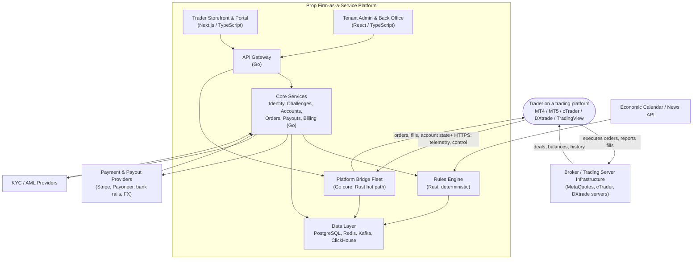

*« 01 system context »*


### 4.2 Container architecture

```mermaid
flowchart TB
    subgraph CL ["Trader Devices & Platforms"]
        MT["MT4/MT5 Expert Advisor (MQL)<br/>trader machine or VPS"]
        CT["cTrader cBot (C#)<br/>terminal-side"]
        DX["DXtrade client / REST client"]
        TV["TradingView strategy webhooks"]
        WEB["Trader Web Portal (TypeScript)"]
        ADM["Tenant Admin & Back Office (TypeScript)"]
    end

    subgraph EDGE ["Edge Layer (stateless, autoscaled)"]
        LB["Ingress / L7 LB, TLS 1.3, WAF"]
        WSB["WebSocket Frontend (Go)<br/>sessions, backpressure, sticky-by-account"]
        GW["API Gateway (Go)<br/>authN/Z, rate limits, routing"]
    end

    subgraph BF ["Bridge Fleet (stateless workers)"]
        A1["MT Adapter"]
        A2["cTrader Adapter"]
        A3["DXtrade Adapter"]
        A4["TradingView Adapter"]
        NORM["Normalizer -> canonical<br/>TradeEvent / AccountState"]
        GUARD["Sequence, idempotency,<br/>replay & clock-skew guard"]
        SNAP["Snapshot Manager<br/>(resync, gap recovery)"]
    end

    subgraph BUS ["Event Backbone (Kafka / Redpanda)"]
        T1["topic bridge.events<br/>partition key = account_id"]
        T2["topic ticks"]
        T3["topic rule.verdicts"]
        T4["topic audit (hash-chained)"]
    end

    subgraph SVC ["Domain Services"]
        CH["Challenge Service (Go)"]
        ACC["Account & Balance Service (Go)"]
        ORD["Order & Position Service (Go)"]
        RE["Rules Engine (Rust)"]
        RISK["Fraud & Risk Detection (Go + Rust libs)"]
        REC["Reconciliation Service (Go)"]
        PAY["Payout Service (Go)"]
        BILL["Billing Service (Go)"]
        NOTI["Notification Service (Go)"]
        POS["Position/Hedge Sync (Go)"]
    end

    subgraph STORE ["Stores"]
        PG[("PostgreSQL 16<br/>system of record, RLS multi-tenant")]
        RD[("Redis 7<br/>sessions, hot state, rate limits")]
        CHDB[("ClickHouse<br/>ticks, trades, audit, analytics")]
        OB[("Object storage<br/>audit archive, exports")]
        VAULT[("Vault / KMS<br/>keys, broker credentials")]
    end

    OBS["Observability: OpenTelemetry,<br/>Prometheus, Grafana, Loki"]

    MT --> WSB
    CT --> WSB
    DX --> GW
    TV --> GW
    WEB --> GW
    ADM --> GW
    LB --> WSB
    LB --> GW
    WSB --> A1
    WSB --> A2
    GW --> A3
    GW --> A4
    A1 --> NORM
    A2 --> NORM
    A3 --> NORM
    A4 --> NORM
    NORM --> GUARD
    GUARD --> T1
    NORM --> T2
    GUARD --> T4
    SNAP --> WSB

    T1 --> RE
    T1 --> ORD
    T1 --> REC
    T1 --> CHDB
    T2 --> CHDB
    T2 --> RE
    RE --> T3
    T3 --> CH
    T3 --> NOTI
    T3 --> RISK
    T3 --> POS

    CH --> PG
    ACC --> PG
    ORD --> PG
    PAY --> PG
    BILL --> PG
    REC --> PG
    CH --> RD
    ACC --> RD
    WSB --> RD
    GW --> RD
    RE --> RD
    POS --> PG
    T4 --> OB
    CHDB --> OB
    A1 --> VAULT
    PAY --> VAULT
    BF -.-> OBS
    SVC -.-> OBS
    EDGE -.-> OBS
```

*« 02 container architecture »*


### 4.3 The four planes

**Edge plane (Go).** TLS termination, WAF, WebSocket frontend with per-connection state machine (authed → streaming → degraded → suspended), API gateway for all HTTP surfaces (portal, admin, webhooks, broker callbacks). Stateless; horizontal autoscaling; WebSocket connections placed by consistent hash of `account_id` for *soft* stickiness (Redis session registry makes any node able to take over any session, so stickiness is optimization, not requirement).

**Bridge plane (Go core, Rust hot-path lib).** Adapters → normalizer → guard (sequence, replay, idempotency, clock skew) → publisher. The "hot path" — per-message HMAC verification, canonicalization, sequence accounting — is Rust (shared library or gRPC microservice; the pragmatic choice in v1 is a **Rust core behind a Go shim**: Go owns connections/Kafka, Rust owns the per-message pipeline; measure before splitting further).

**Core plane (Go).** Domain services: identity/tenancy, challenges (state machine), accounts & balances (ledger), orders & positions, position/hedge sync, payouts, billing, notifications, reconciliation. All read/write PostgreSQL with **tenant-scoped queries enforced at the repository layer** (no service sees another tenant's rows), outbox pattern for all cross-service effects.

**Data plane.**
- **PostgreSQL 16** — system of record. Multi-tenant via Row-Level Security (one database, tenant-scoped policies) — simpler ops than per-tenant schemas at ~50–500 tenants; move to schema-per-tenant only if a contractual requirement demands it. Double-entry **ledger tables** for every balance movement; `day_snapshots`, `rule_packs` (immutable, versioned), `verdicts`, `audit_log` (hash-chained), `sessions`, `pairings`.
- **Redis 7** — hot session state (seq counters, rules pack version, halt flags, hot account state for the rules engine), rate limits, distributed leases (cron sharding), pub/sub for control-command fan-out.
- **Kafka / Redpanda** — the event backbone. Topics partitioned by `account_id` so per-account ordering is *structural*, not probabilistic. Exactly-once *delivery* is unnecessary; exactly-once *effect* is achieved by idempotent consumers + idempotency keys.
- **ClickHouse** — ticks (optional, if quotes feed rules or analytics), closed trades, verdicts, message telemetry (per-tenant metering), feature stores for fraud. 90-day hot, object-storage cold.
- **Object storage (S3-compatible)** — immutable audit archive (hash-chained blocks, GPG-signed manifests), tenant exports, ETL landings.

### 4.4 Event backbone design (the spine)

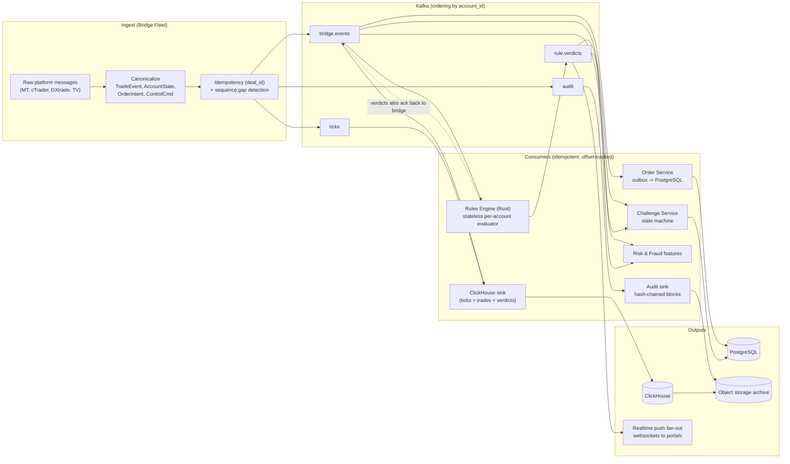

*« 04 event data flow »*


Topics and partitioning:

| Topic | Partition key | Retention | Consumers |
|---|---|---|---|
| `bridge.events` | `account_id` (hash) | 7 d (30 d for audit tenants) | rules engine, order svc, challenge svc, risk, CH sink, reconciliation |
| `bridge.events.control` | `account_id` | 7 d | bridge fleet (control fan-out), audit |
| `ticks` | `symbol` | 24 h | rules engine (spread/news rules), CH sink |
| `rule.verdicts` | `account_id` | 30 d | challenge FSM, notifications, risk, CH sink, push fan-out |
| `audit` | `tenant_id` | 365 d | audit sink (hash-chained → object storage) |
| `metering` | `tenant_id` | 90 d | billing |

Ordering guarantee: **all rule-relevant events for an account are on one partition and consumed by the rules engine single-threaded per account.** Parallelism across accounts is unbounded; parallelism within an account is zero — which is what makes the engine's state machine trivial and replay exact.

### 4.5 Multi-tenancy model

- `tenant_id` is a first-class column on every table, key, topic consumer group, metric label, and log field. No exceptions (this is an SLO: "zero cross-tenant data access" is verified by integration tests on every release).
- **RLS**: `CREATE POLICY tenant_isolation USING (tenant_id = current_setting('app.tenant_id'))`; the app sets the GUC per connection pool. Repository layer refuses to build a query without a tenant scope (compile-time-checked wrapper in Go).
- **Performance isolation**: per-tenant queue *consumer groups* for bursty work (rollover, reconciliation) so one tenant's backlog cannot starve others; per-tenant message rate limits on the bridge (plan-based); noisy-neighbor circuit breakers on PG (pgBouncer pool per tenant class).
- **Key isolation**: every bridge API key is bound to `(tenant_id, purpose, platform)`; a key from tenant A *cannot* even be verified against tenant B's accounts (pairing records are tenant-scoped).

### 4.6 Deployment topology

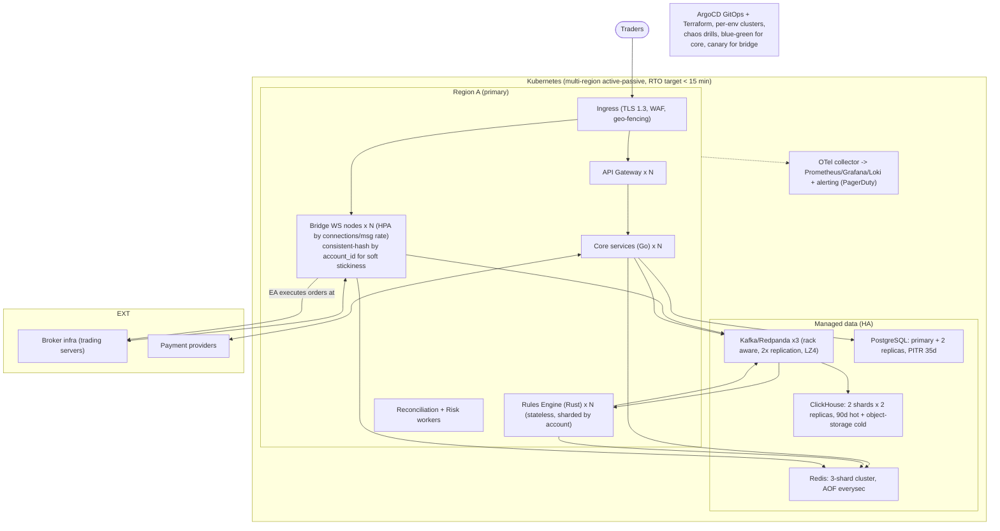

*« 12 deployment »*


### 4.7 Tenant onboarding (what "as-a-service" looks like in ops)

```mermaid
flowchart LR
    A["Tenant signs up (KYB done)"] --> B["Admin creates tenant:<br/>slug, plan, limits, timezones"]
    B --> C["Configure rule packs (DSL):<br/>challenge, verification, funded,<br/>payout split, fees"]
    C --> D["Branding: theme, domain, copy,<br/>pricing, support email"]
    D --> E["Broker connections:<br/>demo + real credentials into Vault,<br/>hedging policy, symbol mapping"]
    E --> F["Issue bridge keys:<br/>API keys per platform+purpose,<br/>HMAC pairing flow per account"]
    F --> G["Platform enablement:<br/>MT4/MT5, cTrader, DXtrade, TradingView"]
    G --> H["Dry run: simulated traders,<br/>reconciliation baseline, load test"]
    H --> I["Go-live checklist: SLO dashboards,<br/>on-call, runbooks, audit retention"]
    I --> J["Production: tenant-isolated data (RLS),<br/>isolated queues, noisy-neighbor guards"]
```

*« 14 tenant onboarding »*


### 4.8 Where every rule-relevant truth lives

| Truth | Owner | Store |
|---|---|---|
| Position exists at broker | Broker | broker (authoritative) |
| Position in platform model | Order service | PG `positions` (+ ClickHouse history) |
| Balance (platform ledger) | Account service | PG `ledger` (double-entry) |
| Day snapshot & HWM | Rules engine state | PG `day_snapshots` (persisted at each event batch + rollover), Redis hot |
| Rule definition | Rule pack registry | PG `rule_packs` (immutable versions) + Redis cache |
| Verdicts | Rules engine | PG `verdicts` + Kafka + ClickHouse |
| Evidence (raw telemetry) | Bridge | Kafka → ClickHouse → object storage (immutable) |

This separation is deliberate: **the broker is right about markets, you are right about the business.** Reconciliation (Section 7.4) exists only because both are true simultaneously.

---

## 5. The Bridge: Protocol, Transport, and State Machine

### 5.1 Transport choices

| Concern | Decision | Rationale |
|---|---|---|
| Primary transport | **WebSocket over TLS 1.3** | Bidirectional (telemetry up, control down) on one long-lived connection; MT5 EAs lack native WS, so MT clients use **HTTPS JSON POST** with the same envelope and short-interval push (500 ms–2 s adaptive) — the protocol is *transport-agnostic* by design |
| Fallback / bulk | HTTPS REST (`POST /bridge/v1/events`, batched up to 50 events) | Terminal spool delivery after long outages; snapshot chunks |
| Message encoding | **JSON (v1) → protobuf over WS (v2)** | JSON for trivially debuggable v1 and MT's native `WebRequest` string world; protobuf later for bandwidth at scale — schema in `.proto` from day 1, JSON is just a codec |
| Message size | ≤ 64 KB per message; snapshots chunked at 128 positions or 32 KB | Terminal memory + gateway limits |
| Compression | `permessage-deflate` (WS) / gzip (REST) | Telemetry is highly compressible |
| MT4 quirk | REST-only (WebRequest), domain `.pfx` onboarding | MT4 constraint (Section 3.3) |

The **connection is a convenience; the protocol is a sequence-ordered, idempotent log.** Any transport — WS, REST polling, or a future MQTT bridge — is acceptable as long as the guard (5.4) verifies the same invariants. This is what makes "trader's laptop over hotel wifi" a supported deployment.

### 5.2 Session lifecycle

```
IDLE ──hello──▶ AUTHENTICATING ──auth_ok──▶ ACTIVE ──gap/timeout──▶ RESYNC ──snapshot ok──▶ ACTIVE
                    │ (bad key / replay / tenant mismatch)               │ (checksum fail, N times)
                    ▼                                                    ▼
                 REJECTED (403 + reason code, pair rotation suggested)  SUSPENDED (alert + reconciliation + manual)
ACTIVE ──24h key expiry──▶ REAUTH (inline, connection preserved)
ACTIVE ──heartbeat miss x3 (30s)──▶ DEGRADED (trading allowed, flagged; control via next connect)
```

Sessions are **stored in Redis**, not on the node: `{account_id → {node_id, seq, sess_key_ref, rules_pack_ver, state, since}}`. This gives: (a) node failure → any node resumes; (b) LB hash changes are harmless; (c) the session registry *is* the "who is connected" map for ops dashboards and for the `events_since` API used during resync.

### 5.3 Canonical event schema (v1 core)

Defined in Protobuf; JSON rendering for wire v1. Every message is wrapped in an **envelope**:

```json
{
  "v": 1,
  "id": "0193f7a2-…",            // ULID, server or client origin
  "kind": "ev",                   // ev | ctl | ack | snap | hb
  "type": "order_filled",
  "tenant": "acme-firm",
  "account": "778123",
  "seq": 482,                     // client-origin: monotonic per account-session
  "ts_client": 1758259200123,     // client clock (untrusted, recorded for skew analysis)
  "ts_server": 1758259200091,     // bridge clock (NTP, authoritative for ordering)
  "nonce": "d41c…",               // replay guard (per session, 60 s window)
  "sig": "base64(hmac-sha256(canonical_bytes, sess_key))",
  "payload": { }
}
```

Canonical event types (bridge → core):

| Type | Key payload fields | Source of truth notes |
|---|---|---|
| `account_state` | balance, equity, margin, free_margin, leverage, currency | broker-reported; platform ledger cross-check |
| `order_filled` | order_id, deal_id, symbol, side, type, volume, fill_px, stop/limit, commission, swap, **broker_ts**, slippage | `deal_id` is the **global idempotency key** |
| `order_modified` | order_id, new_sl, new_tp, deal_id | same idempotency discipline |
| `position_closed` | deal_id, entry_px, exit_px, volume, pnl, commission, swap, **broker_ts** | PnL **recomputed** by bridge from stored entry — discrepancy > tolerance → `data_integrity_alert` |
| `quote` (optional) | symbol, bid, ask, ts | only if tenant enables quote-based rules (spread caps, mark frequency) |
| `balance_adjustment` | type (commission, swap, bonus, refund, correction), amount, ref, **broker_ts** | ledger entries must reconcile 1:1 |
| `data_integrity_alert` | kind, details | emitted by bridge when its cross-checks fail |
| `snapshot_applied` | seq_range, checksum, collected_at | resync completion marker |
| `client_diagnostics` | app_ver, ea_build, decode errors, buffer occupancy | fleet health |

Control commands (core → bridge → terminal), all with `ttl`, `seq`, and `reason`:

`trading_halt`, `resume_trading`, `close_all`, `close_symbol`, `set_param` (rules pack version bump → client refetches pack), `snapshot_request`, `force_rescan_history`, `pair_rotate` (new signing key), `account_notice` (display to trader).

Every control command is also written to `bridge.events.control` and to PG — **a halt must survive terminal disconnects**: on reconnect, the bridge replays all unacknowledged control commands for the account.

### 5.4 The Guard: security invariants on every message

Executed in Rust, < 1 µs budget per check (amortized):

1. **Signature**: HMAC-SHA256 over canonical bytes (sorted keys, no whitespace, UTF-8) with `sess_key` (fresh per session) → protects against tampering and spoofed accounts. Pairing key (long-lived, per account) signs only `hello`/`auth`.
2. **Sequence continuity**: `seq` must equal `last_seq + 1`. Gap → buffer up to 2 s for out-of-order delivery; then `RESYNC`. (WS is ordered per connection, so gaps mean *lost batches* on the client side → spool replay.)
3. **Replay**: `nonce` must be unseen in the last 60 s (Redis Bloom+exact, per session) and `ts_client` within 90 s of bridge NTP. Catches recorded traffic replay.
4. **Binding**: `tenant`/`account` must match the session's pairing record (a tenant-A key cannot speak for tenant-B accounts, ever).
5. **Broker-attestation cross-check** (on `order_filled`/`position_closed`): recompute PnL fields from the stored entry event; verify `broker_ts` plausibility (monotone per symbol within jitter tolerance); flag — never hard-fail — anomalies (a buggy EA should not silently fail a trader; the alert path reconciles).
6. **Idempotency**: `(account, deal_id)` insert-once into PG with a unique constraint; duplicates are acked, not processed.

### 5.5 The two most important exchanges (sequences)

**Authentication & session establishment** (every connection, including reconnects):

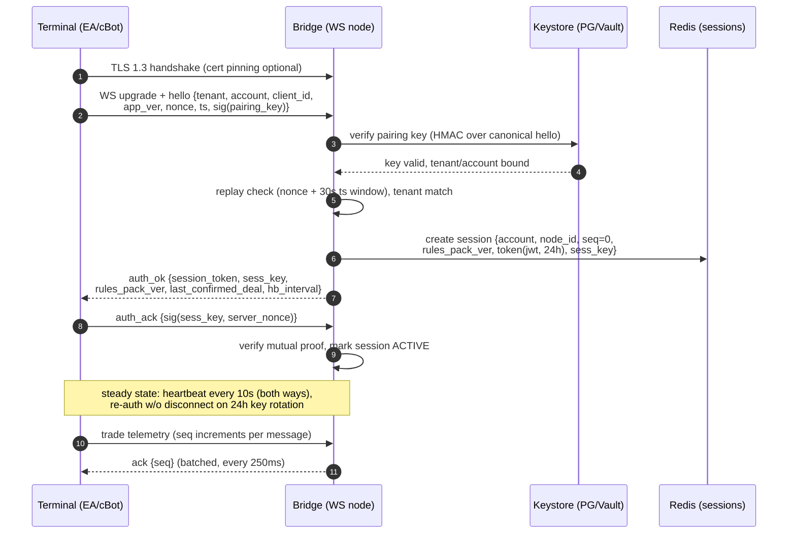

*« 05 auth handshake »*


**The critical order path** — note that execution happens at the broker, and the bridge only authorizes and observes:

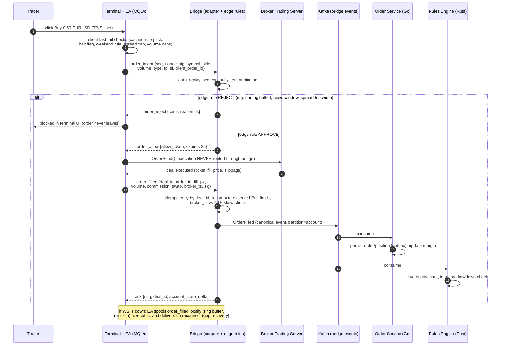

*« 06 order placement »*


### 5.6 Pairing: getting a new terminal connected

1. Trader portal: "Connect MT5 account" → platform provisions the broker demo/real account → creates a **pairing record** `{account, tenant, pairing_key (256-bit, shown once), platforms, limits}`.
2. Trader enters pairing code into the EA (or scans QR in the portal — EA displays QR on a second tab). EA signs a `hello` probe with the pairing key.
3. Bridge verifies, returns `pairing_ack {ok, session bootstrap}`. Pairing key is **single-use for session bootstrap**; thereafter the session key signs everything. Pairing records are revocable per terminal (device fingerprint recorded: MT account number, terminal build, IP ASN, hash of EA identifier).
4. Rotation: 24 h session key rotation is inline (no disconnect); pairing keys rotate on revocation or on "device trust downgrade" (new IP-ASN pattern → require re-pair; configurable per tenant risk appetite).

### 5.6 Clock discipline

- All bridge nodes run **chrony** against at least 3 NTP sources; bridge exposes its own offset/precision via health endpoint; nodes with |offset| > 50 ms are auto-removed from load (configurable).
- **Rule evaluation uses `broker_ts`** (attested by broker, per deal) — the trader's machine clock is recorded and *analyzed* (skew histograms feed fraud features) but never trusted for decisions.
- **Rollover and expiry use server NTP** in the tenant's configured timezone — documented in tenant-facing terms so "what is a trading day" is unambiguous.

### 5.7 Outage policy (bridge down, broker fine)

The bridge is **not** on the execution path, so during a platform outage traders can keep trading at the broker — the policy question is what happens to the *rules clock*:

1. **Grace window** (tenant-config, default 15 min): trading continues; on recovery, spooled telemetry is replayed and rules are evaluated retrospectively. No trader-visible penalty.
2. **Extended outage** (> grace): tenants choose per account class: (a) pause evaluation timers and apply rules from spool once data arrives, or (b) mark accounts `outage_window` and invalidate challenges breached during the window (rare; usually (a) + audit).
3. **Terminal silent** (no connection for N hours): config-driven — challenge pauses or fails after `max_silence` (default 7 days for evaluations, 1 day for funded), with notice sent at each milestone.
4. Every outage window is stamped into the audit log (start, end, affected accounts, retroactive verdicts) — this is the document that settles disputes.

### 5.8 Control-channel fan-out

Halt/resume/close-all are **account-scoped pub/sub**: the challenge service writes the command to `bridge.events.control` (partition = account) and to Redis; the bridge node(s) serving that account (any node, via the session registry) push it to the terminal with ack; unacked commands are re-pushed on every reconnect and are visible in the ops console. A halt is *also* a PG state (`trading_halted = true` + reason), so even a fully offline terminal is treated as halted by the rules engine on the next data point — the control push is latency optimization, the DB state is truth.

---

## 6. The Rules Engine

### 6.1 Position in the system

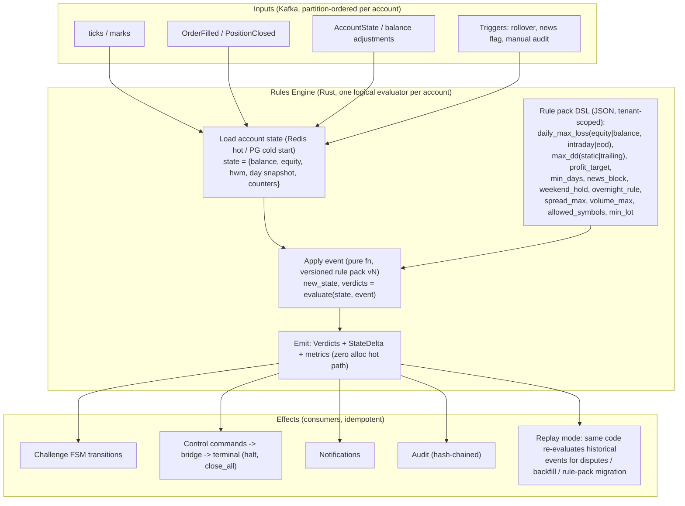

*« 13 rules engine »*


The rules engine is a **stateless, partition-ordered consumer** of `bridge.events` that maintains, per account, a small value-semantic state and a versioned rule pack, and emits `(new_state, verdicts)` for each event. "Stateless" means: no local persistence — state lives in Redis (hot) / PG (durable), and **any event stream prefix can be re-applied from scratch to reconstruct the exact state**. That property — *replayability* — is the foundation of disputes resolution, rule-pack migrations, backfills, and audits.

### 6.2 Rule packs: data, versioned, immutable

```jsonc
// rule_packs v12 — tenant "acme-firm", scope "challenge_100k"
{
  "pack_id": "acme:challenge:100k:v12",
  "currency": "USD",
  "start_balance": 100000,
  "day": { "timezone": "Europe/London", "basis": "equity", "breach": "intraday" },
  "rules": {
    "max_daily_loss_pct": 4.0,
    "max_overall_loss_pct": { "mode": "static", "value": 8.0,
                              "mode_alt": "trailing", "note": "trailing = HWM-based" },
    "profit_target_pct": 10.0,
    "min_trading_days": 4,
    "time_limit_days": null,
    "news": { "enabled": true, "block_minutes_before": 5, "block_minutes_after": 5,
              "tiers": ["high"], "instruments": "FX_majors,indices",
              "source": "economic-calendar:v3", "pre_positioned": "flag" },
    "weekend": { "mode": "no_hold", "cutoff": "Fri 21:00 Europe/London", "action": "close_all" },
    "overnight": { "enabled": false },
    "spread_max_pips": { "EURUSD": 2.5, "default": 6.0 },
    "volume_max": 10.0, "open_positions_max": 20,
    "allowed_symbols": ["*"], "denied_symbols": ["XAUUSD_limit_1.0"]
  }
}
```

Rules are **compiled once per pack version** into a typed plan (Rust); the hot path executes the plan, not JSON. Pack changes create a new version; accounts pin their pack until the next rollover boundary (mid-day swaps are a classic source of "but it was different when I signed up" disputes — avoid them by policy, not by cleverness).

### 6.3 State model (per account)

```rust
struct AccountState {
    account: AccountId,
    pack: PackVersion,
    balance: Decimal,            // platform ledger (authoritative for business math)
    equity: Decimal,             // broker-attested marks (authoritative for market value)
    high_water_mark: Decimal,    // trailing-DD mode
    day: DaySnapshot,            // {date, start_equity, start_balance, traded: bool, verdicts: bool}
    open_positions: Vec<Position>,
    day_counter: u32,            // trading days counted
    flags: FlagSet,              // halted, outage_window, integrity_alerted, …
    seq_applied: u64,            // last applied event seq (crash/replay pointer)
}
```

Arithmetic uses **decimal with fixed 8-dp** (never f64 for money); marks come from broker-attested prices; a one-cent drift between platform ledger and broker balance is an *alert*, a one-dollar drift is a *page*.

### 6.4 Evaluation semantics (the exact math, because it will be litigated)

For event `e` at broker-time `t` with resulting marks:

1. **Intraday equity breach (config `breach: intraday`)**: `equity(t) < day.start_equity * (1 − max_daily_loss_pct/100)` → `BREACH(daily_max_loss)` **immediately**, even if equity recovers later that day. (Some tenants run `eod`: evaluate only at rollover with the day's worst equity — support both, default intraday.)
2. **Max overall, static**: `equity(t) < start_balance * (1 − max_overall_loss_pct/100)` → `BREACH(max_overall_loss)`.
3. **Max overall, trailing**: HWM updated on every *realized* close (and at rollover) using `balance + closed_pnl_to_date` (config: equity-based HWM is aggressive and mark-sensitive — tenant choice); breach when `equity(t) < HWM * (1 − pct/100)`.
4. **Profit target**: `equity(t) ≥ start_balance * (1 + target/100)` **and** `day_counter ≥ min_trading_days` → `TARGET_REACHED` (evaluation) / `PAYOUT_ELIGIBLE` (funded, per tenant schedule).
5. **Min days**: incremented at rollover when `day.traded == true` (a day with at least one *closed* deal at broker_ts inside the day boundary).
6. **News block**: an `order_intent` (or opened position) with `t` inside `[event.start − before, event.end + after]` for an in-scope tier/instrument → `BREACH(news_rule)` (evaluation) or `order rejected + evidence` (funded, config). `pre_positioned: flag` records positions opened *before* the window with an audit marker rather than failing (tenant choice between `flag`, `fail`, `close`).
7. **Weekend hold**: at cutoff, any open position → controlled `close_all` + `BREACH(weekend)` if close generates a loss beyond the allowed swap buffer (config; default: breach only on new violations, existing-positions-closed-by-firm is penalized per tenant policy).

**Every rule result is a structured record** — rule id, input values (exact decimals, pack version, event id, broker_ts) — so a verdict is a *proof*, not an assertion. Dispute resolution = replay the stream to the disputed event, diff against the trader's terminal, done.

### 6.5 Where enforcement happens (three layers, three speeds)

| Layer | Latency budget | Enforces | Why |
|---|---|---|---|
| **L0 client (EA)** | 0 ms (cached pack) | Hard halts, weekend cutoff, spread cap, volume caps | Trader UX: a halted account should be *immediately* blocked in the terminal without a round trip; the cached pack is pushed via `set_param` |
| **L1 bridge edge** | < 8 ms p99 | `order_intent` pre-check against live pack version + halt flags + quote state | Authoritative *at order time*; reject before execution to avoid broker-side fills that must be unwound |
| **L2 rules engine** | < 150 ms p99 | Everything (post-fill marks, drawdowns, targets, rollover) | The financial truth; L0/L1 are optimizations and *never* substitutes |

Design invariant: **L0 and L1 may be slow/stale; L2 is always right.** L0/L1 only *tighten* (they can refuse early), L2 *decides*. An L1 miss that L2 later breaches is still a valid breach; an L1 false-allow is never a problem because L2 catches the mark.

The full close → verdict → control round trip, including the breach path that halts the trader's terminal:

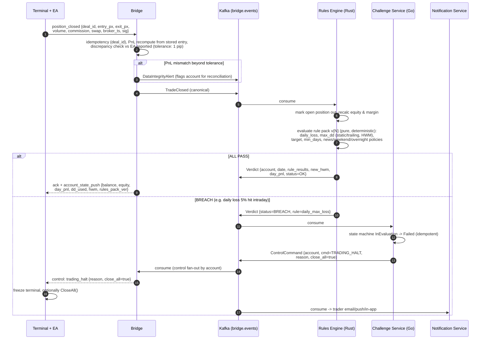

*« 07 close and verdict »*


### 6.6 Rollover (daily close of books)

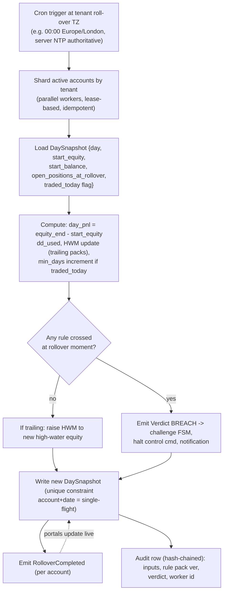

*« 09 daily rollover »*


- Trigger: cron at tenant timezone midnight, sharded by `(tenant, account)` with a **distributed lease** (Redis `SET NX PX`) — exactly one worker per account per day, unique constraint `(account, date)` on `day_snapshots` makes double-runs impossible.
- Per account: finalize `day.traded`, compute day PnL, trail HWM (if trailing pack), increment `day_counter`, check EOD-basis rules, write new `day_snapshots` row, emit `RolloverCompleted` + verdicts, hash-chain the audit row.
- Late-arriving events (fill recorded with `broker_ts` in the *previous* day, delivered after rollover): applied to the previous day via a **retroactive apply** path that re-derives both days' snapshots and, if a breach changed, emits a correction verdict. The engine must treat "time" as `broker_ts`, and "processing order" as arrival order — the two are different, and conflating them is the #1 rules-engine bug in this industry.

### 6.7 Rule-pack migration & replay

When a tenant changes rules (or you fix a bug): (1) publish new pack version; (2) engine pins per-account switchover at the next rollover (or immediate, per tenant config); (3) **migration verification job** re-evaluates a sample of accounts under old and new packs over the trailing 30 days and reports the diff before activation. Because evaluation is pure, this is a batch job, not a migration script.

### 6.8 Funded accounts: the engine's second mode

Same engine, different pack scope: `funded` packs add **payout-schedule rules** (e.g., "first payout day 14, then every 14 days with ≥ $200 withdrawable"), **consistency rules** (tenant-optional: max consecutive losing days, max daily volume, consistency score), and **hedge-drift rules** (mirrored-position divergence beyond tolerance → alert/suspend). Breaches on funded accounts do not "fail" — they produce `SUSPEND`/`TERMINATE` verdicts with a manual-review gate (Section 7.6) because the stakes are real money.

### 6.9 Payout computation (the numbers the engine feeds)

```
tradeable_pnl        = funded_equity_now − deposit − locked_margin
trader_share         = tradeable_pnl * split_pct          (e.g. 80%)
fee_deductions       = Σ broker commissions/swaps on funded account (tenant policy: pass-through or absorb)
fx_adjustment        = if payout_ccy ≠ account_ccy: mid-rate at T-1 (published schedule)
available            = max(0, trader_share − fee_deductions − fx_adjustment)
```

Computed by the payout service **from engine-persisted marks + the ledger** (never from a live broker poll at click time — snapshot at request, re-verify at settlement). Approval workflow (auto below threshold, two-officer above) and the hash-chained audit trail are in Section 8.6. End-to-end:

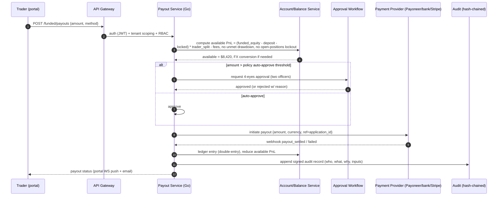

*« 11 payout »*


---

## 7. Consistency, Correctness, and Reliability

### 7.1 The two-truths problem, formally

Let **B** = broker state (positions, deals, balances as the broker server sees them) and **P** = platform state (ledger, positions model, day snapshots, verdicts). The bridge continuously maps B → P (telemetry), reconciliation periodically verifies P ≈ B, and control commands push P → B-adjacent effects (halts, close-all at the terminal). Correctness requirements:

1. **Liveness**: every broker-side event for a supervised account eventually reaches P (spool + reconnect + `events_since` + periodic full rescan).
2. **Soundness**: P never contains a position/deal that B doesn't (no phantom PnL) — enforced by deal-id ingestion only (P is built *from* B-attested deals) and by reconciliation deleting orphans (with audit).
3. **Completeness at decision time**: a verdict is only rendered when P's input for the decision horizon is complete; if the input is uncertain (e.g., 40 s gap), the verdict is *deferred* (rules clock pauses for that account) — a deferred breach is better than a wrong one, and the deferral is recorded.

### 7.2 Event sourcing for the trading domain

- `bridge.events` (canonical, Kafka → ClickHouse → immutable object storage) **is** the event log. PostgreSQL is a *materialized view* of it (consumers with outbox + idempotent apply).
- Any PG row can be regenerated: `replay(account, from_ts, to_ts)` — a first-class ops command, used for incident repair, tenant audits, and dispute packs.
- **Offset discipline**: each consumer group tracks per-partition offsets; the rules engine additionally stores `seq_applied` per account in Redis/PG so it can self-heal after lag (re-read from `seq_applied` if a watermark mismatch is detected).
- **Dead-letter queues** per consumer: any event that fails apply 5× goes to DLQ with the full error + envelope; DLQ age > 5 min pages. A DLQ'd trade event is a P0 by definition (missing evidence).

### 7.3 Idempotency & exactly-once *effect*

Delivery is at-least-once everywhere (Kafka, WS pushes, retries). Exactly-once *effect* is achieved by:

- **Natural keys**: `(account, deal_id)` for trade events; `(account, date)` for rollovers; `(application_id)` for payouts/funding; all with **unique constraints** — duplicates collapse into no-ops that return the original result.
- **Idempotency keys on mutations** (HTTP and control): client sends `Idempotency-Key` header/field; server stores result for 24 h.
- **No side effects on read paths**: verdict emission happens only inside the apply transaction (PG write + Kafka publish via **transactional outbox** polled by a relay — at-least-once publish, exactly-once effect downstream via idempotency).

### 7.4 Reconciliation (the heartbeat of trust)

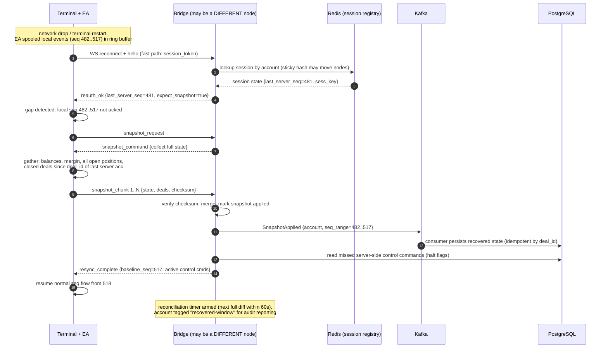

*« 08 reconnect resync »*
 *(the reactive, per-connection half)*

The proactive half, run by the **Reconciliation Service (Go)**:

| Loop | Cadence | Method | Action on mismatch |
|---|---|---|---|
| Event-level | continuous | each ingested deal cross-checked against stored entry/exit | alert (integrity) → auto-correct PnL from B |
| Position diff | 60 s (connected), 5 min (disconnected) | B positions (EA collect or server API) vs P positions | phantom in P → delete + audit; missing in P → ingest + audit + page if > 2 min |
| Full account state | hourly (rolling shard) | balances, margin, full closed-deal scan since last full sync | ledger drift: ≤ 0.01% → auto-correct with reason; more → page |
| Broker history audit | daily per account (off-peak) | full `HistorySelect` since account creation vs ClickHouse evidence | the canonical audit record per account per day |
| Funded hedge drift | 10 s | funded position vs hedge position (fill-aware tolerance: 1 tick + 100 ms) | auto-rebalance order; drift > threshold → suspend trader account + risk page |

Reconciliation output is itself an event (`reconciliation_result`), so the *auditors of the auditors* can be audited. Every correction carries `(cause, before, after, evidence_ids)` in the hash-chained audit log.

### 7.5 Failure-mode matrix

| Failure | Detection | Behavior | Trader sees |
|---|---|---|---|
| WS drop (trader) | heartbeat 3×10 s | client spools; backoff 1 s→30 s jittered; resync on return | nothing, if < few seconds |
| Bridge node crash | LB health, Kafka consumer lag | other nodes serve; sessions in Redis | sub-second |
| Kafka partition lag | consumer-lag SLO alert | rules verdicts **defer** (per-account clock pause), no wrong verdicts; replay on catch-up | nothing (trading continues at broker) |
| PG primary failover | HA manager | read-replica promotion; outbox relay pauses; at-least-once consumers re-apply | sub-minute |
| Broker server outage | terminal reports, API 5xx | all accounts `broker_down` flag; rules clock paused; no verdicts; on recovery → full rescan + diff | "platform unavailable" notice |
| Stale/buggy EA version | `client_diagnostics`, schema mismatch | pin: force `set_param` refetch; if still bad → degrade to REST polling with tighter heartbeat; if tamper-suspected → pairing revocation + fraud review | update prompt |
| Clock skew (bridge node) | NTP offset > 50 ms | node ejected from LB; its in-flight sessions resume elsewhere (Redis registry) | nothing |
| Tenant billing overdue | billing svc | plan: grace → read-only → suspend new challenges (funded accounts always keep full service — contractual) | notice |
| Malicious client (patched EA) | signature valid but *content* anomalies: impossible PnL, broker_ts regressions, EA hash mismatch, device fingerprint change | integrity alerts → auto-halt (config) → risk review with evidence pack | halt notice |

### 7.6 Sagas for multi-step provisioning

Funding (Section 2.3) and payouts are **sagas** — sequences of local transactions with compensations:

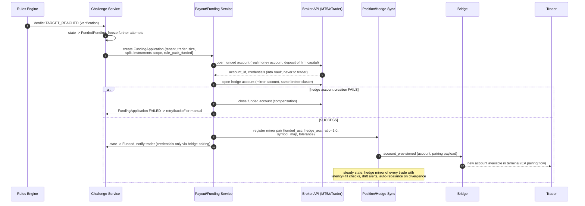

*« 10 funding provisioning »*


- Every saga step is a row in `saga_steps` `(saga_id, step, status, payload, compensation)`; a worker advances steps, and on failure runs compensations in reverse order with retry/backoff, then a manual-queue item.
- **No saga is allowed to leave a funded account open without a hedge** (invariant checked by an independent auditor job, not by the saga itself).
- Payouts: request → freeze (ledger hold) → provider call → webhook confirm → settle; provider timeout → retry with same idempotency key; provider "lost" state → manual reconciliation queue with provider statement download.

### 7.7 Availability design

- **Stateless everything** at the bridge/edge; state in Redis/PG/Kafka — any pod is disposable.
- **Multi-region**: active-passive with DNS failover (RTO target < 15 min); Kafka MirrorMaker for event replay across regions; RPO < 60 s. (Active-active is a phase-5 optimization; the domain tolerates passive failover because broker execution is unaffected.)
- **Degraded mode is a feature**: with the platform down, the broker keeps executing; on recovery, spooled evidence + full rescan rebuild P. The platform's failure never strands a position (the hedge service has its own local fail-safe: on loss of trader-account visibility > threshold, it flattens the hedge *and* pages — tenant-configurable between flatten-hedge and hold-hedge, a real money decision that must be an explicit tenant setting, never an implicit default).

---

## 8. Security Architecture

### 8.1 Threat model (STRIDE, condensed to what matters here)

| # | Threat | Actor | Mitigations |
|---|---|---|---|
| T1 | Spoofed terminal / fake telemetry | malicious trader | HMAC-signed envelopes, per-account pairing keys, deal-id cross-checks vs broker history, device fingerprint, broker-side truth via reconciliation |
| T2 | Patched EA reporting falsified PnL | malicious trader | bridge **recomputes** PnL from stored entries + broker prices; broker `HistorySelect` audit is independent of the EA; impossible-value detectors (e.g., slippage > symbol max, fill outside quote band from last N ticks) |
| T3 | Replay of recorded session | attacker with captured traffic | per-session ephemeral keys (24 h), nonce + 30 s window, monotonic seq, TLS 1.3 (optionally cert-pinned in EA) |
| T4 | Tenant cross-access (A reads B) | insider, bug | RLS + repo-layer tenant enforcement, tenant-bound keys, cross-tenant integration test suite, per-tenant consumer groups, secret-scan CI on queries |
| T5 | Insider fraud (staff approves own payout, edits rules) | insider | 4-eyes approval above thresholds, immutable rule-pack versions with approval workflow, hash-chained audit (see 8.6), Segregation of Duties in RBAC (maker/checker roles), PII access logging |
| T6 | Broker credential leak | external | Vault with dynamic short-TTL credentials where broker supports; per-tenant encryption envelopes; credentials never leave the platform except to broker; egress allow-listing |
| T7 | DDoS / connection flood on WS fleet | external | WAF + rate limits per IP/account/tenant, connection caps per account (anti account-farming), SYN flood protection at LB, autoscale headroom 3× peak |
| T8 | Supply chain (malicious EA build, dependency) | external | EA builds signed + published via portal only (hash pinned in pairing record), dependency SBOM + provenance, image signing (cosign) + admission policy |
| T9 | Mass account manipulation (1 human, 50 evaluations) | fraud ring | device/IP/payment fingerprint graph, per-identity limits, challenge-velocity caps, ML scoring (Section 15 fraud diagram), manual review console |
| T10 | Data exfiltration / privacy | external, regulatory | field-level encryption for PII, DLP egress rules, GDPR-style rights APIs (tenant obligations, platform tooling), data residency per tenant contract |

### 8.2 Cryptographic design

- **Pairing key**: 256-bit, generated server-side (HSM-backed RNG), shown once, stored hashed (Argon2id) in PG + wrapped in Vault for ops recovery; signs `hello` only.
- **Session key**: 256-bit, fresh per session (in Redis, TTL = key lifetime 24 h), signs every message. Canonicalization: RFC 8785 (JCS) for JSON-v1; protobuf wire bytes for v2.
- **HMAC**: HMAC-SHA256. (Ed25519 per-account keys are the v2 upgrade path — cheaper verification at 1M msg/s; keep the envelope field layout compatible.)
- **Internal service mTLS** (SPIFFE-style identities), **Vault** for all secrets, **KMS envelope encryption** at rest (PG, S3), TLS 1.3 everywhere, HSTS + certificate transparency monitoring.
- **Clock**: all signing windows enforced against NTP (Section 5.6) — weak clock discipline is the #1 real-world replay hole.

### 8.3 Authentication & authorization

- **Traders** (portal): email+password → MFA (TOTP, A2P push) → OIDC IdP; short JWT (15 min) + rotating refresh; session risk re-scored on device/IP change.
- **Terminals**: no human login — pairing-key bootstrap (§5.5) is the authenticator; terminal identity = `(account, pairing_id, device_fingerprint)`.
- **Tenants/back-office**: OIDC SSO (tenant IdP), **RBAC** with granular roles (owner, risk_officer, support, payout_approver, read_only), per-role resource scopes, **approval workflows** (payouts, rule-pack changes, manual corrections, terminations) — maker/checker enforced in the workflow engine, not the UI.
- **API**: service-to-service mTLS + scoped tokens; public APIs (webhooks from broker/payment providers) use signed webhooks (HMAC with per-provider keys) + replay window + IP allow-lists where possible.

### 8.4 Network & platform

Kubernetes: NetworkPolicy default-deny (only declared flows), pod identity, secrets via CSI (no env vars), per-tenant namespaces *only* if contractual (default: shared plane + RLS + queue isolation), egress allow-list from bridge nodes (broker domains, Vault, NTP only — an EA's traffic egresses via the LB, not the pod).

### 8.5 Device & identity graph (the fraud backbone)

Fingerprint collected at pairing: terminal build, MT/cTrader account id, IP + ASN, timezone, payment instrument hash (PCI-safe token from the PSP), browser fingerprint on portal, optional hardware attestation on mobile portal. These become nodes in a **graph** (`identity_links`) maintained by the risk service: same payment hash across 3 accounts in 30 days → automatic review queue. The graph is the single most ROI-per-effort fraud control in this industry and it's *data plumbing on top of the event stream*, not a separate system.

The full detection pipeline, from raw stream features to risk-desk actions:

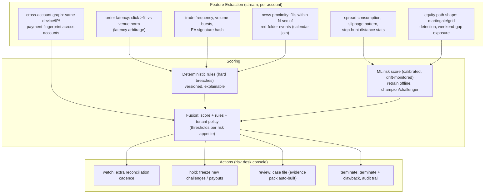

*« 15 fraud detection »*


### 8.6 Audit: hash-chained, exportable, dispute-ready

`audit_log` rows are chained: `row_n.hash = H(row_n.data || row_{n−1}.hash)`, with daily root hashes published to object storage (GPG-signed manifests). Properties:

- any row tamper is detectable by re-hashing from the last published root;
- dispute pack generator: given `(account, date_range)` → produces a signed, human-readable PDF/JSON bundle: every event, every verdict with its exact inputs, every reconciliation result, every control command, every admin action — this artifact *is* the firm's defense in chargeback/regulatory scenarios;
- retention: hot 365 d (Kafka → ClickHouse), warm 7 y in object storage (configurable per tenant jurisdiction).

### 8.7 Compliance posture (do this with lawyers, not just engineers)

- **KYB** on tenants (you), **KYC/AML** on traders (tenant's legal duty, platform provides tooling: document storage, sanctions screening via provider API, PEP checks, source-of-funds questions) — the bridge's evidence packs are the AML *travel rule* artifact for funded accounts.
- **Jurisdictional risk of the product itself**: several regulators treat prop-firm challenges as gaming/financial services depending on structure (fee structure, payout mechanics, entity location). The PFaaS must support tenant-specific terms, entity routing, and jurisdictional feature flags (e.g., some tenants must disable certain payout schedules). *Get this settled with counsel per market before launch — it changes data residency, marketing claims, and payout flow.*
- Data: GDPR (EU traders) as baseline, PK/EU/UK resident options for data regions, DPIA per processing purpose, DPA templates for tenants, sub-processor register (brokers, PSPs, calendar providers).

---

## 9. Scalability, Performance, and Latency Budgets

### 9.1 Load model (sizing assumptions — recalculate per tenant mix)

**Reference fleet**: 10 tenants, 25,000 registered traders, 6,000 concurrently active accounts during peak (FX NY/London overlap), 40% on MT5-EA/REST, 35% MT5/WS-proxy or cBot-WS, 25% server-side (cTrader/DXtrade).

| Signal | Rate (peak) | Notes |
|---|---|---|
| `order_intent` + `order_filled` | ~40 msg/s fleet (10/s burst) | spikes around news: 10× for seconds |
| `position_closed` / `order_modified` | ~15 msg/s | |
| `account_state` pushes | 1/s per connected account ≈ 6k msg/s steady | the *volume* driver; make it adaptive: push on change > 10 bps or 5 s max interval |
| heartbeats | 2 × 6k / 10 s = 1.2k msg/s | tiny; batchable |
| Control commands | < 1/s average, bursty on halts (1k accounts at once = fan-out event) | |
| Quote feeds (if enabled) | 50 instruments × 20/s = 1k/s | opt-in per tenant |
| **Total ingest** | **~8–10k msg/s steady, 30k/s burst** | one bridge node: ≥ 5k msg/s (Go+Rust, measured in the sim harness) → 4–6 nodes at peak, 3× headroom |
| Kafka | 1.5 MB/s compressed steady | 3 brokers, trivial |
| ClickHouse ingest | ticks (opt-in) 1k rows/s; trades+verdicts 100 rows/s | trivial; the storage that grows is *evidence* (raw events, ~5 GB/day at reference scale, LZ4) |

**The bridge is sized by connections and message rate, not by CPU.** 6k–50k concurrent WS connections: one node per ~8k idle connections (tokio/go runtime, 2 vCPU); plan 6–10 nodes at 50k. Memory ≈ 2 MB/connection worst case (buffers + session) → 100 GB at 50k — shard, don't oversize.

### 9.2 Latency budget (critical path: order)

```
Trader click ──[0-20ms]──▶ EA local fast-fail (L0)
  ──[20-60ms, network]──▶ Bridge edge checks (L1): HMAC verify ~1µs, seq, halt-flag (Redis local cache, 50ms staleness)
  ──[20-60ms, network]──▶ EA OrderSend
  ──[10-100ms]──▶ Broker execution + fill
  ──[20-60ms]──▶ Bridge ingests order_filled, guard
  ──[10-50ms]──▶ Kafka partition (account)
  ──[5-30ms]──▶ Rules engine applies, verdict emitted
Total: intent→allow ~40–120 ms (network-dominated); fill→verdict p99 < 150 ms
```

Budget rules: (1) nothing in L1 may touch PG — halt flags, pack version, and quote caps live in node-local cache refreshed from Redis (≤ 50 ms stale, acceptable: L2 is truth); (2) HMAC verify and canonicalization are the only per-message allocations in the hot path (Rust, pool-allocated); (3) Kafka produce with `acks=all, linger.ms=5, batch=32KB` on `bridge.events` — ordering within account is preserved by single-partition-per-account + single producer thread per account shard.

### 9.3 Data growth & retention

| Dataset | Growth (reference) | Hot | Cold |
|---|---|---|---|
| Raw events (evidence) | ~5 GB/d | 90 d (CH) | 7 y (S3, immutable, zstd) |
| Ticks (opt-in) | ~10 GB/d | 14 d | 1 y (S3) |
| Closed trades | ~200 MB/d | 2 y | 7 y |
| Audit chain | ~500 MB/d | 1 y | 7–10 y (jurisdiction-dependent) |
| Ledger / snapshots | ~50 MB/d | forever | PITR backups 35 d |

### 9.4 Capacity patterns that break prop-firm platforms (learned from the industry)

1. **News spikes**: NFP/CPI → order rates 10–20× for 30–60 s *and* quote rates 100×. The bridge must absorb without queueing into the broker (it doesn't route execution — good), but L1 must pre-reject at full rate: keep the intent path allocation-free and test at 50× sustained.
2. **Rollover thundering herd**: 10k accounts roll over in the same minute. Sharded leases + per-tenant offsets (spread rollover checks across 10 min by hash(account)) → constant CPU instead of a spike.
3. **Halt fan-out**: one tenant halts 5k accounts → 5k control pushes in seconds. Fan-out goes through Kafka control topic (partitioned by account), bridge pushes are async, no synchronous waits — a halt *command* is durable (PG) even if 100% of pushes are delayed.
4. **Snapshot storms after an incident**: 10k reconnects in 5 min → 10k snapshots. Chunks are rate-limited per account (2/s), snapshots are *the* backpressure valve: shed heartbeat bandwidth first, never trade telemetry.
5. **Weekend effect**: Friday 21:00 cutoff → `close_all` on 5k positions → 5k fills in minutes → 5k `position_closed` events + reconciliation load. The cutoff itself is batched (hash-sharded across 10 min) and reconciliation cadence auto-tightens for 1 h after.

### 9.5 Load & performance testing targets

- Bridge node: 5k msg/s × 30 min @ < 1% error, p99 intent→allow < 25 ms (sim-harness generator, Section 13.4).
- Fleet chaos: kill bridge node with 8k connections → 100% resync in < 60 s p95, zero lost events (asserted against harness ground truth).
- Kafka lag injection: +5 min partition lag → rules verdicts defer (clock pause verified), no incorrect verdicts, catch-up re-applies cleanly (property test).
- Rollover: 50k accounts simulated → 100% within 5 min, PG p99 query time flat (no row-lock storms).
- Soak: 14 d continuous at 80% peak → memory flat (leak radar), Redis memory bounded (TTL discipline), CH compression ratio stable.

---

## 10. Language Assignment: Rust, Go, TypeScript, JavaScript

### 10.1 The assignment matrix

| Component | Language | Why (and when NOT to) |
|---|---|---|
| **Rules engine** (evaluator, state, replay) | **Rust** | The financial-correctness core: deterministic, zero-alloc hot path, decimal math, no GC pauses, single-thread-per-account model maps to ownership. You *can* do this in Go — acceptable at ≤ ~2k accounts/region — but Rust's invariants (no data races by construction, no panic paths in `no_std`-style core) and speed headroom make it the right tool where a verdict = money |
| **Bridge hot path** (guard: HMAC, canonicalize, seq, idempotency) | **Rust** (crate, linked into Go nodes via FFI or gRPC sidecar) | < 1 µs per message, 10k+ msg/s per node; GC-free. Go alone is fine at v1 scale; extract to Rust when profiling says so — but the *interface* (canonical bytes in → guard verdict out) is designed from day 1 so the swap is mechanical |
| **Bridge nodes** (WS/REST connections, sessions, adapters, Kafka I/O) | **Go** | Mature WS/HTTP stack, trivially huge connection counts, fast to hire, great k8s/otel ecosystem, protobuf/grpc first-class. Rust's tokio is equally good — pick Rust here too if the team is Rust-heavy; the protocol design is language-agnostic, the matrix is a *default*, not a law |
| **Core domain services** (challenges, accounts, orders, payouts, billing, reconciliation, notifications) | **Go** | CRUD-plus-orchestration work; speed of development + operational maturity beats micro-optimization; gRPC + PG + Kafka idioms are boring in the best way |
| **Simulation broker harness** | **Rust** | Deterministic market generator + mock MT/cTrader server; property-test oracle for the whole pipeline; no allocations on the tick path |
| **Trader storefront & portal** | **TypeScript** (Next.js + React, tRPC/REST, WS for live views) | Rich client, type-safe end-to-end (shared types generated from the same `.proto`/OpenAPI), live challenge dashboards (equity curve, drawdown meters, verdicts) |
| **Tenant admin & back-office (risk desk console)** | **TypeScript** (React) | Rule-pack editor (schema-driven forms + JSON escape hatch), approval workflows, evidence-pack viewer, payout approvals, tenant config |
| **BFF / webhooks / edge jobs** | **TypeScript** (Node 20+) | Thin adapters: payment webhooks, email, tenant portal session refresh; Vercel/edge-friendly |
| **Browser-side bridges** | **JavaScript** (ES2022, no build step where possible) | Portal widgets embedded on tenant sites, TradingView webhook debug console, EA-pairing QR flow, legacy tenant scripts; plain JS keeps third-party embed surface auditable |
| **MQL4/MQL5 EAs** (unavoidable extra) | **MQL** (not in your 4 — reality of MT) | Thin client only (~500 LOC): pairing, spool, intent/fill reporting, control handling, snapshot collection. All logic stays server-side; the EA is a *transport + local cache*. MQL4 variant is REST-only. The EA is the one piece of code running on untrusted hardware — keep it small, signed, hash-pinned |
| **cBot (if not server-side)** | **C#** (cTrader platform) | Same thin-client philosophy; superseded by Open API server-side where broker permits |

**Shared contract**: one `contracts/` directory of **Protobuf + JSON Schema (rule packs) + OpenAPI**, with generated clients in Go (`protoc-gen-go`), Rust (`prost`/`tonic`), and TypeScript (`ts-proto`). The contract repo is the source of truth; CI fails on breaking changes without a version bump (buf breaking). This is how four languages stay one system.

### 10.2 Monorepo layout

```
pf-platform/
├── contracts/                 # protobuf, rule-pack JSON schema, OpenAPI, buf config
├── rust/
│   ├── rules-engine/          # evaluator, state, pack compiler, replay tool
│   ├── bridge-guard/          # per-message pipeline (HMAC/seq/dedup) + cdylib + gRPC
│   ├── sim-harness/           # deterministic broker simulator + scenario DSL
│   └── crates/{decimal-math, canonicalize, eventlog}/
├── go/
│   ├── bridge/                # nodes: WS/REST, adapters (mt4, mt5, ctrader, dxtrade, tv)
│   ├── services/{identity,challenge,account,order,payout,billing,notification,recon}/
│   ├── gateway/               # API gateway, webhook receivers
│   └── ops/{replay-tool, audit-gen, capacity}/
├── web/
│   ├── storefront/            # Next.js (tenant-branded)
│   ├── portal/                # trader portal (TS)
│   ├── backoffice/            # tenant admin + risk console (TS)
│   └── widgets/               # plain-JS embeddables
├── ea/
│   ├── mt5-bridge/            # MQL5 thin client (signed builds)
│   ├── mt4-bridge/            # MQL4 (REST)
│   └── cbot-bridge/           # C# thin client
├── infra/                     # Terraform, k8s manifests, ArgoCD, helm
├── pipelines/                 # CI/CD, contract tests, load profiles
└── docs/                      # this document, runbooks, ADRs
```

### 10.3 Code sketches (the load-bearing parts)

**Rust — rules engine core (pure, replayable, no I/O in `apply`):**

```rust
// rust/rules-engine/src/eval.rs
pub struct Evaluator { pack: CompiledPack, metrics: Metrics }

/// Pure: (state, event) -> (state, verdicts). No I/O, no clocks, no randomness.
pub fn apply(state: &mut AccountState, ev: &CanonicalEvent, pack: &CompiledPack)
            -> ApplyResult {
    match ev {
        CanonicalEvent::OrderFilled(f) => {
            state.upsert_position(f);
            let equity = state.broker_equity_at(f.broker_ts);
            let day_pct = pack.daily_loss_pct; // Decimal, from pack
            let floor = state.day.start_equity * (DECIMAL_1 - day_pct / DECIMAL_100);
            let mut verdicts = vec![];
            if pack.daily_breach_mode == BreachMode::Intraday && equity < floor {
                verdicts.push(verdict(state, ev, RuleId::DailyMaxLoss,
                    RuleInput { equity, floor, start: state.day.start_equity }));
            }
            if equity < pack.overall_floor(state) {   // static or trailing (HWM)
                verdicts.push(verdict(state, ev, RuleId::MaxOverallLoss,
                    RuleInput { equity, hwm: state.high_water_mark, start: state.start_balance }));
            }
            if pack.target_met(state) && state.day_counter >= pack.min_trading_days {
                verdicts.push(verdict(state, ev, RuleId::ProfitTarget, RuleInput::target(state)));
            }
            ApplyResult { verdicts, state_changed: true }
        }
        CanonicalEvent::TradeClosed(c) => {
            let recomputed = pnl_from_entry(state.position_for(c.deal_id)?, c);
            if recomputed != c.pnl && (recomputed - c.pnl).abs() > pack.pnl_tolerance {
                return ApplyResult { verdicts: vec![], integrity_alert: Some(c.deal_id) };
            }
            state.apply_close(c); state.maybe_trail_hwm(c); // per pack config
            ApplyResult { verdicts: check_post_close(state, ev, pack), state_changed: true }
        }
        CanonicalEvent::Rollover(r) => state.finalize_day(r.date, pack),
        _ => ApplyResult::unchanged(),
    }
}
// Consumer wrapper (async, per account partition): load state (Redis/PG) ->
// for ev in batch { apply -> persist state (seq_applied) -> outbox publish verdicts }
// Replay tool re-runs the SAME apply over the event log to any point in time.
```

**Go — bridge node: WS session with guard, spool-tolerant resync:**

```go
// go/bridge/session.go
type Session struct {
    Acct    AccountID
    Key     []byte          // session key (256-bit), from keystore, TTL 24h
    LastSeq uint64          // last ACKed client seq (Redis-backed)
    PackVer string
    node    *Node
}

func (s *Session) handleEnvelope(raw []byte, send func(Wire)) {
    env, err := guard.Verify(raw, s.Key, s.LastSeq, s.nonceCache, s.clock) // Rust FFI: <1µs
    if err != nil {
        switch err {
        case guard.ErrReplay, guard.ErrSig:  s.reject(env403, err); s.escalateTrust()
        case guard.ErrGap:                   s.beginResync(send)    // snapshot flow, §5.2
        default:                             s.reject(env400, err)
        }
        return
    }
    s.LastSeq = env.Seq
    canon, diag := s.adapter.Decode(env)                    // per-platform adapter
    s.metrics.Inc(env.Type)
    if ack := s.acks.maybe(env.Seq, 250*time.Millisecond); ack {
        send(Wire{Kind: "ack", Seq: ack})
    }
    s.pub.PublishAsync(canon, s.Acct)                       // Kafka, partition=account
    if env.Kind == KindCtlAck { s.node.deliverControl(s.Acct, env) }
    s.audit.Append(env)                                     // hash-chained, async
}

func (n *Node) beginResync(s *Session, send func(Wire)) {
    send(ctlSnapshotRequest)                                // §08 diagram
    // terminal sends snapshot chunks (positions, deals since last ack);
    // checksum-verified, merged, then unacked control commands replayed.
}
```

**TypeScript — trader portal live view (WS fan-in from core, not from bridge):**

```ts
// web/portal/live.ts — the portal NEVER connects to the bridge; it consumes
// rule.verdicts + account_state from the core push service (account-scoped WS)
export function useAccountLive(account: AccountId) {
  const [state, setState] = useState<AccountView | null>(null)
  useEffect(() => {
    const ws = connect(`${import.meta.env.VITE_PUSH}/v1/live/${account}`,
      { withCredentials: true, onReconnect: backoff(1, 30) })
    ws.on('account_state', s => setState(prev => mergeView(prev, s)))   // idempotent merge
    ws.on('verdict', v => { if (v.status === 'BREACH') toast.violation(v) })
    return () => ws.close()
  }, [account])
  return state
}
```

**JavaScript (plain, no build) — tenant-embeddable status widget:**

```js
// web/widgets/status.js — <script src> embed on tenant sites; signed, versioned, pinned
(function () {
  const root = document.currentScript.dataset.pfWidget            // "acme:widget:3"
  fetch('/v1/public/widgets/' + root + '/state', { credentials: 'omit' })
    .then(r => r.json())
    .then(s => {
      const el = document.getElementById(root); if (!el) return
      el.textContent = s.platform_status === 'operational' ? '● Markets feed OK'
                                                           : '○ Reconnecting…';
      el.title = 'Updated ' + new Date(s.ts).toLocaleTimeString()
    })
  setInterval(tick, 30000)   // poll fallback; WS where the host page allows
})();
```

**MQL5 — thin EA (the untrusted-device contract, kept ~500 LOC on purpose):**

```mql5
//+------------------------------------------------------------------+
//| mt5-bridge: pairing, spool, intent/fill, control, snapshot       |
//+------------------------------------------------------------------+
void OnTradeTransaction(const MqlTradeTransaction& t, const MqlTradeRequest& rq,
                        const MqlTradeResult& rs)
{
   if(t.type == TRADE_TRANSACTION_DEAL_ADD)
   {
      MqlDeal d; HistoryDealSelect(t.deal);
      SpoolEvent(SpooledEvent{ .kind="order_filled",
         .deal_id=(string)t.deal, .order_id=(string)d.order(), .symbol=d.symbol(),
         .side=d.entry()==DEAL_ENTRY_IN? "buy":"sell", .volume=d.volume(),
         .fill_px=d.price(), .commission=-d.commission(), .swap=d.swap(),
         .broker_ts=(long)d.time() });               // broker time, never TimeCurrent()
   }
}

bool PreFlight(const string& symbol, const double& vol)
{
   if(CachedPack.halted || WeekendRule.closed()) return false;          // L0
   if(BidAskSpread(symbol) > CachedPack.spread_max(symbol)) return false;
   if(!Bridge.OrderIntent(symbol, vol, &allow_tok, &ttl_ms)) return false; // L1
   return (GetTickCount() - sent_tick) * 1000 < ttl_ms;                 // token fresh
}

void OnTimer()   // 1 s: heartbeat, spool drain (batch<=50), control poll fallback
```

### 10.4 Team-shape implication

A 10–14 person build team: 3–4 Go (bridge + services), 2–3 Rust (engine + guard + sim harness), 3–4 TypeScript (portal, back-office, storefront), 1 MQL/cBot (platform integrations — hire from the FX dev community; this skill is rare and critical), 1 SRE/security, 1 PM/domain. The contract repo and sim harness are what let these streams move independently — invest in them in week 1, not week 12.

---

## 11. Technology Selection (Best Solutions)

Selections below are the **recommended defaults** with the runner-up and the kill-criteria for each. All are boring-on-purpose: in a system where a bug costs real money, the best technology is the one with a decade of production scars.

### 11.1 Event backbone

| Option | Verdict |
|---|---|
| **Kafka (Confluent or MSK)** | ✅ Default. Partition-per-account ordering, exactly-once effect via idempotent consumers, MirrorMaker for DR, 7-year ecosystem, ops tooling. Cost: real (3 brokers minimum) |
| **Redpanda** | ✅ Strong runner-up — same Kafka API, lower ops burden, single-binary; pick it if you don't need Kafka's exotic connectors. *Switch criterion:* none until scale forces |
| NATS JetStream | ❌ Here. Ordering guarantees + retention semantics are weaker for this use case; great for internal control-plane messaging (use it *inside* a service if you like) |
| Pulsar | ❌ Here. Two-tier storage is overkill; smaller ecosystem for financial-grade patterns |

### 11.2 System of record

- **PostgreSQL 16** (Citus only if shard pain arrives; RLS is native — the multi-tenant answer). pgBouncer (transaction mode) + per-tenant-class pools. PITR 35 d, logical replication to DR + analytics read replica.
- ❌ MySQL here (RLS story, JSON, ecosystem), ❌ per-tenant databases at 100+ tenants (ops suicide), ❌ document DB for the ledger (you need transactions and constraints, not flexibility).
- Ledger design: double-entry `journal` + `entries` with decimal(20,8), one transaction per business effect, immutable (no UPDATE — corrections are new entries). This is the difference between "our math is defensible" and "our math is folklore."

### 11.3 Hot state

- **Redis 7 cluster** (3 shards, AOF everysec, no eviction — OOM must page, never silently evict a session key).
- ❌ Memcached (no persistence, no TTLs-without-pain), ❌ building your own (you're not).

### 11.4 Time-series / analytics

- **ClickHouse** (2×2 shards/replicas): ticks, trades, verdicts, raw-event evidence, per-tenant metering. Columnar scans for dispute packs are *fast* here; 7-year cold tier via S3-backed tables.
- Runner-up: **QuestDB** (simpler ops, weaker multi-tenant + DR story), **Timescale** (fine up to ~2× the tick volume here).
- ❌ InfluxDB for the evidence tier (retention/consistency story), ❌ "just use Postgres for ticks" (it will hurt at 1k rows/s × 7 y).

### 11.5 Streaming compute

- Consumers are **services, not a Flink cluster**: the domain is partition-ordered state machines, which a per-account Rust/Go consumer *is*. Add Flink/Polars later only if fraud-feature pipelines outgrow simple consumers (the ML side can batch — it doesn't need the hot path).
- Batch/ETL: **dbt** on PG/CH + object storage; exports to tenant S3 on schedule (contractual right).

### 11.6 API & service layer

- **gRPC** between services (typed, fast, streaming for control fan-out), **REST + WS** at the edges (OpenAPI-published), **tRPC or REST** portal↔BFF.
- **Go gateway** with: OIDC validation, RBAC checks, rate limits (Redis token-bucket, per tenant/IP/account), request tracing propagation, schema-validated webhooks.
- ❌ Service mesh as a *requirement*: optional (use Istio only for mTLS at scale); default-deny NetworkPolicy + mTLS sidecars-free via Vault CNI keeps it simpler.

### 11.7 Secrets & keys

- **HashiCorp Vault** (or AWS KMS + Secrets Manager if single-cloud): dynamic broker credentials where supported, per-tenant encryption keys, pairing-key wrapping, OIDC root for internal mTLS, audit logging of every secret read.
- **KMS envelope encryption** for PG at rest and S3 evidence.
- ❌ Env-var secrets (dead on arrival), ❌ per-tenant KMS keys *as default* (cost/ops; offer as enterprise tier).

### 11.8 Observability

- **OpenTelemetry everywhere** (Go/Rust/TS SDKs → OTLP collector): traces carry `tenant_id`, `account_id`, `deal_id` — a trace from "trader clicked" to "verdict emitted" is one link click in Grafana.
- **Prometheus + Grafana** (metrics, SLO burn alerts), **Loki** (structured JSON logs, tenant-filtered), **Grafana IRM / PagerDuty** (alert routing).
- Business-observability dashboards are *first-class*: connections per node, spool occupancy, seq-gap rate, DLQ age, verdict deferrals, reconciliation drift, rollover progress, per-tenant message metering. If you can't see a resync storm happening, you're too late.
- **SLOs** (error-budget based, per plane): bridge availability 99.95 %, verdict freshness p99 < 150 ms (target, tracked), zero cross-tenant access (hard SLO, 100 %), zero uncorrected reconciliation drift > 24 h.

### 11.9 Infrastructure & delivery

- **Kubernetes** (EKS/GKE — pick the one your team knows; the app is k8s-idiomatic either way), **Helm + ArgoCD** GitOps, **Terraform** for everything else, per-env (dev/stage/prod, + per-tenant canary tenants in prod).
- **Blue-green** for core services, **canary** (5 % of accounts by hash) for bridge releases — a bridge regression touches live supervision; canary + automatic rollback on seq-gap/SLO burn is mandatory.
- **Cha engineering**: quarterly game-days (Kafka down 10 min, PG failover, 30 % of bridge nodes killed, broker fake-outage) with the sim harness as the referee.
- ❌ Raw VMs (you'll outgrow by month 4), ❌ Serverless for the bridge (cold starts + connection model are wrong for 6k–50k WS).

### 11.10 Payments, news, KYC (the "boring" integrations that define the product)

- **Payouts**: Payoneer + bank rails (ACH/SEPA/wire) + Stripe (card payouts for small amounts); idempotency keys on every provider call; webhooks HMAC-verified; *never* block the platform on provider latency (async saga + status webhooks).
- **Economic calendar**: one primary (e.g., ForexFactory API) + one secondary; the rules engine joins on calendar *version*; calendar outages degrade to "news rules paused + audit flag" (config: pause vs fail-closed — tenant choice, documented in terms).
- **KYC/AML**: provider API (e.g., Sumsub/Onfido/Veriff) with document storage in tenant-scoped buckets, sanctions/PEP screening on funded conversion and every payout (re-screen schedule per jurisdiction).

### 11.11 The one place NOT to be boring

The **simulation harness** (Rust) is where you spend "fun" budget: a deterministic, scenario-driven broker simulator with scenario DSL (news spikes, gaps, partial fills, broker outages, malicious-EA personas) that drives the *entire* production pipeline in CI and staging. Every production incident that has ever happened in this industry is a scenario the harness could have generated on Tuesday. If you build one thing extra, build this.

---

## 12. Operations, Observability, and Runbooks

### 12.1 Operating model

- **You operate three products**: the platform (SaaS for tenants), the bridge fleet (the supervision plane), and the evidence pipeline (the trust plane). The last one has its own on-call rotation — *audit pipeline down* is P1 even if traders see nothing, because disputes cannot be settled without it.
- **Environments**: `dev` (sim-harness-driven, ephemeral), `stage` (full topology, synthetic tenants, chaos-safe), `prod` (multi-tenant), plus **canary tenants** (real small tenants on pre-prod bridge builds — the only honest way to test bridge releases against real terminals).
- **Change discipline**: all changes via GitOps; bridge releases canary (5 % accounts) → 25 % → 100 % with SLO burn + seq-gap rate as auto-rollback gates; rule-pack changes require tenant approval + (for funded scope) risk-officer sign-off; schema migrations are expand/contract (dual-write window, no big-bang).

### 12.2 SLOs and the metrics that mean something

| SLO | Target | Measurement |
|---|---|---|
| Bridge plane availability | 99.95 %/mo | LB success rate on hello/auth + WS message flow |
| Verdict freshness (fill → verdict) | p99 < 150 ms, p99.9 < 500 ms | Kafka→engine latency histogram per account |
| Zero cross-tenant data access | 100 % | integration test suite + query audit log (RLS denials) |
| Zero lost evidence | 0 | spool accounting + reconciliation drift = 0 beyond tolerance |
| Rollover completeness | 100 % within 5 min of rollover | `RolloverCompleted` count vs active accounts |
| Reconciliation clean | 100 % within 24 h | drift ledger age |
| Control delivery (halt) | p99 < 200 ms (connected) | control-topic → terminal ack |
| Resync p95 | < 3 s (≤ 200 positions) | resync duration histogram |

**Error budgets**: bridge canary rolls pause automatically at 50 % budget burn in the window; verdict-freshness burn pages the Rust team; cross-tenant *denial spikes* (not successes) page security — a sudden wave of RLS denials is a bug or an attack.

### 12.3 Alerting philosophy

Page on **user-money-relevant uncertainty**, not on load. Load is dashboards; uncertainty is pages. Concretely: DLQ age > 5 min (missing evidence), reconciliation drift beyond tolerance (P ≠ B), Kafka consumer lag on `bridge.events` > 30 s (verdicts deferring), spool-occupancy p95 > 25 % of capacity (fleet about to lose data), NTP offset > 50 ms (clock discipline = replay defense), halt commands unacked > 60 s across > 1 % of halted accounts.

### 12.4 Runbooks (the six that matter)

1. **Resync storm** (post-incident mass reconnect): throttle snapshot chunks per account; prioritize funded accounts; watch PG apply rate; declare "evidence integrity window" in audit for the period.
2. **Kafka partition backlog / broker death**: consumer groups fail over (managed); verify `seq_applied` watermarks; on catch-up, the rules engine re-applies from watermark (pure apply — safe); confirm zero `integrity_alert` spikes; publish incident note to affected tenants if any verdicts were deferred (transparency is a contractual and trust asset).
3. **Broker outage**: flag accounts `broker_down`; pause rules clock (no verdicts — no wrong verdicts); on recovery: force full rescan + diff for all accounts; tight reconciliation for 2 h; auto-generated outage-window audit record.
4. **Suspected malicious EA** (impossible PnL / tamper signatures): auto-halt (config), preserve evidence (snapshot of raw events + pairing record + fingerprint), risk-desk case with evidence pack, pairing revocation, tenant notification (they own the trader relationship), post-mortem of the detector (tune thresholds on the sim harness before re-tightening).
5. **Payout provider incident**: idempotency keys prevent double-send; reconcile provider statement vs ledger same-day; manual-queue workflow with 4-eyes for any manual correction; never "fix" a ledger row — corrections are entries.
6. **Cross-tenant exposure (suspected)**: freeze (read-only mode) for involved tenants, RLS audit trace, contract-law + security triage in parallel, evidence preservation to object storage *before* any fix.

### 12.5 Capacity & cost operations

- Weekly capacity review from ClickHouse metering: connections, msg/s, storage growth per tenant → plan node counts 2 quarters ahead; tenant metering is *also* the billing input (bill on active traders + message volume above plan).
- Cost model (reference fleet, AWS us-east): bridge 8 nodes × 4vCPU ≈ $4–6k/mo; Kafka (3× managed) ≈ $1.5–2.5k; PG + Redis + CH ≈ $2–4k; object storage (7 y evidence) ≈ $0.5–1.5k; observability + misc ≈ $1–2k → **≈ $10–16k/mo infrastructure at 25k traders**, scaling ~linearly per 25k traders. (Recalculate with your cloud; the shape — bridge nodes + Kafka + PG/CH dominate — is stable.)

### 12.6 Incident management & post-mortems

- SEV ladder: SEV1 (money at risk: hedge drift uncontrolled, cross-tenant exposure, evidence loss), SEV2 (supervision degraded: verdict deferrals > 10 min, resync storms), SEV3 (degraded, contained).
- Every SEV1/2 → written post-mortem within 5 days, **and the incident becomes a sim-harness scenario** (regression-tested forever). This loop — incident → scenario → CI — is what makes a platform in this domain mature; it's the direct analog of how payment processors operate.

---

## 13. Testing Strategy and the Simulation Harness

### 13.1 Testing pyramid for a rules-critical system

```
        ╱‾‾‾‾E2E: full pipeline vs sim broker, scenario DSL, nightly + canary gate╲
      ╱‾‾‾contract tests: every adapter ↔ canonical schema (pact-style), per build╲
    ╱‾‾‾‾property + golden-file tests: rules engine (the crown jewels), per commit╲
  ╱‾‾‾‾‾‾‾‾‾‾unit: guard, adapters, services, packs compiler, per commit (fast)╲
```

### 13.2 The crown jewel: rules-engine property tests (Rust, `proptest`)

Properties that must hold for *all* generated event streams (thousands per run, seeded and reproducible):

1. **Determinism**: same stream + same pack ⇒ bit-identical verdicts and state (run twice, compare).
2. **Replay equivalence**: state after replay-from-zero == state after incremental apply, for any prefix.
3. **Monotone breach**: once `DailyMaxLoss` is breached (intraday mode), no later event can un-breach that day.
4. **Money conservation**: for any stream, `ledger.balance == start + Σ(closed_pnl + commission + swap + adjustments)` — the double-entry invariant, checked at every step.
5. **Pack sanity**: compiling a pack is total (no panics); pack A tightened (larger loss limit) never produces *more* breaches than pack B (directional monotonicity where defined).
6. **Clock robustness**: reordering *delivery* of events (keeping `broker_ts`) must not change verdicts, except via the documented retroactive-apply rules (which are themselves tested as explicit cases).
7. **Decimal exactness**: all assertions on `Decimal`, never float; a fuzz input that makes `f64` disagree with `Decimal` fails the build.

Plus **golden files**: recorded production-like streams (anonymized) with hand-verified expected verdicts, checked every commit — these encode the *business* semantics the properties can't express ("trader who closes at 23:59:58 with broker_ts counts for that day — yes").

### 13.3 Adapter contract tests

For each platform adapter: a corpus of captured wire messages (real, anonymized) in `testcorpora/{mt4,mt5,ctrader,dxtrade}/` → decode → assert canonical equality; and the inverse: canonical event → encode → golden wire bytes. New EA/cBot releases run the corpus before publication. Fuzz the decoders (malformed, truncated, huge, unicode-hostile inputs) — a crashing bridge node on one weird message is a fleet incident.

### 13.4 The simulation harness (Rust) — the moat

**What it is**: a deterministic broker simulator + terminal emulator fleet that drives the *real* production pipeline (bridge → Kafka → engine → services → PG/CH) in CI/stage, with a scenario DSL:

```rust
// scenarios/nfp_spike.msl  (pseudo-DSL, compiled to a scenario binary)
market EURUSD base 1.0850 vol(0.2 pips/s)
event news(NFP, at t=10m, impact: [EURUSD, DXY, indices])
  spread_before 1.2 pips, spread_at_event 18 pips, gap ±8 pips, vol ×6 for 90s
accounts 500 {
  450 profile(retail_active)          // 2–10 orders/h, TP/SL, weekday rhythm
  40  profile(high_frequency)         // news snipers: fire within 200 ms of print
  10  profile(martingale)             // doubling grid — must trip consistency rules
}
terminal_profiles {
  60% stable_link, 25% flaky (drop 5% of windows 2–20 s), 10% malicious
}
malicious {
  "pnl_spoof": reports pnl = real_pnl × 0.5 on 30% of closes (must trigger integrity alerts, zero wrong verdicts)
  "clock_rewind": broker_ts − 120 s on 5% of events (must be flagged, not trusted)
  "replay": re-sends yesterday's deal ids (must be idempotent no-ops)
}
assert {
  zero_lost_events,
  verdicts_match_oracle,        // independent slow oracle (Rust reference, different impl)
  halt_delivery_p99 < 200ms,
  reconciliation_drift == 0 at t+5m,
  no_cross_tenant_access        // two tenants in one scenario
}
```

**Why it wins**: (1) it's *deterministic* (seeded RNG, virtual clocks) — every incident is reproducible; (2) it generates **ground truth** (the sim knows what "happened") so the pipeline's output is *asserted*, not eyeballed; (3) it includes adversarial personas, which no manual test will ever sustain; (4) it's the load generator (9.5), the canary gate, and the DR drill — one tool, four jobs. Build it in week 1 as a stub, grow it every sprint; it is the highest-leverage engineering artifact in this project.

### 13.5 E2E & chaos

- Nightly E2E in stage: scenario DSL → full pipeline → assertions; canary releases in prod run a reduced corpus against 5 % of accounts with shadow assertions (compare shadow vs live verdicts; divergence = auto-rollback).
- Chaos: quarterly game-days per runbook (Section 12.4) — the harness *is* the referee: after "Kafka down 10 min", it asserts zero lost events and correct retroactive verdicts.
- **Dispute drills**: quarterly, pick a real (anonymized) dispute, run the evidence-pack generator, have the risk team settle it using *only* the generated pack. If a pack can't settle its own dispute, the audit pipeline is broken.

### 13.6 Security testing

- AuthN/Z and replay tests in CI (the guard's test suite *is* the T1–T3 regression net);
- OWASP ASVS L2 target for all web surfaces, annual third-party pentest (bridge protocol gets custom test cases: the default pentest kit doesn't know what an MQL5 EA is);
- Dependency: `cargo audit` / `npm audit` / Go vuln, SBOM per artifact, image signing + admission policy;
- Threat-model reviews at each major feature (the STRIDE table from Section 8.1 is a living document, not a one-time artifact).

### 13.7 Data quality & golden paths

- Synthetic tenant in dev/stage: 1,000 simulated traders with known "true" outcomes (the harness computes them independently) — the platform's *reporting* (pass rates, PnL, payouts) is diffed against truth every run. This catches the entire class of "the dashboard says the firm made money it didn't" bugs, which in production are *financial restatements*.

---

## 14. Build Roadmap, Team, Cost, and Risk Register

### 14.1 Phased roadmap (A→Z)

**Phase 0 — Foundations (weeks 1–6).** Contract repo (protobuf + rule-pack schema + OpenAPI) with codegen in all three languages; monorepo + CI/CD + environments; PG schema (ledger, rule packs, pairings, audit chain) + RLS; Vault; OTel baseline; **sim-harness v0** (deterministic market gen + ground-truth oracle, MT5-REST persona only); MT5 EA v0 (pairing + spool + hello/ack). *Exit criterion: a simulated MT5 persona trades in stage; every event is auditable end-to-end; guard passes the full T1–T3 regression suite.*

**Phase 1 — Supervision MVP (weeks 6–14).** Go bridge nodes (WS+REST), MT5 adapter, normalizer+guard (Rust crate, FFI), Kafka topics, rules engine v1 (daily loss, max overall static/trailing, target, min days, rollover), challenge state machine, trader portal v1 (live view, challenge status), tenant admin v0 (single tenant, rule-pack CRUD), reconciliation v1 (position diff 60 s + hourly full state), hash-chained audit + evidence pack generator. *Exit: one real (or stage) tenant runs challenges; dispute pack settles a synthetic dispute.*

**Phase 2 — Funded loop (weeks 14–22).** Funding saga (funded + hedge accounts via broker API), position/hedge sync with drift alerts + auto-rebalance, funded rule scopes (payout schedules, consistency rules), payout service (provider integration, 4-eyes workflow, FX schedule), billing/metering v1, notifications. *Exit: a simulated trader is funded, trades, hedges 1:1 with drift < tolerance, and receives a correct payout — all asserted by the harness.*

**Phase 3 — Platform breadth (weeks 22–30).** MT4 adapter (REST, `.pfx` onboarding), cTrader adapter (cBot + Open API server-side mode), DXtrade adapter, TradingView webhook adapter, multi-tenant hardening (per-tenant consumer groups, metering-based billing, tenant exports), storefront (tenant-branded checkout), KYC tooling integration, fraud feature pipeline v1 (identity graph, news-proximity, latency arb). *Exit: 3+ tenants, 3+ platforms, 10k simulated traders in stage with SLOs green under news-spike scenario.*

**Phase 4 — Scale & adversarial hardening (weeks 30–40).** WS protobuf v2 + Ed25519 keys, multi-region active-passive (MirrorMaker, RTO < 15 min), shadow-verdict canary system, ML risk scoring (champion/challenger, drift monitoring), advanced consistency rules, dispute-center (tenant-side portal), cost/tenant metering v2, chaos game-day cycle. *Exit: 25k-trader reference fleet sustained at SLOs; RTO proven in game-day; pentest findings closed.*

**Phase 5 — Platform business maturity (ongoing).** Tenant self-serve everything (rule packs, pricing, branding, data exports), partner APIs (tenant ↔ platform webhooks), advanced venues, white-label "as-a-service" marketplace features, DR active-active evaluation, cost optimization program.

### 14.2 Team & effort (reference)

| Role | FTE (phases 0–4) | Notes |
|---|---|---|
| Go engineers (bridge + services) | 3.5 | |
| Rust engineers (engine, guard, harness) | 2.5 | the harness is one of their permanent jobs |
| TypeScript engineers (portal, back-office, storefront) | 3.5 | |
| Platform integrations (MQL/cBot, broker APIs) | 1 | scarce skill; start recruiting in phase 0 |
| SRE / security | 1 | |
| Product / domain (ex-prop-firm ops preferred) | 1 | owns the rule-pack semantics — *this person is why the engine is right* |
| PM | 0.5 | |
| **Total** | **~13 FTE × 40 weeks** | ≈ 52 person-months to phase 4; range ±25 % depending on broker API access and team seniority |

### 14.3 Cost outlook (excl. salaries)

- **Infra** (Section 12.5): ~$10–16k/mo at 25k traders; ~$2–4k/mo during phases 0–2.
- **Third parties**: economic calendar, KYC/AML (per-check), PSP fees (per payout), pentest ($30–80k/yr), broker fees for funded/hedge accounts (the real P&L line — model slippage asymmetry and spread costs per symbol pair before promising a split).
- **Biggest hidden cost**: broker API access negotiation (cTrader/DXtrade server-side) — start vendor conversations in phase 0; if denied, topology B shrinks to "server-side where allowed" and MT stays terminal-side.

### 14.4 Risk register (top 12)

| # | Risk | L×I | Mitigation (owner) |
|---|---|---|---|
| R1 | Wrong verdict (false fail/pass) erodes trust or loses money | M×H | pure engine + property tests + golden files + shadow verdicts + evidence packs (eng lead) |
| R2 | Broker API access denied / changed | H×H | dual-topology design (§3.2); vendor contracts in phase 0; topology A as permanent fallback (PM + integrations) |
| R3 | Terminal-side tampering scales (patched EA fleet) | M×H | broker-side truth via reconciliation + server-side execution migration + fraud scoring + pairing revocation (security) |
| R4 | Regulatory reclassification of challenges in key markets | M×H | jurisdiction feature flags, counsel review per market, entity routing (PM + counsel) — *do not ship into a market before this is answered* |
| R5 | News-spike cascade (orders ×20 + quote ×100) | M×M | allocation-free intent path, 50× load test in CI, pre-reject at L1 (eng) |
| R6 | Rollover bug hits 10k accounts at once | L×H | sharded leases + idempotent unique constraint + harness scenario + canary tenants (eng) |
| R7 | Hedge drift = silent real-money loss | M×H | 10 s drift loop, fill-aware tolerance, auto-flatten + page (eng + ops) |
| R8 | Multi-tenant cross-access (bug or insider) | L×H | RLS + repo enforcement + cross-tenant tests per release + audit chain + 4-eyes (security) |
| R9 | Talent: MQL integrator / Rust financial engineer scarcity | H×M | recruit early, document the thin-client contract so it's swappable (PM) |
| R10 | Kafka/PG ops at scale outpace team | M×M | managed services, GitOps, runbooks from day 1, game-days (SRE) |
| R11 | Cost overruns at scale (ticks, storage, connections) | M×M | opt-in tick feeds, metering from day 1, weekly capacity review (SRE + PM) |
| R12 | Scope creep into "become the broker" | H×M | hard scope line: supervision, never custody-of-funds; brokerage features are tenant contracts, not platform features (product) |

### 14.5 The A–Z in one breath

**A**uthenticity (signing, pairing, fingerprints) → **B**roker topologies (terminal-side vs server-side) → **C**anonical events (protobuf, deal-id idempotency) → **D**rawdown math (decimal, broker_ts, intraday vs EOD, static vs trailing) → **E**vidence (event-sourced, hash-chained, replayable) → **F**raud (graph, calendar, latency, pattern) → **G**uard (HMAC/seq/nonce/skew, < 1 µs) → **H**edging (mirror accounts, drift loops) → **I**solation (RLS, tenant-bound keys, queue isolation) → **J**ustice (dispute packs, retroactive apply) → **K**afka (partition-per-account) → **L**edger (double-entry, immutable) → **M**ulti-tenancy (packs, metering, exports) → **N**ews (calendar-joined rules, pause-vs-fail policy) → **O**perations (SLOs, six runbooks, game-days) → **P**ayouts (saga, 4-eyes, FX schedule) → **Q**uotes (opt-in, spread caps) → **R**esilience (spools, resync, degraded mode) → **S**imulation (the harness as moat) → **T**rust (reconciliation as heartbeat) → **U**pgrades (canary by account hash, shadow verdicts) → **V**erdicts (proof, not assertion) → **W**eekends (cutoffs, swaps, carry) → **X**-tenant leaks (zero-tolerance SLO) → **Y**ield (billing, metering, unit economics) → **Z**ero-downtime rollovers (leases + unique constraints).

---

## 15. Glossary and References

### 15.1 Glossary

| Term | Meaning in this document |
|---|---|
| **PFaaS** | Prop Firm-as-a-Service: multi-tenant SaaS on which prop firms (tenants) run funded-trader businesses |
| **Bridge** | The edge plane connecting trader-side trading terminals to the platform core (telemetry up, control down) |
| **Adapter** | Per-platform component (MT4/MT5/cTrader/DXtrade/TradingView) mapping wire ↔ canonical schema |
| **Canonical event** | The platform's normalized trade/account event (protobuf-defined); the unit of the event log |
| **Pairing key** | Per-account, one-time-showed long-lived key that bootstraps a terminal session |
| **Session key** | 256-bit per-session key signing every bridge message (24 h TTL) |
| **Guard** | Per-message verification pipeline (HMAC, seq, nonce, binding, cross-checks) |
| **Spool** | Terminal-local ring buffer (≥ 72 h) of unsent telemetry — the evidence-survives-outages guarantee |
| **Resync / snapshot** | Full state collection from the terminal after a gap, checksummed and chunked |
| **Rule pack** | Immutable, versioned, tenant-scoped JSON definition of all rules for an account scope |
| **Verdict** | Structured, input-complete rule outcome (proof, not assertion) |
| **HWM** | High-water mark; the reference for trailing drawdown |
| **Day snapshot** | Per-account, per-day row: start equity/balance, traded flag, counters — the rollover artifact |
| **Reconciliation** | The continuous proof that platform state ≈ broker state (two-truths discipline) |
| **Integrity alert** | Raised when bridge cross-checks (recomputed PnL, broker_ts monotonicity) fail |
| **Deferral** | Pausing an account's rules clock while its input stream is incomplete — never decide on partial evidence |
| **Saga** | Multi-step provisioning/payout with compensations (funded + hedge account) |
| **Topology A/B** | Terminal-side thin-client execution / server-side (platform-executed) trading |
| **Hedge/mirror account** | The firm's offsetting real account neutralizing funded traders' market exposure |
| **Evidence pack** | Generated, signed dispute bundle: events, verdicts with inputs, reconciliation, admin actions |
| **Sim harness** | Deterministic broker + terminal simulator with scenario DSL and ground-truth oracles |
| **Shadow verdicts** | Canary-build verdicts computed alongside live and diffed for auto-rollback |

### 15.2 Protocol & platform references

- MetaTrader 5 MQL5 reference — `WebRequest`, `OnTradeTransaction`, `HistoryDealSelect`, `AccountInfo` (MetaQuotes documentation).
- MetaTrader 4 — `WebRequest` domain-signature model (`.pfx`), terminal constraints (32-bit, one account per terminal/server).
- cTrader — Open API v2 (server-side REST: positions, execution reports, history), cBot developer docs (client-side).
- DXtrade — platform REST + WebSocket API (trade webhooks, position limits, per-account API keys).
- TradingView — strategy webhook documentation (outbound HTTPS, token auth, no execution API).
- RFC 8785 (JSON Canonicalization Scheme) — canonical byte form for HMAC signing of JSON envelopes.
- RFC 8259 / 4180 basics for wire hygiene; NTP/PTP — chrony operational practice for bridge clock discipline.

### 15.3 Architecture pattern references

- **Event sourcing & CQRS** — the trading domain's state is a materialized view over an append-only log (Martin Fowler's pattern literature; Gray & Reuter for transaction foundations).
- **Saga pattern** (H. Garcia-Molina & K. Salem; Microsoft Orleans documentation) — multi-service provisioning with compensation.
- **Transactional outbox** — reliable cross-store publish (Kleppmann, *Designing Data-Intensive Applications* — the single best book for this architecture; especially chapters on consistency, consensus, and replication).
- **Consensus-free partition ordering** — Kafka partition-key ordering as the substitute for distributed consensus (Kleppmann ch. 10 discussion of ordering).
- **Dual-entry ledger design** — the accounting literature (double-entry bookkeeping invariants) applied to `journal/entries` tables.
- **Row-Level Security multi-tenancy** — PostgreSQL RLS documentation; tenant-isolation patterns (SaaS tenancy surveys, e.g., the "Database-per-Tenant vs Schema-per-Tenant vs RLS" decision space).
- **STRIDE threat modeling** (Microsoft SDL) — the structure of Section 8.1.
- **SRE practice** (Google SRE Workbook) — SLOs, error budgets, toil; adapted in Section 12.
- **Property-based testing** — `proptest` (Rust), `fast-check` (TS), `go-spew`-era testing idioms; the literature on algebraic specifications of invariants.
- **Financial data systems** — click-through: ClickHouse documentation (S3-backed cold storage, ReplacingMergeTree for evidence tables); Redpanda documentation (Kafka-API compatibility).

### 15.4 Domain references (the prop-firm business itself)

- Prop-firm public rules pages (FTMO, FundingPips, TopStep-style futures firms, MyFundedFX etc.) — the *ground truth* of what rule packs must express; collect 10–20 competitor rule sets and derive the rule-pack schema from the union of their semantics (this is a week-1 product exercise, not an afterthought).
- Broker API documentation (for the specific brokers the platform onboards): MT5/CTP (MetaQuotes), cTrader Open API (cTrader LLC), DXtrade (DXglobal).
- Payment-rail documentation (Payoneer, Stripe Connect/Transfers, ACH/SEPA schemas) for the payout saga.
- Economic calendar provider documentation (ForexFactory et al.) — tier definitions (high/medium/low impact) are *their* vocabulary; the rules pack must pin a calendar **version** and a mapping to its own tiers.
- Regulatory: FCA/ASIC/CMA statements on prop firms and "gaming" classification where applicable; PRA/Pakistani SECP considerations for the tenant's entity (per-market counsel review — Section 8.7).

### 15.5 Decision log (ADR seeds to write in week 1)

1. ADR-001: Terminal-side execution as default, server-side where broker APIs allow (§3.2).
2. ADR-002: Event-sourced trading domain; PG as materialized view; Kafka partition-per-account (§4.4, §7.2).
3. ADR-003: Rule packs as immutable data, engine as pure evaluator, broker_ts as rule clock (§6).
4. ADR-004: RLS multi-tenancy over schema-per-tenant (revisit at 500+ tenants or on contract demand) (§4.5).
5. ADR-005: JSON wire v1 → protobuf v2; JCS canonicalization for HMAC (§5.1, §5.4).
6. ADR-006: Go bridge nodes + Rust guard/engine (swap path defined by the interface) (§10.1).
7. ADR-007: Redpanda vs Kafka (default: Kafka; switch criteria documented) (§11.1).
8. ADR-008: Degraded-mode policy on platform outage — trading continues at broker, rules clock pauses, spooled evidence decides (§5.7).
9. ADR-009: Evidence retention 7 y cold (jurisdiction-configurable) (§8.6).
10. ADR-010: Sim harness as CI/ canary / DR referee — mandatory investment (§11.11, §13.4).

---

*End of document. Diagrams: 15 (system context, container architecture, lifecycle, event flow, auth handshake, order placement, close + verdict, reconnect/resync, daily rollover, funding saga, payout, deployment, rules engine, tenant onboarding, fraud detection) — Mermaid sources in `diagrams/`, rendered SVGs in `rendered/`.*

